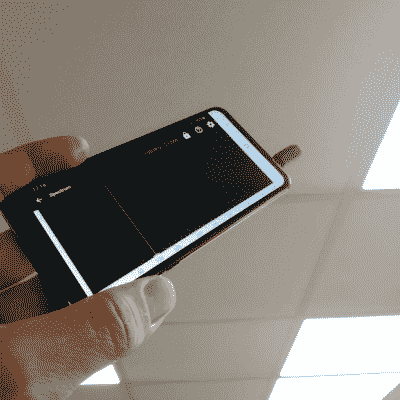

# 使用光电晶体管和音频应用程序测量 LED 闪烁

> 原文：<https://hackaday.com/2021/09/01/measuring-led-flicker-with-phototransistor-and-audio-app/>

没有人喜欢闪烁的光源，但照明往往取决于建筑物主交流电源的质量。光照强度与电源电压密切相关，但灯泡类型也起着一定的作用。白炽灯泡和荧光灯不会在断电时立即停止发光，这使得它们的输出“滑行”以掩盖电源的不稳定性，但 LED 灯泡可能是另一回事。LED 光输出几乎没有惯性，主交流电源和灯泡的交流整流器和滤波的质量将在 LED 灯泡输出的稳定性中发挥重要作用。

The DIY photosensor takes the place of the microphone input.

[Tweepy]想要测量和量化这种效应，并找到了一种方法[，使用一个 NPN 光电晶体管、一个电阻和一个 3.5 毫米音频插头](http://www.dotmana.com/weblog/2020/11/led-light-flicker-diy-measure-it/)。光电晶体管和电阻取代了插入 Android 手机音频插孔的麦克风，Android 手机运行音频示波器和频谱分析仪应用程序。该应用程序旨在处理音频信号，但它与[Tweepy]的 DIY 光电传感器一样好。

结果易于解释；峰值越平滑越少越好。[Tweepy]使用不同的照明解决方案进行了一些测试，发现表现最好的是摄影用照明面板，这或许并不令人意外。表现最差的是超便宜的 LED 灯泡。对于一个简单的 DIY 传感器和一个现有的用于音频的手机应用程序来说，这并不坏。

想近距离了解不同 LED 灯泡的内部构造以及它们是如何工作的吗？[我们已经为您覆盖了](https://hackaday.com/2019/02/05/what-happened-to-the-100000-hour-led-bulbs/)。也不是所有的 LED 灯泡都一样。[有的被剥得只剩骨头](https://hackaday.com/2017/10/11/dollar-tree-led-bulb-tear-down/)，有的被[塞得满满的](https://hackaday.com/2018/04/23/teardown-led-bulb-yields-tiny-ups/)。