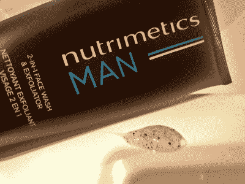
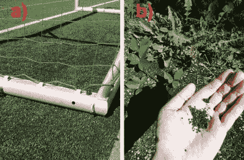

# 微塑料无处不在:陆地、海洋和空气

> 原文：<https://hackaday.com/2021/11/16/microplastics-are-everywhere-land-sea-and-air/>

塑料在 20 世纪起飞，这种新材料找到了金属、木材和纸张无法提供的各种应用。从电子产品到食品包装，每个领域都发现塑料可以发挥作用。

现在，自 1867 年 Parkesine 开发以来，150 多年过去了，我们现在意识到塑料有很多缺点。它们在自然界中不好分解，现在微塑料开始在地球各地出现，甚至在人类很少涉足的地方。看起来它们甚至可能通过空气传播，所以让我们来看看这个日益严重的问题，以及可以做些什么。

## 什么是微塑料？

Microbeads became a popular ingredient of many cosmetics like exfoliating scrubs. Some jurisdictions [have now banned microbeads](https://www.fda.gov/cosmetics/cosmetics-laws-regulations/microbead-free-waters-act-faqs#:~:text=The%20Microbead%2DFree%20Waters%20Act%20of%202015%20prohibits%20the%20manufacturing,)%20drugs%2C%20such%20as%20toothpastes.) for their perceived negative impact on the environment. Credit: Lewin Day

微塑料通常被定义为长度小于 5 毫米的任何类型的塑料颗粒。这个术语是由理查德·汤普森创造的，他在 2004 年担任海洋生态学家时，在英国海滩上发现了大量的微粒。这些颗粒从各种塑料物品上脱落下来，从食物和饮料容器到聚酯羊毛衣物。

微塑料颗粒随处可见；[食盐中的](https://www.nature.com/articles/s41598-019-46417-z#:~:text=We%20found%20that%2094%25%20of,of%20140.2%20microplastic%20particles%2Fkg.)，[饮用水中的](https://www.surfrider.org/coastal-blog/entry/microplastics-found-in-bottled-and-tap-drinking-water#:~:text=Its%20official%20%E2%80%93%20microplastics%20have%20been,particles%20per%20liter%20of%20water.)，更关键的是，就连[本身也漂浮在空中](https://theconversation.com/microplastics-are-in-the-air-we-breathe-and-in-earths-atmosphere-and-they-affect-the-climate-170093)。通过风的运输将微塑料带到了人类很少涉足的遥远地方，在北极的雪地和偏远的山区也发现了微粒。

简单的事实是，在环境中有大量的塑料。在高温、紫外线和普通曝光的情况下，它一直在降解和释放微小颗粒。其中许多都很小很轻，可以在水中甚至空气中自由漂浮，在空中取样时已经在 11000 英尺[的高度发现了它们。](https://www.sciencedirect.com/science/article/abs/pii/S0048969720367449)

## 有问题吗？

鉴于这些塑料在陆地、海洋和空气中的普遍存在，我们每天可能会在任何地方摄入多达 100，000 个微塑料颗粒，这可能并不令人惊讶。事实上，你不会经常从你的瓶装水或食物中捞出大块的塑料，这表明大多数塑料比肉眼能看到的要小。

世界野生动物基金会的一项研究表明，人们一周可能会消耗多达 5 克的塑料，大致相当于一张普通信用卡的金额。这个数字很快被世界各地的媒体引用，但是[的其他研究](https://pubs.acs.org/doi/10.1021/acs.est.0c07384)已经确定人类的摄入量要低得多，在最坏的情况下，大约一年一张信用卡。然而，中位数水平预计会低得多。有趣的是，空气中的微塑料被认为是这些数字的重要贡献者，尽管瓶装水和海鲜是更大的问题。

Artificial turf made out of ground-up tires is shown here as a source of microplastics in the environment, with the particles often washed away by rain.
Credit: [Soleincitta](https://en.wikipedia.org/wiki/File:Football_field_microplastics.jpg), CC-BA-SA-4.0

问题是，这种微塑料摄入对人类健康的影响尚不清楚。研究只是刚刚开始关注这个问题，这是一件非常复杂的事情。微塑料有各种各样的材料，都有自己独特的属性，可能会从环境中吸收毒素或以各种方式进行化学反应。

塑料颗粒的行为也因其大小而异。人们对纳米塑料非常关注，纳米塑料小到足以穿过血脑屏障，血脑屏障负责保护我们的大脑免受体内循环的更有害物质的影响。这些粒子也足够小，以至于它们可以进入细胞并扰乱它们的行为。

迄今为止，潜在的健康影响仍不清楚，是进一步研究的主题。然而，还有更广泛的担忧。微塑料颗粒可能会对地球气候产生影响。到目前为止，[研究表明](https://www.nature.com/articles/s41586-021-03864-x)空气中的微塑料可能会产生散射效应，以类似于大气中气溶胶的方式将阳光反射回太空。然而，这种影响会很小，特别是考虑到目前空气中微塑料的浓度。这些粒子理论上也可以吸收地球散发的热量，因此不能保证这种影响完全是积极的。确定绝对净效应可能需要进一步的调查，尽管在空气中排放大量微小的塑料颗粒并不能解决全球变暖问题。在此过程中，它会引发太多其他问题。

## 当前展望

在这个阶段，研究人员还不相信这对人类健康有巨大的风险。水平仍然太低，不会引起明显的问题。然而，问题是令人担忧的，随着大量塑料在世界各地的垃圾填埋场、河流和海洋中降解，它不会很快消失。

微塑料通常太小，无法在事后有效清理。如果它们确实对我们的健康或生存有害，解决这个问题的唯一方法将是从环境中收集尽可能多的塑料垃圾，并尽量减少生产。

无论如何，研究将继续揭示问题的规模，以及理想情况下的潜在解决方案。同时，减少你的塑料摄入量也很简单。减少塑料食物容器和瓶子的使用，尤其是停止用微波炉加热容器中的食物和饮料。

当然，这并不全是危言耸听。我们已经和微塑料生活在一起很多年了，即使我们并不知道。来自其他来源的微粒污染也是一个问题，这也还没有解决我们的问题。然而，就目前情况而言，我们的食物、水和空气中的微塑料是我们必须同时继续生活下去的东西。

横幅图片:俄勒冈州立大学研究人员发现的微塑料颗粒。学分:[俄勒冈州立大学](https://commons.wikimedia.org/wiki/File:Microplastic.jpg)，CC-BA-SA-2.0