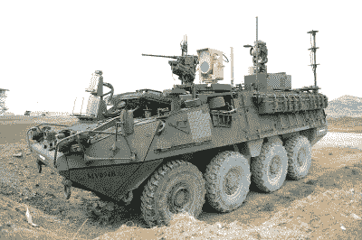
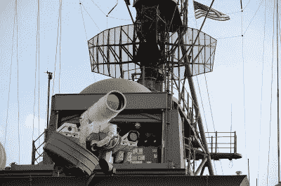

# 军方正急于让反无人机激光器投入使用

> 原文：<https://hackaday.com/2022/08/30/militaries-are-rushing-to-get-anti-drone-lasers-operational/>

几十年来，无人驾驶飞机已经成为现代战争的一部分。最初，这些无人机大多由传统的军事承包商制造，主要由世界上资金最充足的军队使用。然而，最近的叙利亚、乌克兰和其他地方的冲突改变了这一切。小型商用无人机和紧凑型军事化模型已经成为战场上进攻、防御和侦察的关键工具。

由于有如此多的这种微型飞行器在周围嗡嗡作响，军方正在努力寻找实用的方法将其击落。激光可能正是实现这一目标的门票。

## 为什么是激光？

The Mobile Expeditionary High Energy Laser 2.0, or MEHEL 2.0, is a US-built anti-drone laser system that has been trialed on Stryker combat vehicles. It can be seen here as the tan unit fitted on top of the vehicle. Credit: US Army, public domain

击落无人机，甚至是你在沃尔玛买到的最基本的塑料无人机，都是一项令人沮丧的工作。它们很小，因此很难看到。它们也很难被发现，即使它们的无线电辐射有助于追踪它们。

然而，现代军队面临的一个大问题是，无人机通常非常便宜。发射一枚 1 万或 5 万美元的导弹去击落一架价值十分之一价格的无人机，根本不现实。子弹更便宜，但是没有导航，它们更难瞄准目标。那些错过的往往会落回地球，在这个过程中伤害人们。许多无人机*也会*错过，因为这些微型无人机机动性很强，而且很难追踪。

在许多方面，激光为这个问题提供了完美的解决方案。激光通过其强大的光束熔化或焚化无人机来摧毁目标。不涉及弹药，所以只要激光器有电，不过热，就可以开很多枪。也没有炮弹在空中飞行会继续造成附带损害。当然，激光武器仍然需要跟踪系统来瞄准目标。然而，与制导导弹不同，这种昂贵的跟踪系统不会在消灭目标时的爆炸中被摧毁。

自然，反无人机激光技术的现实将不会像你在电影中看到的那样。《星球大战》风格的光脉冲和《T2》皮尤皮尤的声音根本不能反映现实。相反，激光武器更有可能是无声的，除了任何冷却设备的嗡嗡声，许多人可能会依赖于人眼不可见的红外激光技术。

The MEHEL 2.0 system has racked up many successful drone kills in testing. Credit: US Army, public domain

国防承包商雷神公司[最近宣布](https://www.bbc.com/news/technology-62202119)将投资一个新的欧洲中心来开发激光武器。它的主要目标将是开发激光武器来摧毁小型无人机，并将致力于测试和部署这种用于军事应用的硬件。这些激光器可能会用于军用车辆，既可以容纳和携带武器系统，同时为其提供必要的火力。

其他国家也争相部署自己的系统。俄罗斯声称今年 5 月在乌克兰使用了 5 公里射程的反无人机激光[。](https://economictimes.indiatimes.com/news/defence/new-military-tech-russia-uses-new-anti-drone-laser-tool-in-ukraine/articleshow/91659825.cms)与此同时，[法国公司 CILAS](https://www.popsci.com/technology/french-anti-drone-laser-cilas-helma-p/) 正在引用一个系统的成功，该系统依靠雷达或摄像机跟踪，并使用 10 千瓦以下的激光摧毁小型无人机。中国已经开发了一个使用光纤激光器的系统[，工作在几十千瓦范围内，而洛克希德·马丁公司也有一个类似的系统正在开发中，着眼于](https://www.militarydrones.org.cn/silent-uunter-anti-drone-laser-weapon-developed-p00193p1.html)[防御无人机群。美国陆军自己的](https://www.lockheedmartin.com/en-us/news/features/2016/webt-laser-swarms-drones.html) [MEHEL 2.0 激光试验台](https://www.army.mil/article/184353/army_demonstrates_integration_of_laser_weapon_on_combat_vehicle)也在让无人机参与测试方面取得了很大成功。

Defensive laser weapons have applications for land, sea, and air vehicles. Being able to shoot down incoming enemy drones or munitions can have a major effect on a unit’s ability to operate in or around a contested battleground. Credit: US Navy, public domain

它出现在其他激光武器系统也即将成熟的时候。美国空军长期以来一直将激光作为一种潜在的方法来保护飞机免受来袭导弹的攻击。今年早些时候，美国空军收到了洛克希德·马丁公司为此设计的原型激光器，工作在 60 千瓦范围内。人们希望这些安装在飞机携带的吊舱中的高性能激光器能够在来袭导弹接近到足以造成任何实际伤害之前将其击落。

与战斗机的反导弹激光不同，那些瞄准小型无人机的激光在短期内可能更容易实现。它们可能不需要那么强大，因为它们经常被用来摧毁塑料和复合材料制成的飞行器，而不是先进的航空金属合金。它们也能在更短的范围内工作。一枚来袭的空对空导弹以数倍于音速的速度移动，因此远程跟踪并摧毁它是关键。小型无人机最多只能以每小时几百公里的速度移动，所以在更近的距离内对付它们要实用得多。

正如今年的悲剧性战争所显示的，即使是廉价的微型无人机也正在改变战场的面貌。激光武器似乎是军队对抗这种威胁的最佳方式。剩下要做的就是开发和实战它们，现代战争的元游戏将再次改变。