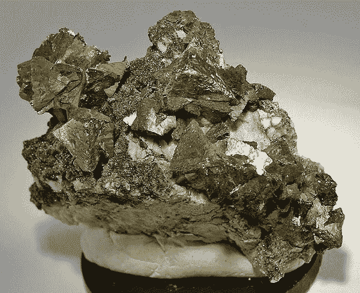
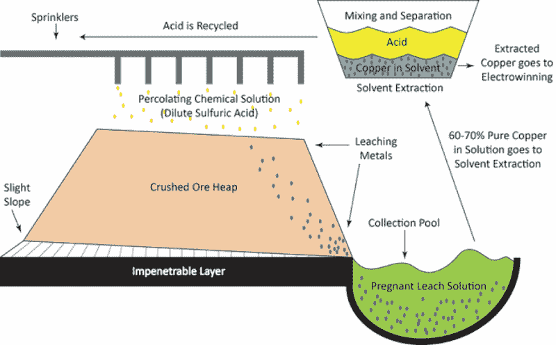
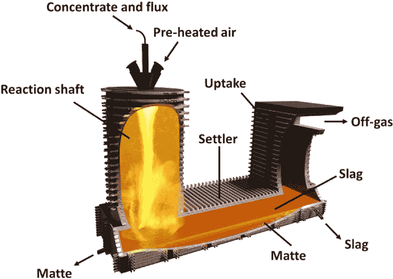

# 采矿和提炼:铜，这种金属创造了科技

> 原文：<https://hackaday.com/2022/01/10/mining-and-refining-copper-the-metal-that-built-technology/>

很难准确计算人类在历史上何时成为技术物种。部分原因是因为技术的定义有些主观；如果你认为制造一根足够尖的棍子，以便从泥土中挖出树根，或者在动物身上戳出足够多的洞，以说服它让你吃它，这就是技术，那么我们的工程世界确实可以追溯到很久很久以前。

但是，从根本上改变一种自然产生的材料的意义上来说，尖头棒的一些东西似乎还不够具有变革性，不能真正算作沙漠中的一条技术线。要越过那条线，似乎金属的使用真的应该是包装的一部分。即使是这样，我们的科技历史仍然可以追溯到很久以前。大约 11000 年前，当我们的祖先发现了这种柔软的红色金属的自然矿藏，并开始学习如何将其加工成工具和器具，使我们摆脱了石器时代，铜最终成为了这一切的起源之一。

我们的世界实际上不能没有铜，因为它不仅形成了文明的电动肌肉，还形成了将我们联系在一起的电力和数据网格的电线和电缆。具有讽刺意味的是，我们现在对铜的依赖程度不亚于它是我们制造工具的唯一金属的时候，或许还更甚。我们将看看提取和提纯铜的过程，看看我们今天使用的方法与七千年前开发的方法有何不同。

## 闪亮的岩石

尽管铜对早期文明很有用，而且由于散布在世界各地的天然铜的表层沉积物，铜很容易获得，但它并不是第一种被发现和加工的金属。这一荣誉既属于黄金，也奇怪地属于陨铁。但是这两种金属都不够丰富，只能对技术产生象征性的影响，而且大部分都被用来充实和装饰国王和王子。

然而，铜很容易找到，也许更重要的是，不需要开发太多的基础设施就可以很容易地加工——至少一开始是这样。由于铜的延展性，铜块可以从天然铜矿中撬出来，用石器冷加工成有用的人工制品。没过多久，铜相对较低的熔点导致了铸造技术的发现，这导致了铜的更多用途和需求的增加。

You can practically see the copper in chalcopyrite. Source: [Rob Lavinsky](https://upload.wikimedia.org/wikipedia/commons/2/2c/Chalcopyrite-199453.jpg), via Wikimedia Commons (CC-BY-SA 3.0)

最终，容易开采的矿藏中的天然金属供过于求，我们的祖先发现了从各种含铜矿石中冶炼金属的方法。商业铜生产中最重要的矿石被称为黄铜矿，这是一种含铁的硫化铜矿物，化学式为 CuFeS [2] 。黄铜矿矿床在世界各地都有发现，在北美和南美以及非洲和澳大利亚尤为丰富。其他重要的矿石以铜的氧化物和碳酸盐的形式存在，如蓝铜矿和赤铜矿。

尽管一些深井开采已经完成，但大多数大型铜矿开采作业都是大型露天矿山。目前世界上产量最高的铜矿是智利阿塔卡马沙漠中的 Minera escond IDA(T1 ),该矿 2007 年生产价值 100 亿美元的铜，年产量可达 120 万吨。虽然纯黄铜矿样品中铜的重量百分比约为 34%,但这种矿物通常与一种主岩类有关，这种主岩类会将矿石中的铜含量降低到百分之几。这意味着必须加工大量的矿石，才能使采矿作业具有商业可行性。在一些矿床中，金和银很少替代矿石中的铜，使这些贵金属成为有价值的副产品，在某些情况下，实际上可以支付提取所有铜的全部成本。

 [https://www.youtube.com/embed/hoflAK3ic0U?version=3&rel=1&showsearch=0&showinfo=1&iv_load_policy=1&fs=1&hl=en-US&autohide=2&wmode=transparent](https://www.youtube.com/embed/hoflAK3ic0U?version=3&rel=1&showsearch=0&showinfo=1&iv_load_policy=1&fs=1&hl=en-US&autohide=2&wmode=transparent)

露天矿的开采始于典型的硬岩开采方法，如爆破。巨大的装载机和铲土机一次将 200 到 300 吨含矿岩石装载到巨大的拖运卡车上，从矿坑运送到加工厂。在那里，巨大的破碎机将汽车大小的巨石粉碎成越来越小的碎片，然后送入球磨机进行更精细的研磨。目标是减少矿石矿物和其周围被称为*脉石*的废石之间的物理接触。

接下来是从矿石中提取元素铜，但是所用的方法取决于矿石的类型。对于铜的氧化物和碳酸盐，铜可溶于酸溶液，因此使用*湿法冶金*工艺。细节各不相同，但在沥滤过程中，通常是将粉状矿石堆积在衬有防渗层的大坑中。将稀硫酸喷洒到矿石堆上，从矿石中浸出硫酸铜。用特殊的*萃取剂*将铜从浸出液中分离出来，这样硫酸就干净了，可以循环用于下一轮浸出，同时富含铜的溶液也可以进一步净化。

Heap leaching schematic. Piles of ore are sprinkled with sulfuric acid; the copper-laden leachate is collected and concentrated. Source: [University of Arizona Superfund Research Center](https://www.superfund.arizona.edu/resources/learning-modules-english/copper-mining-and-processing/processing-copper-ores)

## 浮到顶部

当涉及到化学提取方法时，硫化铜矿处于不利地位，因为硫化物几乎不溶于酸。为了从这些矿石中提炼出铜，精炼者需要用火法冶炼的方法提高温度。这些都是从与之前相同的粉碎和研磨步骤开始的，产生的细粉在大缸中与水混合。向泥浆中加入被称为*捕收剂*的化学物质，其作用是结合硫化物矿物颗粒。捕收剂分子覆盖硫化物颗粒并增加它们的疏水性，或排斥水的趋势，同时留下废石颗粒。当空气鼓泡通过溶液时，现在疏水的硫化物附着在气泡上，并在大桶表面形成泡沫，泡沫从顶部被撇去，并经受这种泡沫浮选方法的进一步循环，以增加铜的浓度。

 [https://www.youtube.com/embed/N6_GUs8EJNo?version=3&rel=1&showsearch=0&showinfo=1&iv_load_policy=1&fs=1&hl=en-US&autohide=2&wmode=transparent](https://www.youtube.com/embed/N6_GUs8EJNo?version=3&rel=1&showsearch=0&showinfo=1&iv_load_policy=1&fs=1&hl=en-US&autohide=2&wmode=transparent)

该泡沫浮选过程的输出物然后经过增稠过程，以尽可能多地去除水。这是通过开放式池塘中的简单蒸发和使用多孔陶瓷圆盘或圆筒过滤相结合来完成的。过滤步骤至关重要，因为它将水分含量降低到 8%左右，并产生浓度约为 20-30%的铜精矿，可以很容易地运输到冶炼厂。

Cross-section of a flash smelter. Ore concentrate melts in the superheated air blast in the reaction chamber, and matte copper collects at the bottom for tapping. Source: [Jylhä *et al*, MDPI](https://www.mdpi.com/2227-9717/8/4/485) (CC-BY-4.0)

为了从精矿中提取铜，使用了闪速熔炼工艺。精矿与加热的富氧空气一起被喷入闪速炉的反应塔中。精矿中的硫化物立即熔化，并落到熔炉底部的收集池中。在那里，熔融材料根据密度分离，被称为*冰铜*的熔融铜沉入底部，而铁和硅酸盐炉渣在添加的熔剂的帮助下漂浮到顶部。

现在纯度约为 60%的冰铜从闪速炉底部流出，通过转化进一步提纯，转化基本上是将热空气吹过熔融的冰铜。氧气与剩余的硫发生反应，留下纯度约为 98%的粗铜。

## 用电取胜

湿法冶金和火法冶金提取的最终产品的最后纯化阶段称为*电解提取*。这就是简单的电解，尽管规模很大。对于湿法冶金铜，来自浸出坑的硫酸铜溶液用作电解液，铅阳极和薄不锈钢板用作阴极。电流通过电解液，使溶液中的铜沉积在不锈钢阴极上。当约 100 磅(45 千克)的铜积聚在阴极上时，将它们取出、清洗并弯曲，以弹出完成的 99.99%纯的铜片。

对于火法冶炼铜，粗铜锭用作电解提取的阳极。它们被悬浮在一个装满稀释的硫酸铜与硫酸混合的槽中，与纯铜片或不锈钢的阴极交错。电流通过电解槽，铜在阴极上电镀，在最终过程中再次达到 99.99%的纯度。

留在电解沉积槽中的废物被称为*阳极泥*，尽管它的名字并不吸引人，但却是一种有价值的产品。根据原料中存在的矿物和用于电解提取的电压，阳极泥可能含有金、银、硒、碲，甚至可能含有铂族金属，以及相当数量的在第一次循环中没有回收的铜。阳极泥通常出售给专业冶炼厂，利用湿法冶金和火法冶金工艺的结合来回收这些有价值的金属，这些工艺是根据阳极泥中的金属混合物定制的。

横幅图片:詹姆斯·圣约翰的[自然铜置换交错层沉积岩](https://www.flickr.com/photos/47445767@N05/16674008634)，2.0 的 CC