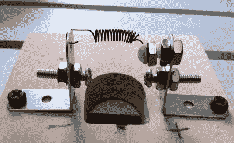

# 来自无绳工具电池的移动电源

> 原文：<https://hackaday.com/2020/06/12/mobile-power-from-cordless-tool-batteries/>

多年来，[迈克尔·戴维斯]一直使用大型铅酸电池为他定制的多布森望远镜的电子元件供电；但这并不意味着他特别喜欢。电池很重，你必须时刻注意连接它和瞄准镜的电线。为了改善这种情况，[他决定为 Ryobi 无线工具电池制造一个适配器](http://www.mdpub.com/RyobiPower/index.html)。

 【迈克尔】已经见过类似的 3D 打印适配器，但他决定以传统方式制作。嗯，算是吧。他使用 CNC 路由器切割出接受 18 V 锂离子电池组所需的独特形状，但其余部分是由五金店零件组装而成的。

带有螺母和螺栓的弯曲修补板用于创建可调触点，顶部添加的弹簧确保系统中始终有一点张力，因此它可以形成良好的电接触。这种设置使得连接器非常坚固，正如[Michael]指出的那样，螺栓是连接电线的方便之处。

随着与 Ryobi 电池物理连接的后勤工作完成，下一步是将它转化为望远镜的有用能量。一个稳定的 12 V 是通过一个紧凑的 DC-DC 转换器产生的，一个拨动开关和保险丝将其连接到一对汽车式的电源插座上。所有的东西都装在一个木头盒子里，这个盒子比它所取代的铅酸怪物要小得多，也轻得多，这意味着它可以直接安装在望远镜上，而不是放在地上。

如果你想建造一个类似的适配器， [3D 打印路线可能会为你节省一些时间和精力](https://hackaday.com/2020/03/30/designing-printed-adapters-for-power-tool-batteries/)。但我们不得不承认，迈克尔在这里建立的重型连接看起来相当坚固。如果你有一个应用程序，其中的[电池可能会被敲来敲去或振动失去](https://hackaday.com/2018/01/05/power-your-guitar-pedals-with-drill-batteries/)，这可能是要走的路。