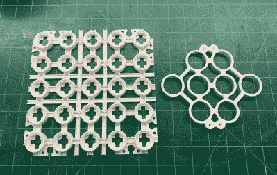

# 模块化设计实现了巨大的乒乓球 LED 显示屏

> 原文：<https://hackaday.com/2022/01/04/modular-design-enables-huge-ping-pong-ball-led-displays/>

乒乓球有很多用途:除了打乒乓球，它们还被用于无数的艺术项目、科学实验，甚至是从海底打捞船只。事实证明，它们作为 LED 像素的扩散器也很方便，允许在不需要大型单个 LED 的情况下构建大尺寸显示器。

[david]使用 3D 打印组件设计了一款 LED 乒乓球显示器,由于采用了严格的模块化设计，因此可以构建任意尺寸的 LED 显示器。基本单元是容纳单个 LED 模块的小片，并且具有用于连接标准乒乓球的杯状结构。这些基本单元中的 25 个组合成一个配线架，该配线架还包含布线管道。最后，由于夹子在平面外方向上提供了结构刚性，任何数量的这些面板都可以组合成显示器。

A single panel holds 25 LEDs and comes with cable ducts. On the right is a clip for connecting multiple frames together.

当然，简单地安装 LED 模块并不足以创建一个显示器:LED 还需要连接到电源线和数据线。[david]不喜欢切割和剥离 1800 根电线的想法，因此设计了一种自动化这一过程的聪明方法:他将一束电线放在一张卡片上，并使用激光切割机定期烧掉绝缘层。然后，只需将这些电线焊接到 led 上，并沿着数据总线剪下一些片段。

完成的面板由 Teensy 3.2 驱动以产生数据信号，并由 Raspberry Pi 处理图像。你可以在下面的视频中看到令人印象深刻的结果；如果这启发了你去构建自己的，你会很高兴听到 STL 文件和所有代码都在[david]的项目页面上。

巨大的 LED 显示屏看起来总是很有趣，虽然这不是第一个使用乒乓球作为扩散器的，但它的模块化和开源设计使它可能是最容易复制的。当然，前提是你有一个好的乒乓球供应商。

 [https://www.youtube.com/embed/Yfn14K6DuwQ?version=3&rel=1&showsearch=0&showinfo=1&iv_load_policy=1&fs=1&hl=en-US&autohide=2&wmode=transparent](https://www.youtube.com/embed/Yfn14K6DuwQ?version=3&rel=1&showsearch=0&showinfo=1&iv_load_policy=1&fs=1&hl=en-US&autohide=2&wmode=transparent)

