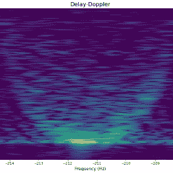

# 用 LoRa 进行月球弹跳和雷达成像

> 原文：<https://hackaday.com/2021/12/03/moon-bouncing-and-radar-imaging-with-lora/>

LoRa 无线电协议是硬件黑客所熟知的，因为它的范围很长(因此得名)，而且功耗极低，这使它成为带有微型天线的电池供电设备的首选。但是如果能量不低，天线不小呢？你可能只是从月球上反弹回来一条信息。但这还不是全部。

完成劳拉登月计划的团队由来自欧洲航天局、 [Lacuna Space](https://lacuna.space/lora-moon-bounce/) 和 [CA Muller 射电天文站基金会](https://www.camras.nl/en/)的人员组成，该基金会运营着德温格洛射电望远镜。对于业余无线电实验来说，Dwingeloo 射电望远镜并不陌生，但这一台是独一无二的。

A radar image of the moon generated from LoRa Moonbounce

工作在 70 cm 业余无线电波段(430 MHz)意味着 LoRa 信号不局限于 ISM 波段所允许的低功率信号。该团队将信号放大到 350 瓦，然后使用射电望远镜的 25 米碟形天线将传输指向月球。

结果呢？他们不仅能够使用与调制它相同的收发器接收反射的传输——一种现成的 IOT·劳拉无线电——而且他们还使用 SDR 记录传输。通过绘制频率和多普勒延迟，LoRa 传输能够用于获得月球的雷达图像-这是一个值得注意的双重用途。

LoRa 是一项多用途的技术，甚至可以用来跟踪你返回陆地的高空气球。