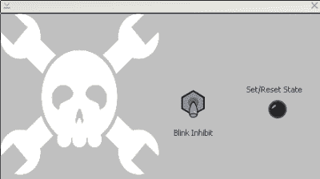
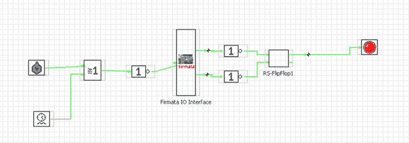
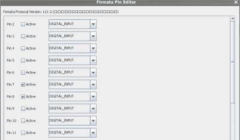
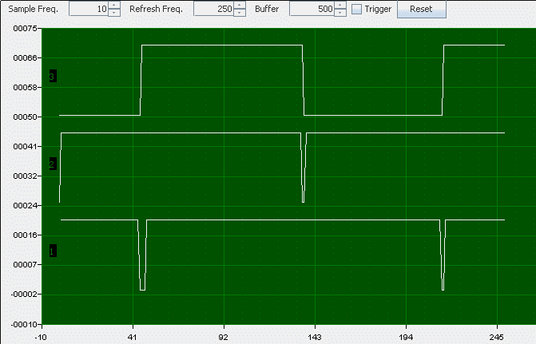
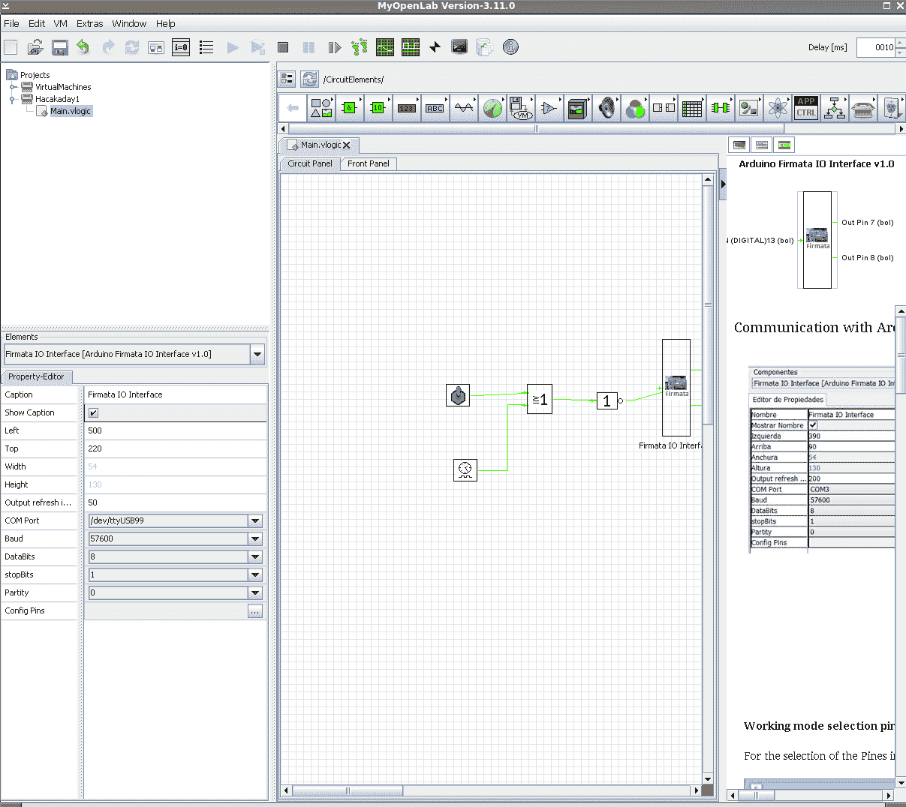

# 使用 MyOpenLab 轻松实现 Arduino、Rasberry Pi 等 GUI 前端

> 原文：<https://hackaday.com/2018/09/21/myopenlab-talks-to-arduino-pi-and-more/>

如果你想将一个漂亮的图形界面与微控制器或单板计算机集成为一个有用的定制设备，你会怎么做呢？ [MyOpenLab 是一个平台，可以让您轻松设计电子构建的虚拟界面](https://myopenlab.org)。如果您想要 Arduino、Raspberry Pi、Android 或任何具有串行端口的控件和读数，这值得一试。

MyOpenLab 让我想起了 LabView。没有那么多现代的 LabView 及其所有的附件和额外功能，但 LabView 回到了它只做几件事，但做得很好的时候。开源 MyOpenLab 项目已经存在一段时间了。网站和文档都不是英文的，这可能会让一些人不敢尝试，但软件本身有德语、英语和西班牙语版本。我大胆尝试，发现语言障碍并没有给我带来麻烦。

作为一个例子，你可以做什么，想象你想建立一个自定义工作台工具。你建立虚拟设备(他们称之为“虚拟机器”)，用你的计算机作为控制面板和读出器，用你的电子项目作为物理接口。在 myOpenLab 中，您的设备将由两部分组成:图表和前面板。有些东西只存在于图表中，比如计时器或与 Arduino 的连接。但是有些东西同时存在于两者之中，比如开关、发光二极管、图表等等。你可以把所有的小盒子连接在一起，组成应用程序。它们可以独立运行，但强大之处在于能够连接到 Arduino 或 Raspberry Pi(或其他一些选项)进行 I/O。

## 快速项目

[](https://hackaday.com/wp-content/uploads/2018/08/front.png) 在进入具体细节之前，让我们先来看看我设计的一个简单的演示。在 VirtualMachines 文件夹中也有大量的实例，您可以查看。

你可以在这里看到前面板。Jolly Wrencher 只是一个添加的图形，用于装饰其他项目和标签，使前面板看起来很好，但不会出现在工作图中。在该图中，您可以指定虚拟前面板和想要控制的实际硬件之间的连接。您还可以向现有的硬件输入添加逻辑。



Firmata 块( [Firmata](https://www.arduino.cc/en/Reference/Firmata) 是一种与微控制器板通信的协议)用于表示项目的硬件接口，它有一些有趣的属性。首先，在你放下程序块之前，你真的需要你的开发板连接好并工作，因为它甚至在你运行你的虚拟机之前就在读取数据。您可以设置要使用的串行端口和输入的刷新间隔(显然是以毫秒为单位)。

[](https://hackaday.com/wp-content/uploads/2018/08/dialog.png)

Checking the Active box on the pin editor makes the pin show up on the Firmata component

我连接了两个按钮，将 Arduino 的引脚 7 和 8 接地，每个都有一个 10K 上拉电阻。这会偏置引脚值，以便 MyOpenLab 可以在按钮空闲时读取这些输入引脚上的 1，并在按钮被按下时读取 0。我用这个来说明 MyOpenLab 很酷的逻辑能力。在 firmata 模块的右侧，我反转按钮，因为它们是低电平有效，然后将结果馈送到 RS 触发器。前面板上的虚拟 LED 显示触发器的状态。

在 firmata 模块的左侧，我有一个慢速计时器和一个虚拟交换机。这将通过一个或门和一个反相器来驱动我的 Arduino 的第 13 号引脚(电路板内置的 LED)。最终结果是 LED 将闪烁，除非您打开 MyOpenLab 前面板上的虚拟开关。是 MyOpenLab 为眨眼计时。

您也可以右键单击一个连线并设置一个测试点。在操作过程中，您可以从窗口菜单中打开一个窗口，轻松显示测试点。你也可以打开一个小小的示波器显示器，显示你所有的数字或模拟信号。

[](https://hackaday.com/wp-content/uploads/2018/08/scope1.png)

Signal 1 is the “set” button, signal 2 is the “reset” button and signal 3 is the LED output.

非常简单，虽然这是一个愚蠢的例子，但你可以从组件中看出，你可以组装一个非常重要的系统。如果你想看更多的例子，在 VirtualMachines 文件夹中有很多例子。

现在，让我们来了解一下使用 MyOpenLab 的细节。

## 使用用户界面

[](https://hackaday.com/wp-content/uploads/2018/08/main2.png)

用户界面一点都不差。在一个高 DPI 的显示器上，我发现它有点小，没有一个清晰的方法来缩放它(但我会告诉你我是如何解决这个问题的)。事情按照你的预期发展。选择工作区上方水平调色板的组件，然后单击工作区来放置它们。请注意，如果您在图表(电路面板)或前面板上，调色板会发生变化。

偶尔，您会看到一些软件的英文版没有本地化的内容(contadores de tiempo 文件夹中有计时器)。我还碰到一些组件坚持抛出与绘画相关的 Java 错误。他们似乎工作，他们只是抛出了一些 Java 异常。我确实在 Linux 下做了一些 Java 修复，我将在后面详述。

画互连线有点困难。你必须从源开始，点击，然后移动到目的地，再次点击。在我的显示器上很难看到绿线，我也没有办法改变颜色。您只能将一个输出连接到一个输入。但是，如果右键单击一条连线，您可以添加一个节点，这将允许您与该节点建立另一个连接。您也可以从 extras 文件夹中选择拆分器组件。

如果你点击一个对象，会有一些帮助文本显示在右边(通常是缺失的),而属性检查器显示在左边。其中一些需要你做一些侦查工作。例如，在计时器组件中，高级属性设置输出为高的时间，低级属性设置输出为低的时间。这两个时间都以毫秒为单位。

## 后端

我感兴趣的是作为 I/O 设备的后端的数量。您可以使用 Firmata 与 Arduino 通话，但也可以使用其他几种方式。您可以与 Raspberry Pi、Modbus、Processing、几个商业 I/O 接口和 RS232 端口对话。我希望有一个 Sigrok 或 USBTMC 的后端。

话又说回来，这是开源的，所以我估计我应该补充一下，而不是抱怨。这个项目[托管在 SourceForge](https://sourceforge.net/projects/myopenlab3/) 上。不要被使用下载按钮得到的代码所迷惑(那是一个旧版本)。如果您查看“代码”选项卡，您会发现 subversion 详细信息，以查看最新的代码:

```
svn checkout https://svn.code.sf.net/p/myopenlab3/code/ myopenlab3-code
```

## 周围工作

让事情运转起来有点挑战性。许多 Java 程序不能正确显示我的大屏幕——我可能需要更新我的 JVM。在我厌倦了眯着眼睛之后，我运行 Xephyr 并给它传递了一个假的 DPI:

```
Xephyr -dpi 100 :3 -screen 1800x1200 -dpi 100  ; DISPLAY=:3 twm ; DISPLAY=:3 ./start_
linux &
```

Xephyr 就像 Xnest。它在你桌面的一个窗口中创建一个虚拟的 X 窗口显示。这使得鼠标光标有点滑稽，对布线没有帮助，但它是可行的。当然，如果界面可以放大和缩小就好了，但据我所知，它没有。

然而，我有一个更大的问题。该程序依靠 RXTX 库与串口通信。起初，它找不到我的安装。我知道它应该可以工作，因为 Arduino IDE 使用相同的库，这很好。

```
-Djava.library.path="/usr/lib/jni/"
```

但这并不是问题的结束。Arduino 枚举为/dev/ttyACM0 或其他数字，这取决于连接的是什么。该程序会找到显示为/dev/ttyUSB*和/dev/ttyS*的端口，但不想显示任何包含 ACM 的端口。在一次小林丸机动中，我发出了如下命令:

```
ln -s /dev/ttyACM0 /dev/ttyUSB99
```

然后 MyOpenLab 找到/dev/ttyUSB99 我就入行了。我不喜欢输。

## 更多资源

这个工具还有很多值得探索的地方。有几十个组件，从简单的门到 PID 控制器。然而，这应该让你开始。如果你会说西班牙语，你就万事俱备了。如果你没有，不要忘记你的浏览器可能有一个翻译按钮，或者你可以使用在线翻译器——你可能需要翻译整本手册(或者[借我的副本](https://drive.google.com/file/d/1ociBIBnVPw8OC_3Refl3ejSvKd2K3Szb/view?usp=sharing))。当然，翻译也有不尽如人意的地方。有一个[论坛](https://myopenlab.org/comunidad/)的英语不错。还有一个 [YouTube 频道](https://myopenlab.org/comunidad/)，有一些英语，最近更新了。

关于 YouTube 视频有一点需要注意。至少有些有一些英文字幕。例如，查看下面的介绍视频，并在 YouTube 查看器中打开隐藏式字幕。不幸的是，当你读到好的内容时，翻译就停止了，但是你仍然可以很好地理解正在发生的事情。

 [https://www.youtube.com/embed/r3UheAVXU_w?version=3&rel=1&showsearch=0&showinfo=1&iv_load_policy=1&fs=1&hl=en-US&autohide=2&wmode=transparent](https://www.youtube.com/embed/r3UheAVXU_w?version=3&rel=1&showsearch=0&showinfo=1&iv_load_policy=1&fs=1&hl=en-US&autohide=2&wmode=transparent)

