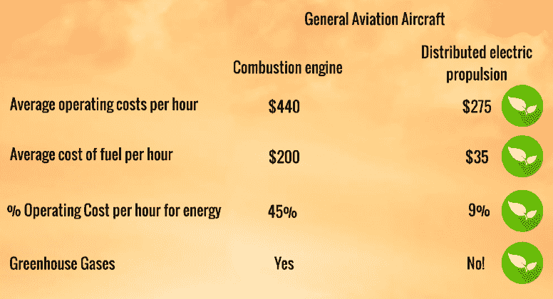
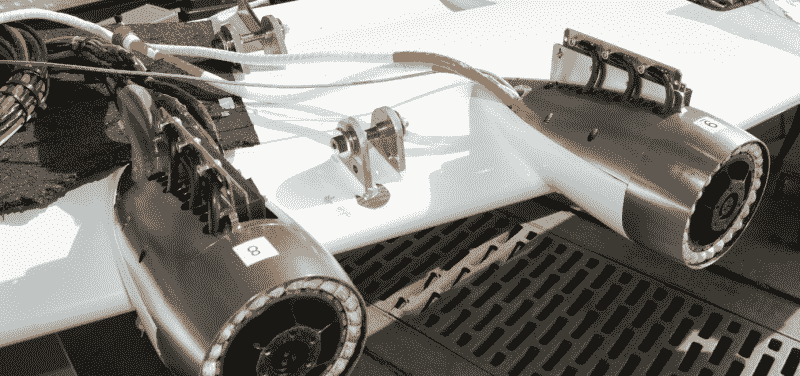
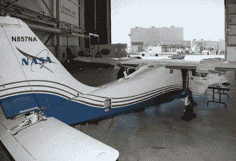

# 美国宇航局准备新的电动 X 飞机首飞

> 原文：<https://hackaday.com/2020/04/28/nasa-readies-new-electric-x-plane-for-first-flight/>

自 1951 年以来，美国国家航空航天局(在太空时代之前被称为 NACA)和美国空军一直使用“*X”*的名称来称呼推动技术发展的实验飞机。这些飞行器中最著名的，如 X-1 和 X-15，被用来研究在极端高度和速度下的飞行。几十年来，一些战斗机以 X-飞机起家，一些高超音速超燃冲压发动机飞行器也打着这个旗号飞行。因此，X 飞机通常被认为是速度和机动性的缩影。

因此，X-57 Maxwell， [NASA 二十年来第一架有人驾驶的 X-飞机](https://www.nasa.gov/specials/X57/index.html)，看起来可能有点偏离其前辈的火爆性能。它不会飞得很快，不会做任何高 G 的转弯，当然也不会在高层大气中爬行。机组人员的飞行装备甚至不会比一件 polo 衫和一条短裤更有异国情调。就尖端实验飞机而言，X-57 已经是尽可能的悠闲了。

但是像以前的 X-planes 一样，Maxwell 有一天会被视为它自己的技术里程碑。正如 X-1 帮助开创了超音速飞行时代一样，X-57 的开发使工程师能够更好地理解有人驾驶电动飞机的独特挑战。在电动飞机可以在公共空域运行之前，必须在真实世界的场景中探索电动飞机的性能特征和局限性。X-57 进行的实验将有助于指导认证计划和政府规则的制定，这些都需要在这种飞机能够大规模运行之前到位。

## 电动飞行的案例

需要说明的是，商用喷气式飞机不会很快被全电动飞机取代。这将需要在能量储存方面取得重大突破，也许是基于一种全新的电池化学物质，才能使这种飞机即使在国内飞行中也是可行的。电动马达很难与现代涡轮风扇发动机竞争，后者在过去几十年里已经进行了大量改进，以最大限度地提高功率和燃油效率。

NASA’s cost comparison for electric aircraft

但这并不意味着没有电动飞机可以填补的空白。对于电力驱动的飞机来说，快速周转的短途飞行是理想的，特别是如果电池组可以在着陆时快速更换的话。

如果电池组可以通过现场可再生能源如风能或太阳能充电，甚至有可能实现零排放飞行。这将是对目前执行这些短距离“跳跃”的小型飞机上通常使用的效率相对较低的内燃机的显著改进。

即使我们忽略在飞机上使用电动机的潜在环境影响，还有其他引人注目的优势。电动飞机比活塞或涡轮驱动的同类飞机更安静，维护和安全操作也更简单。它们对私人所有者尤其具有吸引力，因为它们的飞行成本应该比传统动力飞机低得多。

## 各个击破

与过去更大胆的 X 飞机不同，X-57 实际上是作为一种商用飞机开始的。特别是双引擎 Tecnam P2006T，它是同类飞机中重量最轻的飞机之一。即使你考虑到美国国家航空航天局所做的修改的成本，P2006T 股票略低于 50 万美元的标价可能使它成为有史以来最便宜的 X 标志车辆之一。

由于美国宇航局认为电动飞机非常适合所谓的“通用航空”飞行，因此他们希望将他们的实验飞行器建立在现有的服务于这个市场的设计基础上是有道理的。当你真正想测试的只是推进系统时，为什么要花费时间和金钱去开发一架全新的飞机呢？

为此，美国宇航局已经用他们所谓的“分布式电力推进”系统取代了 Tecnam P2006T 的原始机翼和发动机。由于电动马达的动力不如它们所取代的原始内燃机，X-57 在起飞和着陆时需要 14 个电动马达来驱动。但是，一旦飞机在空中和巡航高度，中心的 12 个马达将关闭以节省能量。

These small motors only require power cables be routed through the wing.

中央发动机将使用折叠式离心螺旋桨，这样一旦它们不再旋转，它们就会平放在机舱上以减少阻力。当需要额外的动力时，它们会随着马达的旋转而伸长。这种布置远没有多引擎飞机中传统使用的顺桨机构复杂，并且具有完全自动化的额外好处。只要定期润滑关节，就可以依靠物理来处理其余的问题。

 [https://www.youtube.com/embed/4X1FxZgfFbc?version=3&rel=1&showsearch=0&showinfo=1&iv_load_policy=1&fs=1&hl=en-US&autohide=2&wmode=transparent](https://www.youtube.com/embed/4X1FxZgfFbc?version=3&rel=1&showsearch=0&showinfo=1&iv_load_policy=1&fs=1&hl=en-US&autohide=2&wmode=transparent)

当激活时，这些小马达将大大增加机翼上的气流，从而增加升力。这种性能的提升使美国宇航局能够大大缩小飞机的机翼，而大型电动马达相对较轻的重量使它们可以放置在翼尖。所有这些因素结合在一起，X-57 不同于以前飞行过的任何东西。

## 需要一些组件

Ground testing the X-57’s systems.

在 X-57 在所有 14 个电动机的驱动下起飞之前，还有相当多的工作要做。目前，该项目处于“Mod II”阶段，即原来的 Rotax 912S3 发动机被相同的发动机取代，这些发动机最终将被重新安置到新机翼的翼尖。机翼本身最近已经完成了结构测试，一旦安装到 X-57 飞机上，该计划将正式进入第三阶段。

最后一级“Mod IV”将沿着新安装的机翼前缘安装 12 个较小的发动机。在每个阶段，预计飞机的效率将会提高，最终美国宇航局希望证明操作这种轻型飞机所需的能源减少了五分之二。虽然该机构对新冠肺炎的回应已经减缓或停止了几个主要项目，但美国宇航局表示，X-57 Maxwell 的工作仍在加利福尼亚州继续进行，最终配置的飞机飞行测试仍有望在年底前完成。