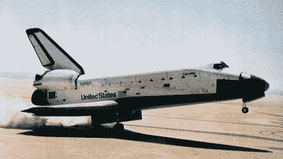
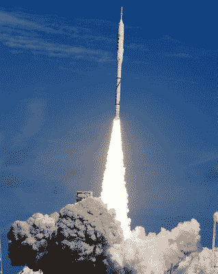
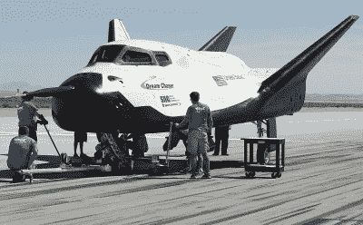
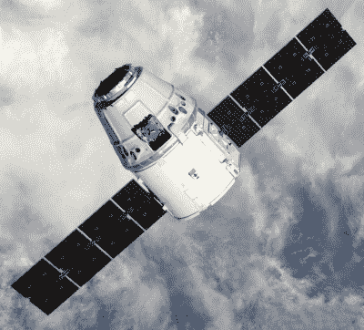
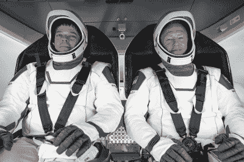

# 美国宇航局推迟已久的载人航天回归

> 原文：<https://hackaday.com/2020/06/01/nasas-long-delayed-return-to-human-spaceflight/>

随着 SpaceX Demo-2 任务的发射，美国实现了近十年来没有做过的事情:用国产助推器和运载工具将人类送入近地轨道。这是一次能力上的失误，其持续时间远远超出了 NASA 内外任何人的想象。通过一系列的延迟和计划取消，自 2011 年以来，将鞋印放在月球上并建造标志性航天飞机的同一家机构被迫依赖俄罗斯将其宇航员送入太空。

如果美国国家航空航天局依靠美国传统的航天巨头来完成这项工作，他们仍然会等待发射自己的宇航员。去年 12 月，波音 CST-100“Starliner”飞往国际空间站的首次飞行是一次尴尬的失败,险些失去无人太空舱。后来的调查发现，草率的软件开发和不一致的测试导致了任务期间至少两次重大失败，最终不得不中断，因为飞行器甚至无法到达国际空间站的高度，更不用说进行对接尝试了。美国宇航局和波音公司已经同意在年底前的某个时候尝试 CST-100 的另一次测试，[尽管由于全球疫情](https://hackaday.com/2020/04/06/getting-to-space-is-even-harder-during-a-pandemic/)，推迟到 2021 年似乎是不可避免的。

但是，美国在载人航天方面的缓慢回归不能归咎于 CST-100，甚至波音公司。自从航天飞机退役后，美国宇航局一直受到政治和优柔寡断的阻碍。随着来自白宫的不断变化的授权，该机构的载人航天计划一直在努力朝着任何一个目标取得重大进展。

## 后航天飞机计划

人们常说航天飞机被取消了，没有明确的替换计划，但事实远比这复杂。2003 年哥伦比亚号【T2 号】不幸失事后不到一年，乔治·w·布什总统发布了他的*太空探索计划*，该计划将使美国宇航局走上退役老化航天飞机舰队的道路，同时保持美国的发射能力和太空探索的全球领先地位。

该计划指示美国宇航局在 2010 年前完成国际空间站的主要建设，届时航天飞机的主要任务将完成，该计划可以结束。与此同时，美国国家航空航天局将开发乘员探索飞行器:一种更传统的太空舱，能够将美国宇航员运送到空间站、月球，甚至可能是火星。这种相对简单的运载工具的测试飞行将于 2008 年开始，在航天飞机完成最后一次空间站组装任务之前，有足够的时间使其进入运行状态。

Space Shuttle *Columbia*

太空探索*计划的一个关键目标是分离乘员和货物。航天飞机试图将乘员运输工具和重型助推器结合到一个可重复使用的包装中，但最终结果是一种从未真正擅长任何一项任务的车辆。它太大太复杂，不能仅仅将人员运送到国际空间站，但同时，其独特的设计和操作参数限制了它实际上可以携带的有效载荷类型。*

简而言之，白宫认为航天飞机是一个失败的实验，不仅花费了 14 名美国宇航员的生命，而且消耗了太多的美国宇航局的预算和资源。太空探索的愿景旨在让美国国家航空航天局回到更安全、更可持续的道路上，最终目标是在 2020 年离开地球轨道，重返月球。

## 星座计划

为了响应布什总统的太空探索愿景，美国宇航局在 2005 年开发了星座计划。它由两个独立的火箭助推器组成，一个用于运载载人飞船，另一个是重型运载工具，其载货能力是航天飞机的八倍。根据新计划，前往月球或火星的大型航天器将提前由较大的火箭发射，其乘员将乘坐较小的火箭进入太空，并在轨道上与其会合。

Ares I-X launches on October 28, 2009

该计划还要求开发猎户座太空舱和牛郎星月球着陆器，这两个都将受到阿波罗时代的同行的严重影响。甚至有计划使用土星五号火箭上使用的 Rocketdyne J-2 发动机的现代化版本，尽管现代安全要求导致这个想法在相当早的时候就被放弃了。

不幸的是，星座计划被延迟和成本超支所困扰。部分问题是美国宇航局仍然必须资助和运营航天飞机和国际空间站，这给该机构带来了巨大的压力。当航天飞机还在运送宇航员时，从航天飞机项目中抽走资金和工程师可能会导致另一场灾难，所以星座从来不是首要任务也就不足为奇了。

2009 年，美国国家航空航天局进行了战神 I-X 的试飞，这是一种人类额定助推火箭的原型，旨在将猎户座太空舱送入近地轨道。虽然这次飞行是成功的，但它将是唯一一件能够飞行的星座硬件。随着惰性模型代替上面级和乘员舱，不完整的战神 I-X 最终成为星座计划自开始以来实际进展甚微的象征。

## 商业船员接管

此时，白宫已被巴拉克·奥巴马总统占据，正如政府易手时经常出现的情况，新的领导层正在寻求削减成本和精简运营。奥巴马总统下令进行的审查得出结论，完成星座计划将花费至少 1500 亿美元，即使这样，在可预见的未来重返月球或火星任务也不太可能。基于这些发现和他所谓的“缺乏创新”，他在 2010 年正式取消了该计划；在航天飞机计划进行最后一次飞行的前一年。

为了寻找一种更现代、更灵活的方式将货物和人员运送到近地轨道，奥巴马政府努力推动商业运营商参与 NASA 的运营。资金被专门分配给新的商业乘员开发(CCDev)计划，该计划的任务是寻找能够设计、建造和操作他们自己的载人飞船的公司。

Dream Chaser prototype during testing.

波音公司的 CST-100 是通过 CCDev 计划获得资金的第一批车辆之一，内华达山脉的追梦太空飞机也是如此。作为一项应急措施，如果美国宇航局的新商业伙伴未能生产出可行的飞行器，猎户座乘员舱的开发将被允许继续进行。

随着航天飞机即将退役，很明显，美国将不得不依靠俄罗斯的航天器将宇航员送往国际空间站，但这被视为一项临时措施。

当 CCDev 计划的第二阶段于 2011 年开始时，波音公司相信 CST-100 可以在 2014 年开始载人测试飞行，美国宇航局认为猎户座将在 2016 年为国际空间站的运营飞行做好准备。

## 巨龙崛起

当美国国家航空航天局及其传统的航空航天合作伙伴正在应对重新设计载人飞船的现实时，SpaceX 公司已经用自制的助推器将他们的龙胶囊送入低地球轨道，并为他们首次前往国际空间站的货运任务做准备。SpaceX 通过仅用于货运的 CCDev 版本(即商业轨道运输服务(COTS ))获得了资金，并迅速成名。

By 2012, SpaceX had already sent a Dragon to the ISS.

因此，当 CCDev 的第三阶段在 2012 年开始时，SpaceX 在这个游戏中遥遥领先。他们提出的航天器版本不仅已经完成并已经飞行，而且在所有 CCDev 参赛项目中也是独一无二的，因为他们还开发了自己的助推火箭将他们的运载工具送入太空。这种垂直整合不仅是 SpaceX 大幅降低运营费用的关键，还实现了竞争对手根本无法匹敌的快速迭代设计流程。

美国宇航局在 2014 年正式选择 SpaceX 作为他们的商业乘员合作伙伴之一，他们获得了 26 亿美元的资金，为载人任务开发他们的龙货运太空舱的修改版本，预计他们可以在 2017 年之前进行测试和认证。

但是该公司仍然必须履行 COTS 合同下的货运义务，加上开发载人飞船时预计会出现的正常[挫折和延迟，将新船员龙的首次试飞推迟到 2019 年。](https://hackaday.com/2019/08/05/spacex-clips-dragons-wings-after-investigation/)

## 新时代的开始

自从航天飞机正式宣布退役后，其模糊的替代者将永远在几年后进行首次飞行。但是即使有了八年的领先，当亚特兰蒂斯号最后一次停下来的时候，美国国家航空和宇宙航行局已经没有任何东西可以展示他们在追逐纸火箭上花费的时间和金钱。尽管经过十多年的发展，CST-100 和猎户座仍然没有开始运营飞行。传统的航空航天工业未能响应这一号召。

Behnken and Hurley aboard Crew Dragon

通过将宇航员罗伯特·贝肯(Robert Behnken)和道格拉斯·赫尔利(Douglas Hurley)送入太空，SpaceX 正式结束了美国宇航局历史上的艰难篇章。这不仅标志着该机构对外国硬件进行载人航天任务的依赖的结束，而且证明了旧的方法不是一成不变的。

黑马彻底击败了根深蒂固的巨头，空间的民主化从未如此接近。很难预测人类太空飞行的下一个十年将会是什么样子，但毫无疑问，它将会比上一个十年更加令人兴奋。