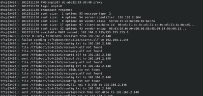

# 网络引导 Pi 4

> 原文：<https://hackaday.com/2019/11/11/network-booting-the-pi-4/>

我们已经讨论过 [PXE 启动树莓派 3B+](https://hackaday.com/2018/10/08/hack-my-house-running-raspberry-pi-without-an-sd-card/) ，然后看了看[树莓派 4 作为桌面替代](https://hackaday.com/2019/09/09/can-you-really-use-the-raspberry-pi-4-as-a-desktop-machine/)。但还有更多！Pi 4 有一个非常有用的新特性，可闪存引导程序。就在最近，发布了该引导加载程序的测试版，支持 PXE(通过网络引导),这已经成为我们这些对 SD 卡上的根文件系统一直有糟糕体验的人的必备工具。

我听到你问，有什么不好的方面？与高质量的 SD 卡相比，您可能会看到网络速度较慢，特别是使用 Pi 4 及其改进的 SD 卡插槽。PXE 不需要以太网电缆；WiFi 是不够，所以你有限制要对付。最后，这不是一个便携的选择——当你跑步时，你被拴在网络电缆上，并且被拴在你的网络上来启动。

另一方面，如果你要永久或半永久安装 Pi，PXE 绝对是赢家。没有什么比拖着梯子去访问一个烧了 SD 卡的 Pi 更糟糕的了，更不用说你有可能把自己挡在了外面。需要用一个新的 Raspbian 图像重新开始吗？很简单，只需在 PXE 服务器上重建它，然后远程重启 Pi。

确信 PXE 适合你？我们开始吧！

要使用 PXE 引导 Raspberry Pi 4，需要几个步骤，从更新引导加载程序固件开始。这意味着将 Raspbian 安装到 SD 卡上，并至少启动一次 Pi。从那里，我们转向 PXE 服务器来构建远程文件系统，并设置 NFS 和 dnsmasq 服务。本文摘自[一双官方](https://github.com/raspberrypi/rpi-eeprom/blob/master/firmware/raspberry_pi4_network_boot_beta.md) [Pi 网开机指南](https://www.raspberrypi.org/documentation/hardware/raspberrypi/bootmodes/net_tutorial.md)。

### 引导加载程序更新

在撰写本文时，支持 PXE 引导的 eeprom 固件仍处于测试阶段。我们必须获取固件，更改启动顺序配置，然后将其刷新到板载芯片。一旦 Pi 4 从您的 Raspbian SD 卡启动，我们可以执行以下操作来更新固件:

```

sudo apt-get update
sudo apt-get upgrade
wget https://github.com/raspberrypi/rpi-eeprom/raw/master/firmware/beta/pieeprom-2019-10-16.bin
rpi-eeprom-config pieeprom-2019-10-16.bin > bootconf.txt
sed -i s/0x1/0x21/g bootconf.txt
rpi-eeprom-config --out pieeprom-2019-10-16-netboot.bin --config bootconf.txt pieeprom-2019-10-16.bin
sudo rpi-eeprom-update -d -f ./pieeprom-2019-10-16-netboot.bin
cat /proc/cpuinfo

```

最后一个命令应该输出一些关于 Pi 本身的信息。我们对 Pi 序列号的条目感兴趣。记下代码的最后 8 个字符，因为我们稍后会用到它。我的情况是“0c4c21e5”。这就是 Pi 本身所需的所有设置。

### 构建文件系统

上次我们设置 PXE 服务器时，我们使用了 Centos 和专用网络。这一次，让我们使用 Debian，看看我们能否让 PXE 在现有的家庭网络上工作。这些说明也应该适用于 Raspbian 服务器。

下面简单地将 Pi 的文件系统构建为 NFS 共享。我们使用的 Raspbian 映像确实需要手动更新两个文件，这就是为什么我们要删除并重新下载`start4.elf`和`fixup4.dat`

```

sudo apt-get install unzip kpartx dnsmasq nfs-kernel-server
sudo mkdir -p /nfs/raspi1
wget https://downloads.raspberrypi.org/raspbian_latest
unzip raspbian_latest
sudo kpartx -a -v 2019-09-26-raspbian-buster.img
mkdir rootmnt
mkdir bootmnt
sudo mount /dev/mapper/loop0p2 rootmnt/
sudo mount /dev/mapper/loop0p1 bootmnt/
sudo cp -a rootmnt/* /nfs/raspi1/
sudo cp -a bootmnt/* /nfs/raspi1/boot/
cd /nfs/raspi1/boot
sudo rm start4.elf
sudo rm fixup4.dat
sudo wget https://github.com/Hexxeh/rpi-firmware/raw/master/start4.elf
sudo wget https://github.com/Hexxeh/rpi-firmware/raw/master/fixup4.dat

```

还记得之前的序列号吗？这就是它发挥作用的地方。Pi 尝试 PXE 启动的第一个地方是一个名为序列号最后 8 个字符的文件夹。您需要将下面的每个“0c4c21e5”替换为之前找到的序列号。我们还使用了一个`bind`挂载，这样/boot 文件夹可以作为 tftp 服务的一部分被访问，也可以作为 NFS 共享的一部分被挂载。这里的优点是内核和其余的引导代码可以使用`apt`来更新。

```

sudo mkdir -p /tftpboot/0c4c21e5
echo "/nfs/raspi1/boot /tftpboot/0c4c21e5 none defaults,bind 0 0" | sudo tee -a /etc/fstab
sudo mount /tftpboot/0c4c21e5
sudo chmod 777 /tftpboot

```

我们将在 boot 文件夹中创建一个文件来启用 SSH，修改 Pi 的`fstab`以便它不会在 SD 卡上寻找文件系统，最后替换`cmdline.txt`中的 boot 命令。确保将`nfsroot` IP 地址替换为作为 PXE 服务器的 Debian 机器的 IP 地址。

```

sudo touch /nfs/raspi1/boot/ssh
sudo sed -i /UUID/d /nfs/raspi1/etc/fstab
echo "console=serial0,115200 console=tty root=/dev/nfs nfsroot=192.168.2.209:/nfs/raspi1,vers=3 rw ip=dhcp rootwait elevator=deadline" | sudo tee /nfs/raspi1/boot/cmdline.txt

```

### 配置服务

设置 NFS 共享就像添加一行到`/etc/exports`并启动服务一样简单。请注意，我们并没有建立一个特别安全的 NFS 服务。在您信任所有计算机的家庭网络中，这不是问题，但是不要在公共互联网上运行此设置。

```

echo "/nfs/raspi1 *(rw,sync,no_subtree_check,no_root_squash)" | sudo tee -a /etc/exports
sudo systemctl enable rpcbind
sudo systemctl enable nfs-kernel-server
sudo systemctl restart rpcbind
sudo systemctl restart nfs-kernel-server

```

我们需要将我们的设置添加到`dnsmasq`配置文件中，这是最神奇的地方。让我们来谈谈“代理”设置。我们要求`dnsmasq`做的是监视 DHCP 请求，而不是直接响应这些请求，等待主 DHCP 服务器分配 IP 地址。如果`dnsmasq`看到对 PXE 信息的请求，它将发送额外的信息来通知支持 PXE 的设备 PXE 服务器信息。好处是，这种方法让我们无需修改主 DHCP 服务器就能支持 PXE 启动。

您需要调整 dhcp 范围设置以匹配您的网络。通常它可以设置为您网络的广播地址，可以使用`ip addr`识别，查看`brd`条目。

```

echo 'dhcp-range=192.168.2.255,proxy' | sudo tee -a /etc/dnsmasq.conf
echo 'log-dhcp' | sudo tee -a /etc/dnsmasq.conf
echo 'enable-tftp' | sudo tee -a /etc/dnsmasq.conf
echo 'tftp-root=/tftpboot' | sudo tee -a /etc/dnsmasq.conf
echo 'pxe-service=0,"Raspberry Pi Boot"' | sudo tee -a /etc/dnsmasq.conf

```

### 成功！


最后一步是启动`dnsmasq`并查看连接日志。

```

sudo systemctl enable dnsmasq
sudo systemctl restart dnsmasq
sudo tail -f /var/log/daemon.log

```

此时，您可以使用我们配置的 Pi 4，移除 SD 卡，并尝试通过 PXE 引导它。您应该能够在日志中看到对引导文件的`tftp`请求，最后是一个 NFS 挂载请求。恭喜，我们成功了！