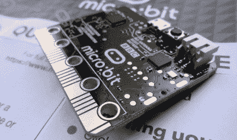

# 新的 BBC Micro:bit 增加了麦克风和扬声器

> 原文：<https://hackaday.com/2020/10/13/new-bbc-microbit-adds-microphone-and-speaker/>

有一个古老的故事，电视公司只需要制作几年的儿童电视节目，因为他们的观众不断增长，不再喜欢他们的节目，而是被一个事先不知道旧节目的新节目所取代。这是真的还是假的还有待讨论，但是这同样适用于针对儿童的单板计算机吗？最初的 BBC micro:bit 于 2015 年首次发布，现在第二代孩子肯定会对它感兴趣，但这并没有阻止他们推出第二版的小型教育电脑。这么简单的设备怎么更新？是时候看看了。

Edge connector shown on the original micro:bit design

新板的外形与其前代产品基本相同，具有相同的边缘连接器和大型连接焊盘，以及熟悉的 LED 矩阵显示屏。最明显的增加是一个小扬声器和 MEMS 麦克风，允许孩子们在他们的代码中与音频进行交互，但不太明显的是 micro:bit 徽标中的一个新触摸按钮。原来的是在丝网层，而新的是作为电容传感器的铜。

硅也有升级，现在配备了运行在 64 MHz 的北欧半导体 nRF52833，配备了 512k 的 ROM 和 128k 的 RAM，内置蓝牙低能耗。二进制文件与原始文件不兼容，但是所有的开发环境都可以为新的通用二进制文件格式重新编译代码，这种新的通用二进制文件格式能够为任一版本运行适当的软件。

micro:bit 在学校比在我们的社区更受欢迎，也许是因为它不幸与这么多强有力的竞争对手一起出现。然而，它仍然是一个强有力的竞争者，其简单的编程加上更传统的工具链的力量使它成为孩子和成年人的好选择。[我们看了一下 2016 年](https://hackaday.com/2016/06/03/hands-on-with-the-bbc-microbit/)的原回，如果你有兴趣的话。