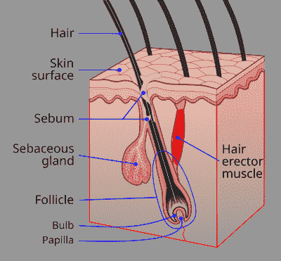

# 新的帕金森氏症测试闻起来成功了

> 原文：<https://hackaday.com/2022/09/14/new-parkinsons-test-smells-success/>

帕金森氏病影响着全世界数百万人。这种退行性疾病会导致特有的颤抖、行走困难，并经常伴有并发症，包括痴呆、抑郁和焦虑。

围绕帕金森病的主要挑战之一涉及诊断。没有单一的、普遍可用的测试可以确认或排除这种疾病。这可能会导致特别的挫折，因为这种疾病在早期是最容易治疗的。

然而，这种情况可能很快就会改变。一名妇女发现她似乎有能力“嗅出”受感染人群中的疾病，现在正与科学家合作开发一种针对这种疾病的测试。

## 凭直觉

总的来说，人类的嗅觉并不特别令人印象深刻。它帮助我们享受在烤箱里烤的新鲜面包的香味，或者新割的草的香味。然而，作为一个检查和了解我们周围世界的工具，它确实有所欠缺。

然而，我们中的一些人在嗅觉方面比其他人更有能力。来自苏格兰珀斯的乔伊·米尔恩就是这样一个人。有一天，她碰巧发现了她伴侣特有气味的变化，12 年后，他们被诊断患有帕金森氏症。

有人能“嗅出”帕金森氏症患者的不同之处，这个想法很容易验证。当米尔恩最终得出结论，她注意到的不同气味可能与她丈夫的状况有关时，她很快引起了科学家的兴趣。在她的搭档、前医生的帮助下，她与研究人员蒂洛·库纳特博士和佩尔迪塔·巴兰教授合作进行了进一步的研究。

[Anatomy of a hair follicle](https://commons.wikimedia.org/wiki/File:Hair_follicle-en.svg). (Public domain, NIH)

有人怀疑，气味的变化可能是由于皮脂的化学差异，皮脂腺分泌到皮肤的油性物质。他们组织了一个测试，让米尔恩去闻不同人穿过的 t 恤。一些参与者患有帕金森病，一些没有。米尔恩能够正确地识别出患病者穿过的衬衫。她还在一件 T 恤衫上发现了一种特殊的气味，这件 T 恤衫属于一群没有患帕金森症的人。仅仅八个月后，那个人也被诊断出患有这种疾病。这是一个响亮的信号，表明帕金森病可能有可检测的化学特征。

经过多年的研究，由巴兰领导的一组研究人员开发出了一种简单的疾病检测方法。样本是通过在脖子后面擦拭一个棉签取得的。然后分析样本中与帕金森氏症有关的分子。它作为一种简单的临床工具，帮助识别可能患有这种疾病的患者。

该测试的工作原理是利用质谱技术识别某些仅在帕金森病患者中发现的大重量脂质分子。目前处于开发的早期阶段，该测试已经在实验室环境中试验成功。它的额外好处是拭子技术是非侵入性的。

## 未来的工作

下一步是将皮脂分析技术开发成一种简单的标准化测试，可以在世界各地的医院和医生诊所的典型临床环境中运行。广泛使用这种测试可能是早期发现这种疾病的关键。米尔恩已经证明了在临床症状明显之前就能闻到皮脂变化的能力；因此，理论上该测试也可以做到这一点。目前，在英国，帕金森病的诊断可能需要几个月或几年的时间，这要归功于相关的工作和系统中积压的患者。一个简单的拭子测试可以改变这种情况，让患者尽早得到正确的专家帮助。

米尔恩正在继续她的工作，与科学家合作，看看她是否能通过气味识别其他疾病。主要候选疾病包括肺结核和癌症。两者中的后一个已经被发现在某些情况下能够被狗察觉，所以米尔恩自己的高度灵敏的鼻子可能能够实现同样的壮举。在公共场合，她偶尔也会闻到帕金森特有的气味。然而，医学伦理专家建议她不能将自己的发现告诉别人。米尔恩指出，无论如何，大多数全科医生不会相信一个来做检测的病人，因为一个女人闻到他们有疾病的味道。

拭子试验的全面发展显示了科学在检验特殊索赔方面的有效性。当米尔恩声称有能力“嗅出”帕金森病时，科学家们很快就能设计出一种测试来证实这一点。从那里，他们能够找出在低水平上发生了什么，并将其转化为真正的医疗效益。这就是科学方法在起作用的好处！