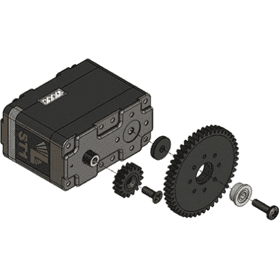
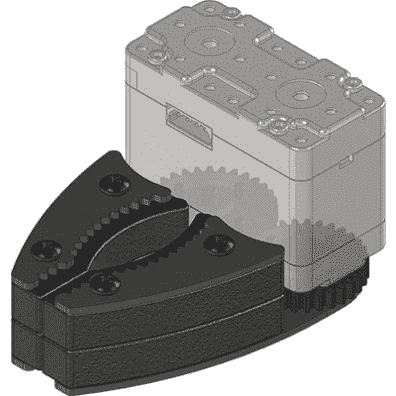

# 新零件日:Lynxmotion 智能伺服系统

> 原文：<https://hackaday.com/2019/05/03/new-part-day-lynxmotion-smart-servos/>

任何购买机器人套件的人都会碰到一些由 Lynxmotion 设计的。自 1995 年以来，他们一直在帮助人们制造机器人，从机器人手臂套件到六足底盘，以及其间的一切。我们希望这些人了解他们的电机，所以当他们推出自己的伺服电机系列[lynx motion Smart Servos(LSS)](http://www.lynxmotion.com/c-189-smart-servos.aspx)时，花点时间看看他们提供的东西是值得的。

虽然这些新设备具有与经典远程控制伺服兼容的 PWM 模式，但要释放其全部功率，需要通过串行总线进行双向通信。我们之前已经给了[三个已经上市的串行总线伺服系统](https://hackaday.com/2018/07/05/wrangling-rc-servos-becoming-a-hassle-try-serial-bus-servos/)的概述，以供比较。[快速浏览了一下 Lynxmotion 母公司 RobotShop 上列出的 68-100 美元的价格标签](https://www.robotshop.com/en/lynxmotion-smart-servos.html)，很明显他们不打算进行价格竞争，那么这些新上市的产品有什么有趣的功能呢？

深入研究[产品文档](https://www.robotshop.com/info/wiki/lynxmotion/view/lynxmotion-smart-servo/)发现了一些很棒的细节。加速度和减速度是可调的，这有助于机器人运动更加平稳。还有一个可调节的“刚度”水平，增加了一些“弹性”(顺从)，所以机器人不会像…嗯，机器人一样僵硬！

在机械方面，最有趣的内部组件是磁性位置传感器。它们比电位计精确得多，但更重要的是，它们允许在 360 度范围内定位。许多其他串行总线伺服被限制在小于 360 度的弧内的位置，留下了盲点。

LSS 产品的一个有趣的特点是串行通信协议使用人类可读的文本字符，因此发送一个数字 255 意味着传输一个三字节的字符串‘2’、‘5’和‘5’，而不是单字节的`0xFF`。这将使调试我们的定制机器人代码容易得多，代价是降低带宽效率和检测通信错误的校验和丢失。这是一些机器人制造商乐意做的权衡，但其他人可能不会。

从外部来看，这些伺服系统有丰富的安装选项，包括一些我们不知道要求。历史上，Lynxmotion 套件使用了各种各样的伺服安装支架，因此它们致力于简化机械集成。最新颖的产品是能够将外部齿轮栓接到伺服机构上。一套 1:3 齿轮允许齿轮伺服向上或向下，或者您可以使用一套 1:1 齿轮的紧凑型手爪。

    

正如你所期望的这个价格范围内的伺服系统，它们都有金属齿轮，但它们也有能力直接从电池组为电机供电(建议使用 3 节锂聚合物)。还有一些额外的功能，比如用于视觉反馈的 RGB LED，我们在这里没有介绍，所以请深入阅读文档了解更多信息。我们期待看到这些有趣的小致动器在未来的机器人项目中的表现。