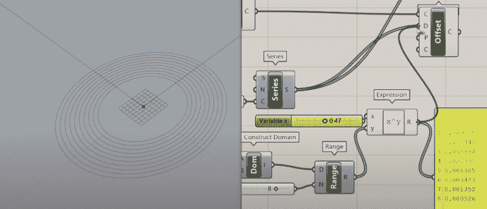

# 新视频系列:用复杂几何图形进行设计

> 原文：<https://hackaday.com/2021/07/22/new-video-series-designing-with-complex-geometry/>

无论是 3D 打印的机器人底盘还是彩色玻璃窗，看着一个完成的物体，并试图理解它是如何设计和组装的，可能会令人生畏。但是经过更仔细的检查，您通常可以识别出重复的形状和子结构，这些形状和子结构组合在一起形成了最终的作品。很快你会发现，这个看起来非常复杂的设计，从整体上看，实际上是简单几何元素的融合。

这种技能，即看到一个物体的主要组成部分的能力，对于设计新的物体和理解现有的物体一样重要。[正如 James McBennett 在他的 HackadayU 课程*用复杂几何图形设计*](https://hackaday.io/course/178584-designing-with-complex-geometry) 中解释的那样，如果你想掌握计算机辅助设计(CAD)并开始创建自己的复杂设计，你最好从一个相对简单的几何图元工具箱开始，这样你就可以快速修改和重用它们。随着时间的推移，您的锦囊妙计将会充满参数化结构，这些参数化结构可以在飞行中重新成形，以适应您当前正在进行的任何工作。

他选择的工具是 Grasshopper，这是 Rhino 的一部分，是一种可视化编程语言。设计是使用让人想起 Node-RED 甚至 GNU Radio 的界面创建的，每个相互连接的块代表一个原始形状或功能，可以通过静态变量、交互式滑块、条件运算甚至数学表达式进行配置。通过将这些模块链接在一起，可以以编程方式生成和操作复杂的结构，与手动方法相比，大大减少了所需的时间和精力。

和许多强大的工具一样，Grasshopper 当然有一个学习曲线。但是在这个由五部分组成的系列中，詹姆斯做了一件很棒的工作，他把事情分解成容易理解的部分，然后一个接一个地建立起来。到最后一节课，你将会处理物理问题，并将你的设计推进到第三维空间，产生几乎具有生物特性的精细设计。

当然，Rhino 并不适合所有人。这个 995 美元的程序是闭源的，官方只在 Windows 和 Mac OS 上运行。但是，James 引入的模块化设计概念，以及将大型复杂对象视为子结构集合的技术，可以应用于其他参数化 CAD 软件包，如 FreeCAD 和 OpenSCAD。

*用复杂的几何图形进行设计*只是通过 HackadayU 提供的[令人难以置信的课程之一，HackadayU 是我们为硬件黑客开设的按需付费的研究生院。从无人机到量子计算，](https://hackaday.io/u/)[目前的课程清单对每个人都有好处](https://hackaday.io/courses)。

 [https://www.youtube.com/embed/bGnJp4X9fRY?version=3&rel=1&showsearch=0&showinfo=1&iv_load_policy=1&fs=1&hl=en-US&autohide=2&wmode=transparent](https://www.youtube.com/embed/bGnJp4X9fRY?version=3&rel=1&showsearch=0&showinfo=1&iv_load_policy=1&fs=1&hl=en-US&autohide=2&wmode=transparent)

 [https://www.youtube.com/embed/QzuLboM2vBM?version=3&rel=1&showsearch=0&showinfo=1&iv_load_policy=1&fs=1&hl=en-US&autohide=2&wmode=transparent](https://www.youtube.com/embed/QzuLboM2vBM?version=3&rel=1&showsearch=0&showinfo=1&iv_load_policy=1&fs=1&hl=en-US&autohide=2&wmode=transparent)

