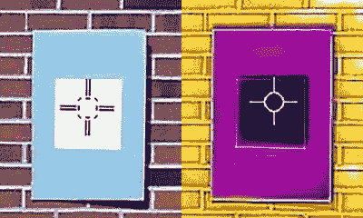

# 新的白色涂料可能有助于应对气候变化

> 原文：<https://hackaday.com/2021/04/16/new-whitest-paint-might-help-fight-climate-change/>

太热了。比以前更热了，而且太热了，未来的事情都不会好起来。阳光持续照射，随着我们的温室气体排放继续覆盖地球，更多的热量被截留，导致全球平均气温稳步上升。减少这些排放会有所帮助，但是还有其他的可能性。一组研究人员用一种新的非常 T2 的白色涂料认为这可能对解决这个问题有所帮助。

Thermal imaging shows the white paint’s ability to cool a surface below ambient temperature, by radiating away excess heat.

美国普渡大学新推出的“最白”涂料。它能够反射到达其表面的 98%的阳光，比传统白色涂料的 80-90%有了很大的进步。此外，它不吸收紫外线，还可以辐射出红外波长的热量，并传递到大气之外。这使得油漆能够将表面冷却到环境温度以下。这种涂料通过使用硫酸钡作为颜料来实现这些功能，硫酸钡不像传统的二氧化钛白色颜料那样吸收紫外线。这种油漆还使用了大量的颜料——60 %,而在更典型的油漆中，这一比例为 20 %- 40%。这类似于生产 Vantablack 的技术，vanta black 是最黑的丙烯酸颜料。

希望通过将建筑物的屋顶和墙壁涂成白色，更多的阳光将被反射回太空，建筑物将自然凉爽，减少对空调的依赖，有助于减少排放。这对解决许多大城市的热岛效应大有帮助。从加州到 T2、纽约州和 T4 的艾哈迈达巴德，世界各地的市政当局已经开始采用这项技术。这是一件容易的事情，几乎没有缺点，所以我们希望看到这种做法在未来几年变得更加流行。虽然它无法独自解决气候危机，但世界肯定会利用它所能获得的每一点帮助。