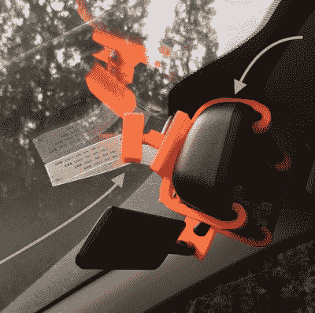

# 现在你也可以成为老大哥了，有了树莓派车牌识别器

> 原文：<https://hackaday.com/2020/02/26/now-you-can-be-big-brother-too-with-a-raspberry-pi-license-plate-reader/>

如果你对特斯拉的一些功能感到惊叹，但又买不起，也许你可以通过一些升级来改善你现在的车。这就是[Robert Lucian Chiriac]对他的路虎所做的，为了深入了解汽车机器视觉[他给它安装了一个树莓 Pi 和一个带有自动车牌识别系统的摄像头](https://towardsdatascience.com/i-built-a-diy-license-plate-reader-with-a-raspberry-pi-and-machine-learning-7e428d3c7401)。

This bracket should find a use in a few projects.

他异常全面的报道带我们经历了整个过程，从为 Pi 和相机创建一套相当有用的 3D 打印支架，到决定所需的人工智能软件组件的组合，再到最终决定通过 4G 手机链接将部分处理卸载到云服务。在这一点上，他使用了 Cortex，这是一个为轻松部署机器学习模型而设计的系统，他对此印象深刻。

结果是他车上的摄像头可以识别和读取周围车辆的牌照。这在某种程度上有点像老大哥，但从另一个角度来看，这预示着一个未来，在这个未来，越来越多不需要云服务的独立可访问的人工智能应用程序将成为可能，而不是那么邪恶。这是一个不可避免的进展，它的隐私问题可能会超出一篇黑客文章的范围，但它也是我们职权范围内的一个迷人领域，应该在我们的级别上可用。

你可以在 break 下面的视频中看到系统的运行，以及[在他的 GitHub 库](https://github.com/RobertLucian/cortex-license-plate-reader-client)中找到代码。

 [https://www.youtube.com/embed/gsYEZtecXlA?version=3&rel=1&showsearch=0&showinfo=1&iv_load_policy=1&fs=1&hl=en-US&autohide=2&wmode=transparent](https://www.youtube.com/embed/gsYEZtecXlA?version=3&rel=1&showsearch=0&showinfo=1&iv_load_policy=1&fs=1&hl=en-US&autohide=2&wmode=transparent)

