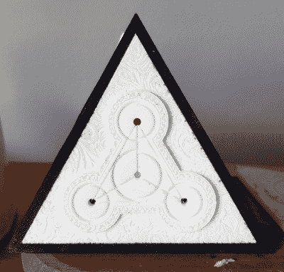
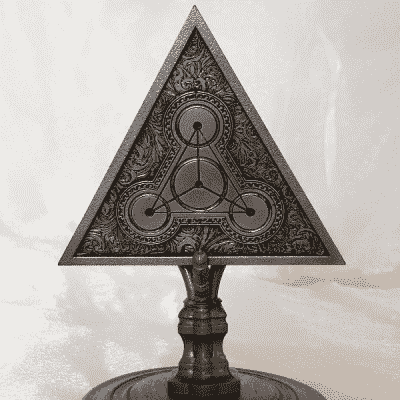

# 零碎片构建通过激光切割、模具制作和 3D 打印模糊了游戏和现实之间的界限

> 原文：<https://hackaday.com/2019/09/03/null-shard-build-blurs-line-between-game-and-reality-with-laser-cutting-mold-making-3d-printing/>

在第三个房间中，玩家的任务是收集被称为“零碎片”的神秘物体。但似乎有一个名叫[Juiceman]的玩家，有点不折不扣地接受了这个挑战。从为游戏发布的宣传艺术开始，[他开始了史诗般的旅程，创造了一个副本“空碎片”](https://13ballstudios.blogspot.com/2019/08/the-null-shard-part-1.html)，最终看起来非常好，其中一个目前住在开发商 fire Games 总部的荣誉之地。

 开发人员之前在他们的网站上发布了图像文件来创建一个 papercraft 版本的 Null Shard，所以[Juiceman]基于这些设计进行了他最初的 CAD 工作。但事实证明，表面纹理有点太复杂，无法用激光蚀刻到丙烯酸树脂上而不造成混乱。他把它简化了一点，同时试图保留整体效果。从他制作的一流的激光蚀刻丙烯酸母版开始，他制作了一个硅胶模具，开始铸造制作两份碎片所需的八个三角形面板。

为了将它们结合在一起,[Juiceman]首先在传统的塑料 FDM 打印机上试验设计，创建一个“骨架”金字塔。经过几次尝试，他有了一个可行的设计，并改用激光烧结机，使最终的框架具有华丽的纹理。随着铸造面板的安装和几层油漆，他有了他的零碎片。

 最后一步是将一块灰烬翻下来做一个漂亮的底座，并使用相同的激光烧结工艺 3D 打印出碎片的脚和“爪”底座。成品看起来棒极了，显然就放在一个架子上，旁边是《T4》系列电影中“哀叹结构”益智方块的类似复制品。[Juiceman]说这两个复制品是他的“地狱几何”系列的第一批作品，顺便说一下，我们已经决定将正式成为我们第一张金属专辑的名字。我们现在需要做的就是学习如何演奏乐器。

我们之前已经研究过 [3D 打印和少量的奉献如何能够创造出一些令人难以置信的道具](https://hackaday.com/2017/11/15/visual-3d-print-finishing-guide/)，曾几何时，我们甚至举办了一场科幻竞赛，挑战我们的读者[将他们最喜爱的电影和游戏物品带入现实世界](https://hackaday.com/2017/01/23/hackadays-sci-fi-contest-hits-warp-speed/)。像这样的构建是一个完美的例子，说明当一个专注的黑客或开发者受到一个真正引起他们共鸣的娱乐节目的启发时会发生什么。

[感谢劳伦的提示]