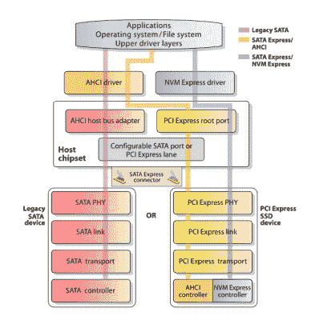
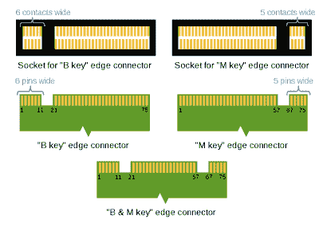
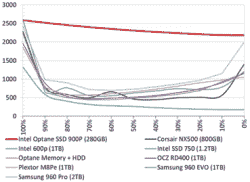
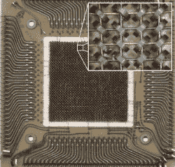

# NVMe 模糊了记忆和存储之间的界限

> 原文：<https://hackaday.com/2021/01/13/nvme-blurs-the-lines-between-memory-and-storage/>

存储设备的历史实际上是介质和计算能力之间的竞赛，因为保存数十亿个 1 和 0 的瓶颈阻碍了计算的天堂。最近的玩家是非易失性内存快车( [NVMe](https://en.wikipedia.org/wiki/NVM_Express) )，它是以前出现的东西的混合体。

第一代家用电脑使用软盘和盒式光盘存储，但随着个人电脑功能的增强，容量更大、速度更快的存储变得越来越重要。到了 20 世纪 90 年代，基于硬盘驱动器的存储已经变得很普遍，允许存储许多兆字节甚至千兆字节的数据。这将推动存储和系统其余部分之间更快链接的需求，到目前为止，系统其余部分主要使用编程输入输出( [PIO](https://en.wikipedia.org/wiki/Programmed_input%E2%80%93output) )模式的 ATA 接口。

这导致了基于 DMA 的传输( [UDMA](https://en.wikipedia.org/wiki/UDMA) 接口，也称为 Ultra ATA 和[并行 ATA](https://en.wikipedia.org/wiki/Parallel_ATA) )的使用，以及基于 DMA 的 [SCSI](https://en.wikipedia.org/wiki/SCSI) 接口在苹果电脑和大多数服务器端的使用。最终，并行 ATA 变成了串行 ATA ( [SATA](https://en.wikipedia.org/wiki/Serial_ATA) )，并行 SCSI 变成了串行连接 SCSI ( [SAS](https://en.wikipedia.org/wiki/Serial_Attached_SCSI) )，SATA 主要用于笔记本电脑和台式机系统，直到 NVMe 和固态存储的出现。

所有这些接口都是为了与连接的存储设备保持同步而设计的，然而考虑到它在系统中的集成方式，NVMe 有点奇怪。NVMe 的不同之处还在于它没有绑定到单一的接口或连接器，这可能会令人困惑。谁能把 M.2 和 U.2 分开，更别说接口说的是哪种协议了，是 SATA 还是 NVMe？

让我们深入了解一下 NVMe 奇妙而古怪的世界，好吗？

## 欺骗性的外表

Diagram of the elements in SATA Express, functionally similar to M.2.

问任何人电脑主板上的 NVMe 插槽是什么样子，他们都会倾向于给你看一张 [M.2](https://en.wikipedia.org/wiki/M.2) 插槽的照片，因为这已经成为消费电子产品中固态存储设备最常用的标准。然而，即使是带有固态硬盘(SSD)的 M.2 插槽也可能不是 NVMe 插槽或 SSD，因为 SATA 也使用这种接口。

往往 M.2 插槽旁边的主板丝印会提到一个 M.2 插槽能接受什么技术。查看有问题的电路板的手册也是一个好主意。造成这种混乱的原因是，最初有一个用于固态硬盘的迷你 SATA (mSATA)标准，该标准使用 PCIe 迷你卡外形，后来演变为 M.2 外形以及 [U.2](https://en.wikipedia.org/wiki/U.2) 接口。后者更类似于 SATA 和 SAS 接口，将 SATA 和 PCIe 通道结合到一个接口中，用于连接 SSD。

与此同时，M.2 标准(在短暂的 SATA Express 标准的短暂迂回之后)得到了扩展，不仅支持 SATA，还支持 AHCI 和 NVMe。这就是为什么 M.2 插槽经常(不恰当地)被称为“NVMe 插槽”,而实际上 NVMe 是一种基于 PCIe 的协议，并且没有定义物理形状因子或连接器类型。

M.2 interface in ‘B’ and ‘M’ keying.

与此同时，M.2 外形本身相当通用，或者说复杂，这取决于你如何看待它。就物理尺寸而言，它的宽度可以是 12、16、22 或 30 毫米，同时支持 16 到 110 毫米之间的长度。在其边缘连接器接口上，凹槽图案用于指示其功能，这与 M.2 插槽本身相匹配。最常见的是密钥 ID 列表中的“B”和“M”密钥 ID 缺口，例如:

*   **A:** 2x PCIe x1，USB 2.0，I2C 和 DP x4。
*   **B:** PCIe x2，SATA，USB 2.0/3.0，音响等。
*   **E:** 2x PCIe x1，USB 2.0，I2C 等。
*   **M:** PCIe x4，SATA 和 SMBus。

这意味着在包括 12 种可能的钥匙 ID 凹槽排列之前，M.2 扩展卡的物理尺寸可以是 32 种不同排列中的任何一种。幸运的是，在主流使用中，该行业似乎已经对 22 毫米宽连接器上的存储卡进行了标准化，这些连接器具有相当有限的长度，从而产生了 NVMe SSD 标识符，如“2242”，这将是一种 22 毫米宽、42 毫米长的卡。与此同时，固态硬盘卡可用于 B、M 或两者。

这里需要注意的是，到目前为止，M.2 插槽通常被用作 PCIe 扩展槽，用于空间有限的情况。这就是为什么 M.2 外形中也常见 WiFi 卡的原因。

## 定义 NVMe

这就引出了 NVMe 的本质定义:直接连接到 PCIe 的存储设备的标准接口。NVMe 与 SATA 的不同之处在于，后者将 PCIe 协议转换为 SATA 协议，然后必须由存储设备上使用 SATA 的芯片进行解释，然后才能执行任何与存储相关的命令。

相反，NVMe 定义了可以被任何有 NVMe 驱动程序的操作系统直接使用的接口。命令被发送到 NVMe 存储设备，后者依次执行这些命令来读取或写入数据，或者执行某些维护操作，如 [TRIM](https://en.wikipedia.org/wiki/Trim_(computing)) 。因为可以有把握地假设任何将自己标识为 NVMe 设备的存储设备都是固态存储设备(NAND 闪存、3D XPoint 等)。)，这意味着 NVMe 协议是围绕低延迟、高突发速率存储设备的假设而设计的。

Intel’s 3D XPoint-based Optane SSD has very consistent performance regardless of the task load. (Credit: Tom’s Hardware)

最近，NVMe 的一项名为主机内存缓冲( [HMB](https://journals.plos.org/plosone/article?id=10.1371/journal.pone.0229645) )的功能变得很受欢迎，作为一种在基于 NAND 闪存的 SSD 上跳过 DRAM 缓冲的方式。该特性使用部分系统 RAM 作为缓冲区，性能损失相对较小，使用的缓冲区[主要用于地址映射表缓存](https://journals.plos.org/plosone/article?id=10.1371/journal.pone.0229645)。

随着存储解决方案的不断发展，新的存储技术，如 [3D XPoint](https://en.wikipedia.org/wiki/3D_XPoint) 已经使这些功能在长期内变得无关紧要，因为 3D XPoint 的访问速度更接近于 DRAM 缓冲区，而不是 NAND 闪存。由于 3D XPoint SSDs 没有 DRAM 缓冲区，因此这种 SSD 的使用越来越多，可能会导致 NVMe 针对这种存储设备进行优化。

## 黑客 NVMe

64×64 (4 kb) magnetic core memory.

在某种程度上，人们不得不怀疑，除了购买 NVMe 固态硬盘并将其放入主板上的 M.2 B 和/或 M 插槽，你实际上还能利用 NVMe 做些什么。在这里，你可能应该考虑一下，你是对一起破解一些固态存储更感兴趣(即使只是一些 DRAM 或 SRAM 的形式)，还是 M.2 插槽本身更有趣。

全尺寸 PCIe 插槽相当大，扩展卡为大型笨重的组件提供了大量空间，如大规模 BGA 芯片和巨大的冷却解决方案，M.2 扩展卡旨在小巧紧凑，使它们能够适合笔记本电脑。比如说，可以将 FPGA 与必备的 SerDes 和 PCIe 硬件模块以及 M.2 外形的 PCB 结合起来，创建一个用于笔记本电脑和嵌入式应用的紧凑型 PCIe 扩展卡。

一些最近的黑客承诺为 Raspberry Pi 计算模块添加 [NVMe 支持，用 WiFi 卡](https://www.tomshardware.com/news/raspberry-pi-nvme-support-coming)取代 Pinebook Pro [中的 SSD，以及](https://hackaday.com/2020/04/27/adapter-brings-m-2-wifi-cards-to-the-pinebook-pro/)[使用 PCIe 的 ZIF 适配器读取 iPhone 的 NVMe 闪存模块](https://hackaday.com/2016/11/18/iphone-nvme-chip-reversed-with-custom-breakout-boards/)。

这并不是说有人试图结合一些愚蠢的东西，比如说使用[核心内存](https://en.wikipedia.org/wiki/Magnetic-core_memory):)制作 NVMe 存储驱动器，就没有什么可反对的

## 包扎

回顾过去几十年的计算，系统内存和存储之间一直存在这种区别，前者是快速 SRAM 或 DRAM 易失性 RAM。近年来，这种差别已经明显缩小。虽然基于 NAND 闪存的存储和 NVMe 意味着我们有潜力实现极低的延迟和每秒千兆字节的数据传输(特别是 PCIe 4.0 NVMe)，但这并不是故事的结尾。

最新的东西似乎是在常规系统内存插槽中使用所谓的“永久内存”DIMMs。这些使用英特尔的 Optane 固态存储，允许系统 RAM 每模块最多增加 512 GB。当然，这些模块目前只能在使用这些特殊内存模块的英特尔(服务器)主板上工作。它们的用途是缓冲数据库等，其中大容量会使内存缓冲非常昂贵或不切实际(例如，多个 TB 的 DDR4 DIMMs)。

通过将本质上非常快速的持久存储直接放在 CPU 的内存控制器上，延迟被降低到绝对最小值。尽管 3D XPoint(作为一种形式的[相变存储器](https://en.wikipedia.org/wiki/Phase-change_memory))还没有 DDR SDRAM 快，但它可能会让我们看到 NVMe 以外的东西，可以想象，“系统 RAM”和“存储”之间的差异完全消失或变得面目全非。