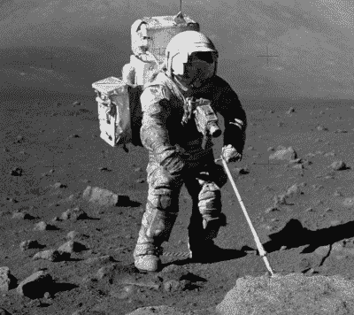
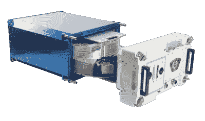
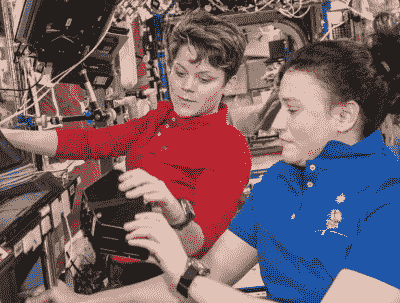
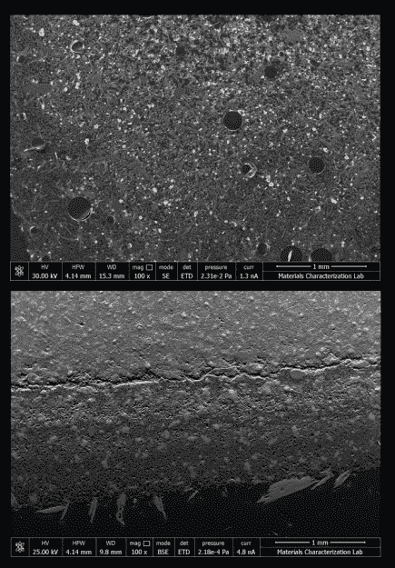

# 首次测试的外星水泥

> 原文：<https://hackaday.com/2019/09/30/off-world-cement-tested-for-the-first-time/>

如果美国现任政府如愿以偿，人类重返月球表面的时间将比许多人预期的要早得多。但是，即使美国宇航局不能满足白宫给他们的积极的时间表，在未来几十年内，月球表面将不可避免地出现新的脚印。在商业运营商和国际竞争之间，我们看到了一场新的太空竞赛的曙光，最终目标是我们最近的天体邻居的长期居住。

An Apollo astronaut covered in lunar dust

但即使有现代技术，也不会很容易，当然也不会便宜。虽然 SpaceX 等商业公司已经大幅降低了向月球运送有效载荷的成本，但我们仍然需要一切优势来确保月球前哨站的经济可行性。一种方法是就地资源利用，不是从地球上运输一切，而是尽可能使用当地来源的材料。这项技术不仅在月球上有用，而且许多人认为，如果我们有任何机会将人类送上火星，它将是绝对必要的。

这个概念最有趣的应用之一是从月壤中创造一种建筑材料。大致类似于地球上的土壤，风化层是由岩石颗粒和微流星体碎片组成的粉末状物质，含有硅、钙和铁。据信，这种类似混凝土的材料与水混合，或者在某些提议中与硫磺混合，可以像在地球上一样使用。用这种“月球混凝土”就地建造住宅比在地球上建造类似的结构并将其运输到月球表面更快、更便宜、更容易。

现在，由于最近在国际空间站上进行的研究，我们对第一批本地生产的混凝土在月球或火星上混合时会发生什么有了更好的了解。当然，像大多数与太空飞行有关的事情一样，事实证明比预期的要复杂一些。

## 形势的严重性

你可以把月壤混合成一种像混凝土一样坚硬的物质，这从来都不是问题。从化学上来说，这一切都被证实了，甚至有一些非常有前途的实验是用阿波罗任务中带回的样本做的。但是，尽管科学家可以很容易地将得到的混合物暴露在真空中，但没有办法研究它如何在低重力环境下固化。

Techshot’s MVP Centrifuge

除了去月球或火星实地试验，了解地球外混凝土在这些星球上表现的唯一方法就是模拟它们在太空中的重力。在地球表面，没有办法降低重力，但在太空中，你可以从实际上为零的地方开始。在轨道航天器上，可以将样品放入离心机中，并旋转以模拟它在月球上受到的大约 17%的地球引力，或者在火星上受到的 38%的地球引力。

这正是国际空间站上的宇航员在[水泥固化微重力研究(MICS)实验](https://www.nasa.gov/mission_pages/station/research/experiments/explorer/Investigation.html?#id=7658)中所做的。装满水合水泥混合物的袋子被放置在多用途可变 g 平台(MPV)上，这是一种商业拥有和操作的离心机，可以从 0.1 到 2G 运行。样品被旋转起来，暴露在相当于他们在月球和火星表面经历的人工重力下，而控制样品被留在国际空间站上正常的微重力环境下固化。

## 混凝土科学

不同重力强度对养护混凝土的影响可能不会立即显现出来。在地球上，这一过程似乎很简单:只要将它与一些水混合，让它静置，大约 24 小时后，你就会得到一个固体块。为了更好地理解这种情况，我们首先需要看看混凝土到底是什么，以及在固化过程中微观层面上发生了什么。

Astronauts load MICS samples into the MVP

首先，虽然在日常对话中有互换使用这两个术语的趋势，但混凝土和水泥不是一回事。混凝土实际上是将骨料(沙子、砾石等)与水泥混合的最终产物，水泥起到粘合剂的作用，将所有骨料粘合在一起。换个说法，没有混凝土可以有水泥，但是没有水泥就不能有混凝土。因此，MICS 实验期间进行的研究集中在水泥上，因为这是生产足够坚固的混凝土以实际建造结构的第一步。

在养护过程中，混凝土内部会发生两种不同的过程。骨料比水泥重，有慢慢沉向底部的趋势。与此同时，水泥正在结晶，将骨料“粘合”在适当的位置。在骨料沉降和水泥结晶之间取得平衡是生产坚固最终产品的关键，但由于这两个过程都严重依赖重力，在低 G 或零 G 下固化的混凝土强度一直是一个有争议的话题。

## 早期结果

来自宾夕法尼亚州立大学和美国宇航局马歇尔太空飞行中心的研究人员仍在分析返回的水泥样本，但到目前为止[他们已经做出了一些非常有趣的观察](https://www.nasa.gov/mission_pages/station/research/news/concrete-advantage-for-space-explorers-mics-iss)。几乎可以肯定的是，在做出任何明确的声明之前，还需要进行进一步的实验，但很明显，在第一批混凝土结构能够浇注到月球表面之前，我们还有很多东西要学。

Concrete cured in space (top) versus on Earth.

好消息是较低的重力导致沉降减少。如果没有地球的重力将较重的材料拉到混合物的底部，固化后的混凝土应该具有更均匀的密度，因此强度更大。这也意味着骨料与水泥的比例可能会增加，从而产生比地球上正常情况下更致密的混凝土。

不幸的是，这些样本还显示，太空固化水泥的晶体结构比地面水泥更加多孔。硬化的水泥包含空隙，这可能是由于混合物中的气泡在重力降低的情况下不太可能上升到表面。未来的实验可能会专注于减少水泥固化时残留在水泥中的气泡数量的方法，可能是通过机械振动或暴露在低真空中。虽然将水泥暴露在完全真空的太空中似乎可以解决这个问题，但之前的实验表明，这会导致混合物中的水升华；随着水的排出，固化过程停止，水泥永远不会硬化。

简单来说，太空混凝土的结构与传统混凝土几乎相反。在地球上，重力导致聚合体下沉到底部，而气泡上升到顶部。但是在失重状态下，所有东西都有悬浮的趋势。固化后，这种材料更加均匀，但密度比地球上的要小得多。这将如何影响混凝土的最终强度及其作为建筑材料的可用性还有待观察。在那之前，经济适用房仍将是在月球上生活的众多挑战之一。

 [https://www.youtube.com/embed/lsiyNZeUfUU?version=3&rel=1&showsearch=0&showinfo=1&iv_load_policy=1&fs=1&hl=en-US&autohide=2&wmode=transparent](https://www.youtube.com/embed/lsiyNZeUfUU?version=3&rel=1&showsearch=0&showinfo=1&iv_load_policy=1&fs=1&hl=en-US&autohide=2&wmode=transparent)

