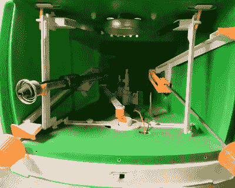

# 老式的机械乒乓仍然令人惊叹

> 原文：<https://hackaday.com/2022/03/23/old-school-mechanical-pong-still-amazes/>

YouTube 频道*的*的【汤姆】在一家旧货店发现了一个非常可爱的小机器人 *Pong* 。它来的时候是坏的，但是在你的十五分钟时间里，[汤姆]成功地完成了[的完全拆卸和修理](https://www.youtube.com/watch?v=-ypUG-09C4w)。(视频，嵌在下面。)

 这款游戏的工作原理是将一个灯泡平衡在一个枢轴臂的末端，这个枢轴臂将一个“球”投射到屏幕上，同时玩家上下移动他们的桨来击打围绕灯组件的弹簧。球臂被 DC 电机和凸轮组件周期性地踢动，这使得它在屏幕上来回疯狂地倾斜。

这是简单无集成电路工程的奇迹。具有讽刺意味的是，在当时，它可能比用硅制造更便宜，但从今天的经济角度来看，仅仅是调整配重的人工劳动就足以让“球”浮动超出预算。

为什么是屏幕和灯泡？因为它是[效仿*Pong*T3，一个视频游戏，新来的孩子。但即使在 45 年后，我们仍然认为它有自己独特的魅力，这是《T4》Pong 冰冷的数字逻辑所缺乏的，即使游戏性受到了影响。](https://hackaday.com/2018/06/05/ted-dabney-atari-and-the-video-game-revolution/)

 [https://www.youtube.com/embed/-ypUG-09C4w?version=3&rel=1&showsearch=0&showinfo=1&iv_load_policy=1&fs=1&hl=en-US&autohide=2&wmode=transparent](https://www.youtube.com/embed/-ypUG-09C4w?version=3&rel=1&showsearch=0&showinfo=1&iv_load_policy=1&fs=1&hl=en-US&autohide=2&wmode=transparent)

谢谢[Hari]的伟大提示！