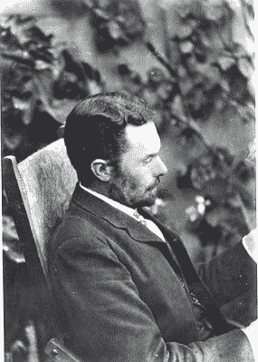
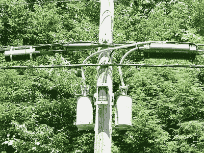

# 奥利弗·亥维赛:从无到有，再到疯狂

> 原文：<https://hackaday.com/2018/10/30/oliver-heaviside-rags-to-recognition-to-madness/>

像任何复杂的话题一样，电磁理论也有自己的词汇。谈到电介质时，我们可能会提到它们的*介电常数*，而关于磁路的讨论可能会发现诸如*磁阻*和*电感*这样的术语到处流传。在更实际的层面上，业余无线电爱好者可能会讨论用于向天线发送信号的*同轴电缆*的*阻抗*，这些信号将被*电离层*反弹，以进行远程通信。

这对我们大多数人来说都是日常用品，但如果没有奥利弗·亥维赛，这些词汇都不会存在。他是一位才华横溢但富有挑战性的自学成才的英国电气工程师和研究员。他创造了所有这些术语，并在他毕生探索电磁世界的奥秘的过程中创造了更多的术语，并为我们提供了电信的许多理论基础。

## 家族企业

One of the few photographs of Oliver Heaviside, circa 1900\. Source: [IEEE Engineering and Technology History Wiki](https://ethw.org/Oliver_Heaviside)

说奥利弗·亥维赛的早年生活不利于他，这可不是轻描淡写。他于 1850 年出生在查尔斯·狄更斯成长的伦敦街区，周围都是由贫困和工业化带来的社会变革所造就的同样的人物。奥利弗的父亲是一名出版业的木雕师，由于技术进步，他的职业变得无关紧要。Heaviside 的四个儿子遭受了由此造成的贫困，以及他们痛苦和沮丧的父亲给予的身体虐待。

奥利弗只上了几年学，在此期间他显示出了自己的潜力。家庭环境阻止他继续接受正规教育，到 16 岁时，他的学术生涯就结束了。但是这个家庭在经济上的不足可以通过联系来弥补。他母亲的姐姐嫁给了伟大的物理学家查尔斯·惠斯通，后者保护奥利弗和他的兄弟亚瑟，让他们在惠斯通的电报公司工作。

像他的正规教育一样，他对有酬职业的尝试将会成功，但却是短暂的。在电报行业工作期间，他确实发表了几篇关于电学测量的学术论文，包括对他叔叔著名的惠斯通电桥电路的改进。他的工作非常出色，赢得了著名科学家威廉·汤姆孙·开尔文勋爵的赞扬。但亥维赛的个性很难相处，这让他的经理和同事们很恼火，他患有一些模糊不清的疾病，如果他继续工作，这些疾病肯定会恶化。于是在 24 岁的时候，他放弃了自己的职位，去和父母一起生活。

## 装载生产线

亥维赛德再也不会被传统意义上的雇佣了，但他绝不是游手好闲。他开始了一段漫长而多产的独立研究时期，主要是在父母家中的一间空房里独自工作。他探索了传输线的问题，比如长期以来著名的“趋肤效应”，即高频交流电倾向于流向导体的外表面。亥维赛第一次能够从数学上解释趋肤效应。在同一时期，[他获得了第一根同轴电缆](https://cdn.shopify.com/s/files/1/0358/5537/files/HeavisideUKPatent1407.pdf?3837882249986977540)的专利，被描述为“两根绝缘导线……一根在另一根里面”，目的是减少电路之间的互感。

他的主要成就之一是简化了詹姆斯·克拉克·麦克斯韦在他关于电和磁的论文中阐述的当时著名但极其复杂的方程组。亥维赛对矢量术语中的方程进行了改造，产生了现在作为麦克斯韦方程教授的四个方程，并给了亥维赛继续他的电磁学探索所需的工具。

Loading coil pots can still be found in rural areas. These cans contain an 88 mH coil for each pair in the cable, and are spaced 6000′ apart. Source: [Cityinfrastructure.com](http://cityinfrastructure.com/single.php?d=RuralOutsidePlant&t=Rural%20Outside%20Plant)

19 世纪后期，随着通信行业从电报转向电话，需要描述发送器和接收器之间电路的新模型。奥利弗的哥哥阿瑟当时是一名工程师，从事电话线工作，试图攻克长途连接中的失真问题。亚瑟已经注意到，随着并行添加到传输线路上的电话数量的增加，线路上感觉到的失真减少了。他向他的兄弟奥利弗寻求解释。

奥利弗钻研电路理论来探索这个问题，并得出结论，减少失真的唯一可行的方法是增加传输线的电感。通过沿线路以精确的间隔串联增加精确值的电感，线路在音频中的频率响应将变得平坦，噪声降低。亚瑟·亥维赛德把他哥哥的发现提交给了他在英国邮局的上司，但是奥利弗提出的“装载线圈”没有被采纳，也许是因为他粗鲁的态度。

## 向上，向上，向上到天堂层

尽管被拒绝了，亥维赛德还是继续他的研究。他转而探索电磁辐射，并于 1902 年预言高层大气中存在一层能够反射无线电波的带电粒子。由美国电气工程师阿瑟·肯涅利独立预测，它被称为肯涅利-亥维赛层。物理学家对它的存在持怀疑态度，直到 1924 年被证实；我们现在知道这是电离层的 E 层，它使远距离无线电通信成为可能。

到世纪之交，亥维赛德的成就得到了广泛的认可，并于 1891 年获得了皇家学会的会员资格。他靠皇家学会的津贴继续他的研究，并最终成为法拉第奖章的第一个获得者。但他的晚年很艰难；他健康状况的恶化和日益增长的怪癖使他陷入了更深的孤立之中。他用花岗岩块代替了房子里的家具，在凌乱的状态下四处游荡，指甲涂成了亮粉色。1925 年 2 月，74 岁的他从梯子上摔下来死去。

奥利弗·亥维赛的生活一点也不平凡。他避开了大多数人寻求的友谊，取而代之的是对电磁世界本质的理解。他能够将缺乏正规数学训练的不利条件转化为一种资产，为每个人简化麦克斯韦的公式，并给自己一个框架来理解一个复杂而奇妙的世界。他为我们今天享有的通信网络奠定了许多理论基础，但却很少得到认可，也没有得到任何补偿，这令人难过，但这也许是他的故事可能结束的唯一方式。