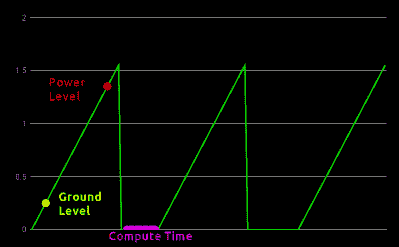

# 一根针统治所有人

> 原文：<https://hackaday.com/2019/04/01/one-pin-to-rule-them-all/>

当 Maxim 收购达拉斯半导体公司时，他们接管了广受欢迎的单线产品系列。这些传感器通过同一引脚获得电源和双向数据。然而，我们从来不喜欢 1 线这个名字，因为你真的需要两根线:一根用于电源和数据，当然还有一根接地线。一家新的创业公司 Cyclopia 宣布了他们最新的真正的单引脚 CPU 系列，我们印象深刻。低功耗片上系统器件在一根线上多路复用数据、电源、时钟和地。

公司发言人[Star Lipfir]指出，“我们正在申请专利的技术使用了两种众所周知的效果。首先，FET 栅极实际上并不吸收电流，而是依靠电荷工作。第二，电容储存电荷。”

 显然，外部系统通过在单线上发送间歇上升的斜坡电压来驱动 CPU。电荷进入接地存储电容器和电力电容器。当电压斜坡达到一定阈值时，FET 关闭，隔离接地存储电容。电力电容器继续充电，直到两个电容器之间有足够的电位差来操作电路(见右图)。斜坡然后变为零，这允许 CPU 或外部系统在下一个斜坡开始之前的时间内进行通信。

[Lipfir]继续说道，“重要的是，ramp 设置了时钟速度，通过一根线，您可以根据需要将任意多的 CPU 连接在一起。这确实简化了电路板布局，减少了传统的接地层问题。”当然，在同一行中添加太多处理器会增加编程的难度。

一位公司内部人士提到，为了向达拉斯的传统致敬，他们曾考虑将这些设备命名为“0-wire”然而，他们决定反对它，因为它会与该公司即将推出的真正的零线设备生产线相冲突，该生产线将于明年同一时间推出。