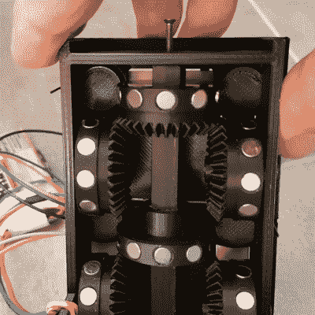

# 一个步进器加上一大堆磁铁等于一个独特的七段显示器

> 原文：<https://hackaday.com/2022/03/05/one-stepper-plus-a-whole-bunch-of-magnets-equals-a-unique-seven-segment-display/>

有时候简单的代价是额外的复杂。看似违反直觉，但似乎是真的。而[这个单电机机械七段显示器](https://www.thingiverse.com/thing:5202487)似乎就是这个悖论的完美例子。

 转念一想，【aeropic】的机制在机械上并不那么复杂，但确实有很多计划和独创性。正面有一个 3D 打印的边框，带有熟悉的分段剪切块，每个剪切块都配有一个旋转段，一侧为黑色，另一侧为白色。

挡板后面是一个带有三个轮子的垂直轴，每个水平段后面有一个轮子，以及一对水平轴，每个水平轴在每个垂直段后面有两个轮子。这三根轴通过底座上的一个步进器连在一起转动。每个轮的外圆周上嵌有十个磁铁，其极性可以将前面的部分翻转到当前数字的正确方向。大概是看了下面的视频最容易理解的东西了。

我们最近已经看到了不少这种机械七段显示器——想到了这个凸轮和伺服机构。当然，我们都喜欢它们，但[aeropic]显示器的伟大之处在于它是多么安静——踏步机基本上是无声的，当它们翻转时，片段只会发出轻轻的沉闷声。很满足。

 [https://www.youtube.com/embed/fM9fBpv1Tc0?version=3&rel=1&showsearch=0&showinfo=1&iv_load_policy=1&fs=1&hl=en-US&autohide=2&wmode=transparent](https://www.youtube.com/embed/fM9fBpv1Tc0?version=3&rel=1&showsearch=0&showinfo=1&iv_load_policy=1&fs=1&hl=en-US&autohide=2&wmode=transparent)

