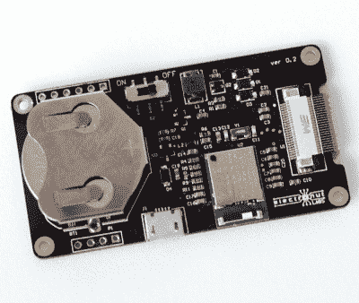

# 开放硬件 E-Ink 显示器只需要一个想法

> 原文：<https://hackaday.com/2019/05/12/open-hardware-e-ink-display-just-needs-an-idea/>

这需要一段时间，但多亏了像亚马逊 Kindle 这样的设备，电子墨水显示器的成本最终达到了像我们这样的普通人可以在我们的项目中实际使用它们的地步。现在我们只需要弄清楚如何恰当地利用它们。当然，你可以将电子墨水显示器连接到树莓 Pi 上开始，但要真正实现这项技术的潜力，你需要在设计硬件时考虑到它。

 为此，[【马赫什·文基塔查拉姆】创造了 Papyr](https://hackaday.io/project/165467-papyr-nrf52840-epaper-display) ，这是一款开放式硬件无线显示器，其设计理念就是电子墨水的能效。这意味着不仅要支持像 BLE 和 Zigbee 这样的低能耗通信协议，还要保持固件尽可能简洁。根据文档，最终结果是 Papyr 在其空闲状态下仅汲取 22 uA。

那么，你用这个节能的蓝牙电子墨水工具做什么呢？好吧，这取决于你。显而易见的应用是标牌，但除非你正在运营一个*特别是*组织良好的黑客空间，否则你可能不需要在你的零件箱上贴无线动态标签(不过如果你真的需要，请告诉我们)。更有可能的是，你会使用 Papyr 作为通用显示器，[显示传感器数据或你的 3D 打印机的状态](https://hackaday.com/2018/11/05/esp8266-monitor-keeps-an-eye-on-octoprint/)。

1.54 英寸 200×200 分辨率的电子墨水面板除了标准的灰度外，还能够显示红色，整个系统由北欧的 nRF52840 SoC 驱动。一切都是为你提供的，你可以自己组装，但是如果你想直接投入并进行实验，你可以在 Tindie 上花 39 美元购买组装版。