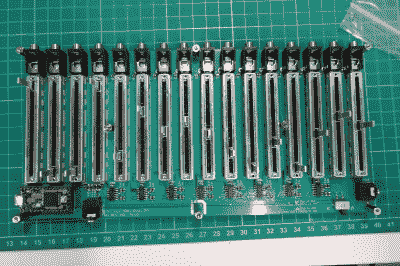

# 开源推子库调节我们的心

> 原文：<https://hackaday.com/2019/01/27/open-source-fader-bank-modulates-our-hearts/>

在 Hackaday，我们喜欢旋钮和按钮。那么还有什么比一个按钮更好的呢？16 怎么样！这里没有关于制造的真正本质的深刻哲学；[infovore]、[tehn]和[shellfritsch]组装了一个非常精巧、适应性非常强的 16 个模拟推子的[库，用于控制音乐合成。如果你不认识这些名字，提到[绿林]是](https://llllllll.co/t/16n-is-a-bank-of-faders-release-thread-current-version-1-32/18620)[单体](https://monome.org/)背后的人之一可能会有帮助，这是一家基于他们标志性的电网控制器的公司。单体现在生产各种精心制作的音乐创作工具。

多年来，我们已经写了一些关于单体网格控制器的许多克隆和 DIY 版本的文章，所以看到创作者自己发布开源硬件是令人兴奋的！

毫不含糊地命名为 16n 的是单体网格的足迹，在某种意义上，它并不是真正的*对*的某种特定的东西。网格是一种乐器，因为它可以连接到计算机(或模块化合成器等)，并用作另一种创造声音的工具的控制输入。同样，16n 的设计可以轻松集成到音乐创作流程中。它可以使用各种接口，如纯模拟的[控制电压](https://en.wikipedia.org/wiki/CV/gate)(每个衰减器有一个插孔)，或 i2c 连接到某些其他单体设备，如 [Ansible](https://monome.org/docs/modular/ansible/) 和 [Teletype](https://monome.org/docs/modular/teletype/) 。在引擎盖下，16n 实际上是一个小东西，所以它在 USB 上的 MIDI 和几乎任何你能想象的东西上都很流畅。

一切都有很好的文档记录，并且完全开源。这里有一个关于[一般提示的全面概述](https://16n-faderbank.github.io/)。来源和更多细节可以在回购中找到[(他们也建议提出改进的拉动请求)。比《来源》更好的是](https://github.com/16n-faderbank/16n)[这本非常友好的建造指南](https://github.com/16n-faderbank/16n/tree/master/build)，它指导你组装 PCBA，测试，并用螺栓将层叠式框架固定在一起。

 [https://www.youtube.com/embed/edriUxDgTsg?version=3&rel=1&showsearch=0&showinfo=1&iv_load_policy=1&fs=1&hl=en-US&autohide=2&wmode=transparent](https://www.youtube.com/embed/edriUxDgTsg?version=3&rel=1&showsearch=0&showinfo=1&iv_load_policy=1&fs=1&hl=en-US&autohide=2&wmode=transparent)

