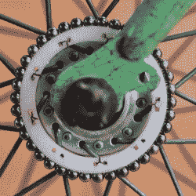

# OpenSCAD 处理磁性球体的 3D 打印支架中的数学运算

> 原文：<https://hackaday.com/2018/08/28/openscad-handles-the-math-in-3d-printed-holder-for-magnetic-spheres/>

3D printed holder mounted to bike wheel, fitting precisely 38 magnetic spheres around its perimeter. Tedious math? Not if you make OpenSCAD do it.

现成的组件很棒；如果没有，这个世界和我们的工作将会完全不同。但其中一个限制是，人们必须围绕它们进行设计，这就是为什么[Antonio Ospite]在 OpenSCAD 中为[一个 3D 打印支架创建了一个参数化设计，该支架可以紧贴其直径周围的许多磁性球体](https://ao2.it/en/blog/2018/08/13/3d-printed-holder-magnetic-spheres-built-openscad)。

如果这听起来有点深奥，在[Antonio]的早期工作[中，用一圈磁性球体](https://hackaday.com/2018/06/05/magnetic-spheres-line-up-for-rotary-encoder-duty/)制作 DIY 旋转编码器，这将变得更加清晰。他发现，在两个霍尔效应传感器前面的这样一个环成本低，精度高，并且由于 3D 打印，它也有很大的定制潜力。但是阻碍简单设计变化的是球体需要紧贴硬件的任何形状，这意味着对编码器直径的限制。

在这种情况下，[Antonio]希望创建一个可以连接到自行车车轮上的编码器，但需要知道哪种外径最适合一圈磁球，因为每个磁球都是 5 毫米。OpenSCAD 做到了这一点，产生了一个适合自行车车轮和辐条的设计，同时在外侧边缘完美地放置了 38 个磁球，浪费的空间最小。

OpenSCAD 是一个 CAD 程序，它更像是一种编程语言。对于那些不熟悉它的人，[Brian Benchoff]讲述了如何在 OpenSCAD 中制作一个简单的对象，和[Elliot]对一些高级功能大加赞赏。既然这个项目让 DIY 编码器变得更容易，也许它们可以用来[给 OpenSCAD](https://hackaday.com/2017/11/01/add-intuitiveness-to-openscad-with-encoders/) 本身添加直观的新控件。