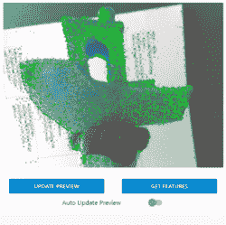

# OpenScan 3D 扫描所有(小)东西

> 原文：<https://hackaday.com/2020/04/25/openscan-3d-scans-all-of-the-small-things/>

OpenScan 项目从一开始就已经更新了很多。OpenScan 是一款基于 Arduino 或 Raspberry Pi 的开源 3D 扫描仪，用于小型物体，使用 3D 打印硬件和一些常见的电子组件，通过摄影测量创建 3D 扫描；使用来自不同角度的一系列静止图像来创建对象的 3D 点云的过程，该点云随后可用于生成 3D 模型。

Feature visualization overlays detected features onto the camera preview to help judge quality. Broadly speaking, green is good.

摄影测量是一个有点复杂的过程，它依赖于一致的条件，所以经历整个过程却发现结果不符合标准是令人厌倦的。令人高兴的是，OpenScan 提供了一些有趣的新功能，如通过 web 界面的功能可视化，这可以帮助用户判断扫描质量并做出更改以优化结果，而不必盲目地交叉手指。OpenScan 仍然是[Thomas]的一个人项目，他显然有动力改进他的设计，我们很高兴看到它得到更新。

下面嵌入了一段视频，介绍了安装和 web 界面。这是一个相当长且全面的视频，但是如果你喜欢的话，你可以[直接跳到【托马斯】演示 8:22 分左右的界面](https://youtu.be/n93kPM1O9jQ?t=499)，或者观看下面的视频。对自己的单位感兴趣？[Thomas]在[有一个零件网店](https://en.openscan.eu/shop)，在[GitHub 仓库就在这里；](https://github.com/OpenScanEu/OpenScan)项目也[有自己的子编辑](https://www.reddit.com/r/OpenScan/)。

 [https://www.youtube.com/embed/n93kPM1O9jQ?version=3&rel=1&showsearch=0&showinfo=1&iv_load_policy=1&fs=1&hl=en-US&autohide=2&wmode=transparent](https://www.youtube.com/embed/n93kPM1O9jQ?version=3&rel=1&showsearch=0&showinfo=1&iv_load_policy=1&fs=1&hl=en-US&autohide=2&wmode=transparent)

摄影测量不限于小物体。我们在过去已经看到了一些很好的应用程序，其中缺少了一个环节，那就是[建模一个定制的控制面板](https://hackaday.com/2019/12/26/custom-control-panels-with-photogrammetry/)并对一个定制的人体工程学轨迹球进行 [3d 扫描。](https://hackaday.com/2017/05/24/only-90s-kids-will-appreciate-this-prototype/)