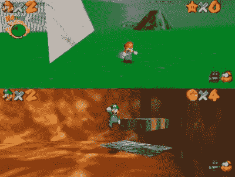

# 优化的超级马里奥 64 提供了令人兴奋的可能性

> 原文：<https://hackaday.com/2022/04/21/optimized-super-mario-64-offers-exciting-possibilities/>

当从事任何软件项目时，开发人员必须在按时发布和优化之间取得平衡。只要你能达到你期望的时间限制，为什么不早点发货呢？众所周知，1996 年任天堂 64 游戏机备受期待的新游戏《超级马里奥 64》(Super Mario 64，T1)为了按时上市，进行了大量优化。本着这种精神，[Kaze Emanuar]一直在探索代码的深度，重构和调整，直到他有了一个具有[重大性能增益](https://www.youtube.com/watch?v=t_rzYnXEQlE)的版本。

为什么有人会花时间去改进一个只能在 20 多年前发布的硬件上运行的旧游戏的代码呢？这个游戏有一个健康的修改社区，人们正在创造的许多新的关卡比原来的游戏能处理的更有野心。但是随着[Kaze]一直致力于的性能改进，你在更大更复杂层次上的预算突然变得重要得多。此外，有传言称该游戏最初计划采用多人模式，但当任天堂发现渲染两个摄像头时的帧速率达不到标准时，不得不取消该功能。通过这些优化，游戏现在可以轻松应对两个玩家。

Luigi has been waiting 26 years for his chance to shine.

[Kaze]有一个提高性能的多步骤计划，包括 RAM 对齐、编译器优化、渲染改进、物理优化，以及总体上减少“抖动”公平地说，任天堂的开发人员当时正在开发全新的硬件，并拓展家用游戏机的功能。建模软件、工具链、编译器和其他支持基础设施在过去的 20 多年里有了很大的改进。一路走来，我们学会了许多当时并不常见的渲染技巧。

[Kaze]工作的中心主题是优化 Rambus 的使用。因为 RCP 和 CPU 必须共享它，所以目标是尽可能减少争用。这意味着布置项目以提高缓存能力，并要求编译器生成更小的代码而不是更快的代码(这里没有循环展开)。此外，可以将某些数据结构放入特定的只写或只读内存区域，以改善资源争用。逻辑错误被修复，渲染技术得到改善。最初的结果令人印象深刻，虽然他还没有完成，但我们非常期待最终的产品。

随着任天堂 64 [即将成为主流支持的 Linux 平台](https://hackaday.com/2021/01/01/a-fresh-linux-for-the-most-unexpected-platform-the-nintendo-64/)，这款老游戏机如今肯定受到了很多人的喜爱。

 [https://www.youtube.com/embed/t_rzYnXEQlE?version=3&rel=1&showsearch=0&showinfo=1&iv_load_policy=1&fs=1&hl=en-US&autohide=2&wmode=transparent](https://www.youtube.com/embed/t_rzYnXEQlE?version=3&rel=1&showsearch=0&showinfo=1&iv_load_policy=1&fs=1&hl=en-US&autohide=2&wmode=transparent)

