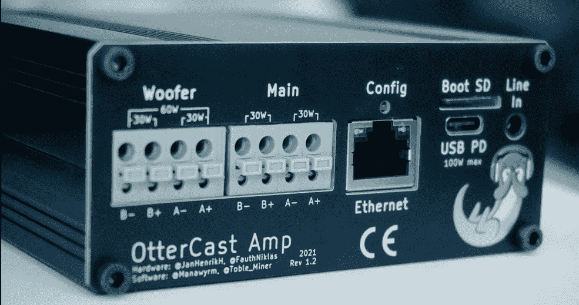
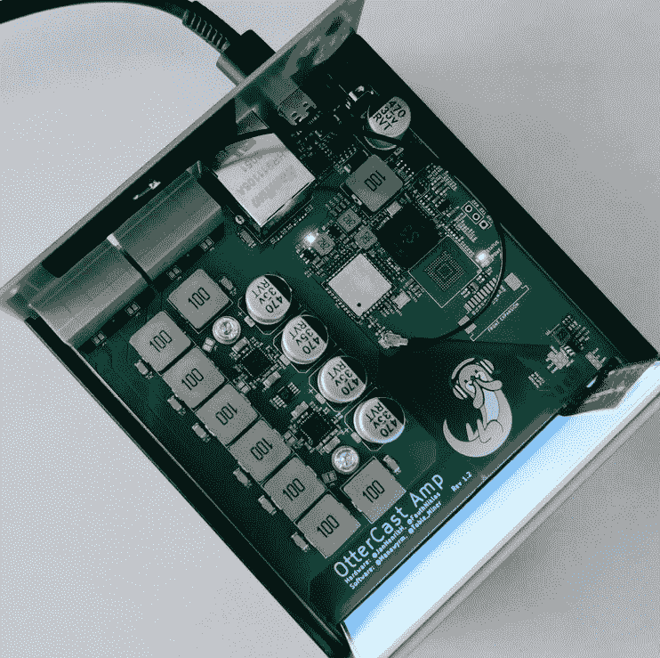

# 水獭提供高功率固定音频体验

> 原文：<https://hackaday.com/2021/05/12/otters-deliver-a-high-power-stationary-audio-experience/>

我们最喜欢的一群水獭又回来了，他们再次展示了开源音频技术，为我们带来了开源音频多功能工具 OtterCast 家族的最新成员 otter cast。如果你看了该系列的前一款产品——[OtterCastAudio](https://hackaday.com/2021/04/06/you-otter-be-able-to-stream-that-audio-open-hardware-eclipses-chromecast-audio/)——并认为它很好，但在像素数量或输出功率方面有所欠缺，那么这就是你要的设备。

放大器基本上是一个非常相似的设备。它共享同一个 Allwinner S3 Cortex-A 应用处理器，运行同一个用 Buildroot 组装的[嵌入式 Linux 版本。反过来，它提供了相同的功能和](https://github.com/Ottercast/buildroot-ottercast-audio)[音频协议支持](https://cast.otter.jetzt/docs/supported-protocols/)。它可以被 Snapcast、Spotify Connect 或 AirPlay 作为目标，如果这些是你选择的工具，或者作为一个通用的 PulseAudio 接收器来满足你的 Linux 音频需求。仍然有一个单独的线路，所以它源音频以及。

一看机箱，很明显，与 OtterCastAudio 不同，这是*而不是*简单的 Chromecast 音频替代品。OtterCastAmp 的正面饰有一个 340×800 的 LCD，让您的耳朵可以欣赏到所有的封面艺术。背面的大量连接器(以及 PCBA 上堆积如山的电感)表明，这是一款成熟的 D 类放大器，在四个通道上驱动高达 120W 的功率。虽然它可能在各种输出上驱动理论上 30W 或 60W 的峰值，最大电源功率为 100W(自然是通过 USB-C 供电)，但真正的最大输出会稍微低一点。除此之外，还有一个以太网插孔和一些设计精美的铜制印刷电路板，让你从里到外都可以尽情享受。

像以前一样，看起来这种设计非常接近黄金时间，但还没有完全到位，所以您需要自担风险。完整的 fab 文件和一些提示链接在[上面提到的 repo】中。如果家庭制造有点多，看起来可能很快就会有这些设备的小规模生产。](https://github.com/Ottercast/OtterCastAmp)