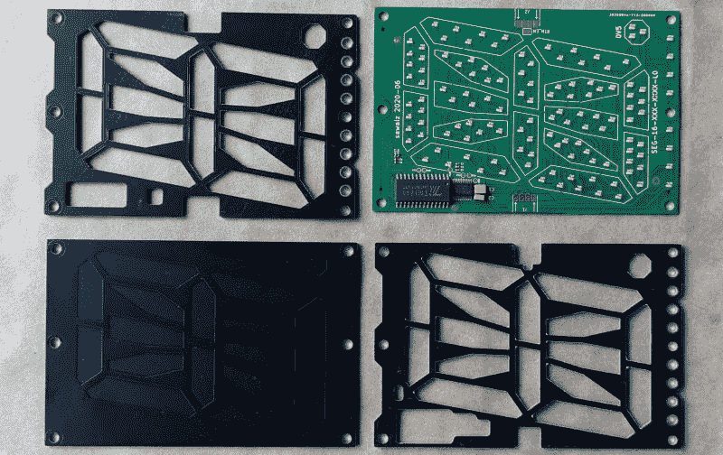

# 手掌大小的十六段照亮了通往我们心灵的路

> 原文：<https://hackaday.com/2020/08/20/palm-sized-sixteen-segments-light-the-way-to-our-hearts/>

众所周知，我们在 Hackaday 喜欢酷的展示。发光二极管，有机发光二极管，白炽灯，谢妮或霓虹灯，你能想到的，我们都想看到它闪光。因此，发现一种新的方法来构建大的、菊花链状的 16 段数字(T1)让我们充满了喜悦，更兴奋的是了解到它们是多么容易制造和组装。

作为我们熟悉的 7 段显示器的近亲，16 段显示器为数字显示提供了更多的可能性(确切地说是 128%的可能性)。具体来说，这些额外的段释放了显示大写和小写拉丁字符以及大量标点符号的能力。

但是在字符集很复杂的地方，组装是绝对不行的，这要归功于[Kolibri]一个叫做 klais-16 的伟大设计。如果你想直接跳到代码，它们是完全组装好的，但是多亏了完整的文档(说真的，[看看这个](https://github.com/openKolibri/klais-16/blob/master/readme.md))组装很容易。

每个模块都由一个非常无聊的 PCBA 基层组成，即使订购一个完全组装好的也不贵。如果最终出现更大规模的生产，三个以上 PCB 的堆叠用于间隔和扩散，计划用于模切或注塑层。每个字符的棋盘尺寸为 100 毫米 x 66.66 毫米(约 4 英寸 x 2.5 英寸)。放在一起，每个模块可以独立存在，也可以很容易地用菊花链连接在一起，形成一个更长的单一显示器。

用一个复杂、丑陋的控制方案来处理所有这些位会很麻烦，但幸运的是，板载 STM8 微控制器的固件提供了一个很好的串行接口，无需配置就可以使用它来显示字符串。甚至还有一个[示例 Windows 批处理脚本](https://github.com/openKolibri/klais-16/blob/master/docs/userGuide.md#windows-batch-file)！