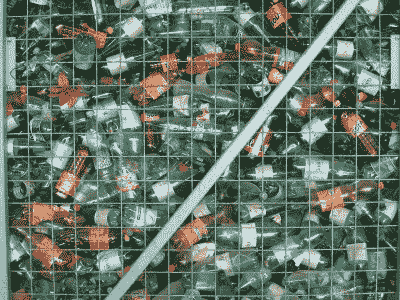
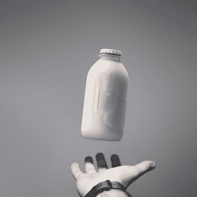

# 装碳酸饮料的“纸”瓶(和瓶装火箭)

> 原文：<https://hackaday.com/2021/04/23/paper-bottles-for-your-fizzy-drinks-and-bottle-rockets/>

一个几乎没人注意到的故事是，可口可乐公司计划进行一次有限的纸瓶子试验。等等，纸做的加压饮料？目前的化身仍然使用塑料衬里和盖子，但未来的发展将集中在“生物基屏障”和生物复合材料或纸盖拴在容器上。

鉴于塑料污染现在是一个主要的全球问题，这是一个有趣的消息，因为塑料饮料瓶对这个问题做出了重大贡献。但它提出了几个问题，首先，为什么我们似乎无法首先回收瓶子，鉴于我们几十年来一直用纸质容器接收牛奶和果汁，为什么汽水行业花了这么长时间？

塑料软饮料瓶由聚对苯二甲酸乙二醇酯或 PET 制成，这种聚酯聚合物与用于涤纶或涤纶织物的聚合物相同。它们是吹塑成型的，也就是说，一个注射成型的预成型品类似于一个带有螺旋盖配件的塑料试管，通过压缩气体从模具内部膨胀。任何试验过瓶子火箭的人都会告诉你，它们非常坚固，而且制造和运输成本低廉，当它们从瓶盖上分离时，也很容易回收。

## 完美的产品被证明是不完美的

Used plastic bottles collected for recycling. That’s a lot of space for not a lot of plastic. Radulf del Maresme, [CC BY-SA 4.0](https://commons.wikimedia.org/wiki/File:Plastic_bottles_for_recycling.jpg)

那么，如果塑料瓶是如此方便的产品，为什么我们似乎不善于回收它们呢？问题在于它们的低密度，在一个典型的饮料瓶里几乎没有塑料，即使被压碎也会占据相当大的空间。处理它们需要大量的基础设施，因此在许多情况下，它们要么作为垃圾被丢弃，要么进入常规的垃圾流。在德国，他们采取了不同的方法来解决回收问题，对每个瓶子都进行押金，然后重复使用，因此德国的塑料瓶比其他地方使用的要厚得多。然而，这既需要政治意愿来强制执行，也需要全国性的瓶子处理行业来为其服务，这是很少有国家愿意接受的。

PET 瓶有一个问题，但这不是他们的玻璃等价物共有的，它们是气体可渗透的。我很小的时候就知道了这一点，当我用塑料瓶做了一批苹果酒，几个月后它变成了醋，因为少量的空气能够穿过塑料。如果你把碳酸饮料放在瓶子里足够长的时间，它最终会失去气泡，所以他们的塑料厚度有一个下限，不适用于利乐包装的短保质期产品，如牛奶或果汁。因此，无论这家软饮料巨头拿出什么样的纸瓶，都必须足够气密以保存气泡，并且足够坚固以承受运输和饮料中的二氧化碳压力。

## 有塑料衬里的纸

 他们正在评估的瓶子来自一家丹麦公司，[帕布科](https://www.paboco.com/theproject)。他们承诺可持续的聚合物防潮层和足够坚固的木浆瓶壳，足以承受撞击，我们怀疑“*移动连接让消费者了解并确保来世*”可能是一个与瓶子精神世界联系的二维码。

目前这只是公司的一个承诺。目前修订的容器技术使用了“初步塑料屏障膜”。鉴于现有的纸质纸箱由于其不可分割的复合材料性质而可能带来重大的回收挑战，我们希望一个回收问题不会简单地被另一个问题取代。

然而，我们的计划是进一步开发这项技术，并取代塑料屏障:

> 第一代概念将是部分可再生和完全可回收的，但这是下一代和后续的纸瓶障碍，将创造一个真正可持续的替代品。

我们期待着第一批纸瓶出现在零售货架上，这样我们就可以亲眼看看了。