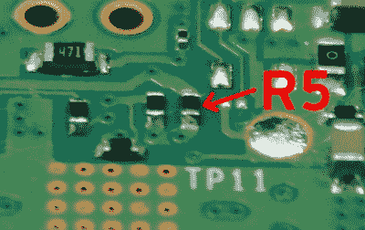

# Pi 4 上的 PCB Mods 静音电压警告

> 原文：<https://hackaday.com/2021/02/12/pcb-mods-silence-voltage-warnings-on-the-pi-4/>

如果你曾经把指针放在你的树莓派上一点，那么你很有可能被可怕的闪电图标拜访过。当它出现在屏幕的角落时，这是一个警告，表明输入电压正在下降到危险区域。如果你经常看到这个符号，通常的建议是获得更高容量的电源。但有经验的 Pi 鼓吹者会知道，董事会仍可能不稳定。

厌倦了在 MAME 会议上看到这个图标，[Majenko]决定通过仔细查看 Pi 4 的电源电路来直接解决这个问题。虽然每个人最喜欢的单板计算机的官方原理图不幸不完整，但他仍然能够找出一些让他感到有点奇怪的组件。虽然我们不一定建议你冲出去对你自己的董事会做同样的修改，但早期的结果肯定是有希望的。

Majenko 发现的第一个潜在的罪魁祸首是 5 V 线路上的 10 欧姆电阻。他认为这部分对系统电压的影响会比一根不可靠的 USB 电缆更大。这些元件没有贴在 Pi 的印刷电路板上，但是用万用表轻轻一拨，他就能找到 0402 元件，并用一根小电线代替它。他给 Pi 加电，运行了几个游戏来测试修复情况，虽然他收到的低电压警告肯定少了*个，但仍有偶尔的停电。*

Do we *really* need this part?

回到原理图，他注意到在与电阻相同的线路上有一个 10 uF 电容。如果他提高了一点呢？USB 规范说这是下游设备的最大电容负载，但他认为这只是那些试图从计算机的 USB 端口给 Pi 供电的人的问题。

将一个 470 uF 的电解电容器安装到现有的 SMD 部件上可能看起来有点滑稽，但安装后，[Majenko]报告说没有出现过一次低电压警告。他想知道增加更大的电容是否会使移除电阻变得不必要，但由于他不想破坏好东西，这一决定将留给读者作为练习。

众所周知，树莓 Pi 4 自发布以来就一直受到电源问题的困扰，但去年发布的一个更新的[版本](https://hackaday.com/2020/02/23/raspberry-pi-slips-out-new-pcb-version-with-usb-c-power-fix/)帮助解决了一些问题。虽然大多数人不会为了解决偶尔出现的边缘情况而走这么远，但知道人们正在尝试潜在的修复和改进还是很好的。