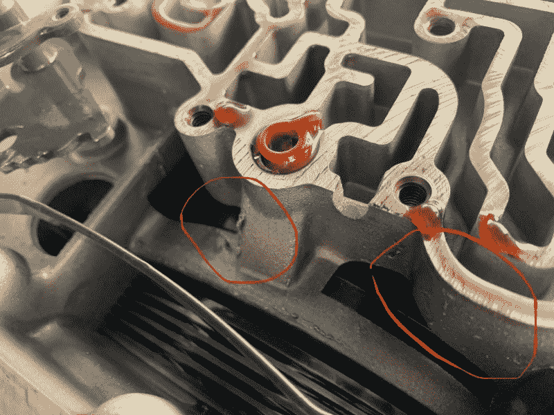
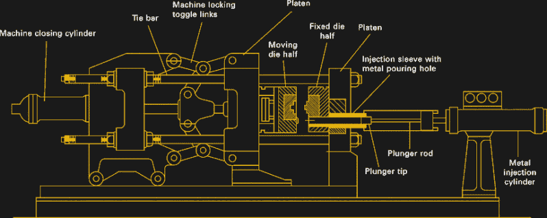
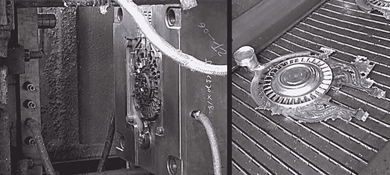
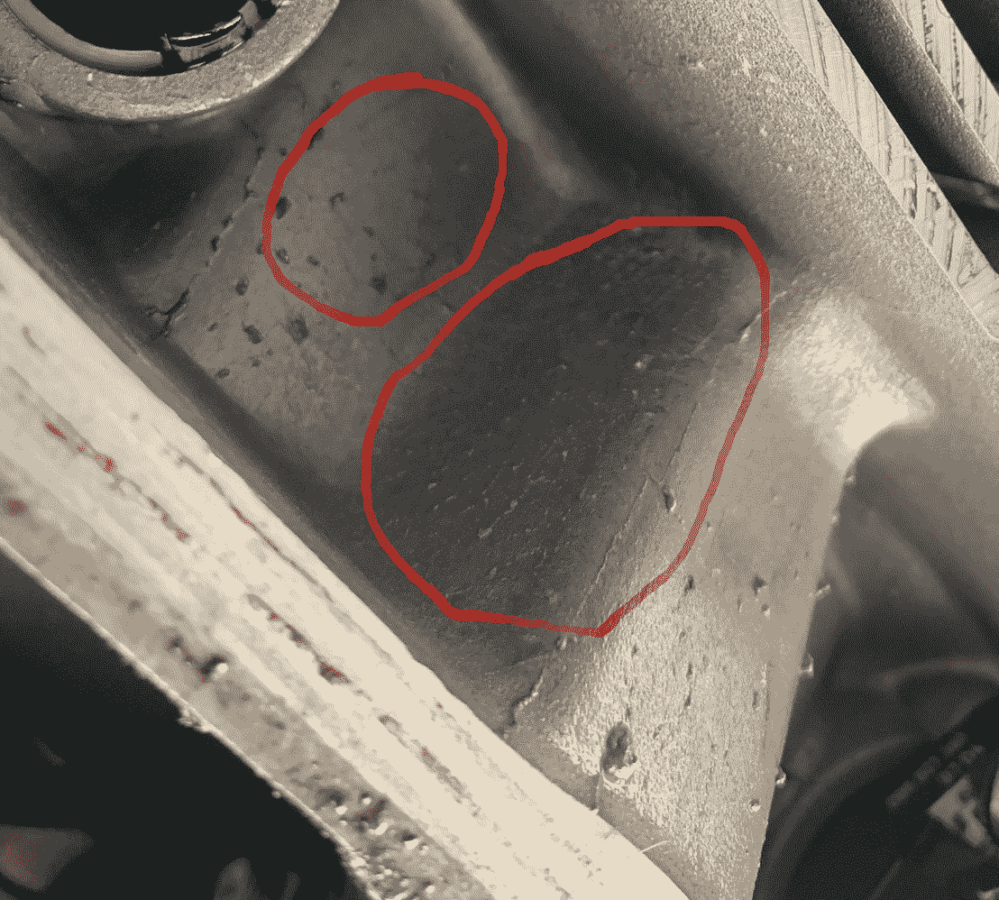
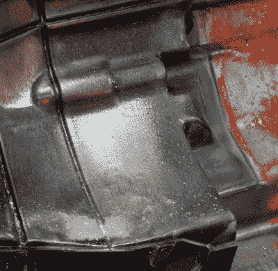

# 窥视大众变速箱内部揭示压铸真相

> 原文：<https://hackaday.com/2020/12/14/peeking-inside-a-vw-gearbox-reveals-die-casting-truths/>

最近，有人以很低很低的免费价格向我提供了一辆 1997 年的大众高尔夫——假设我能拖走它，因为它的自动变速器彻底坏掉了。我无法拒绝这样一个机会，于是我开始拖着这辆可怜的敞篷车回家，并立即检查机器，看看出了什么问题。

唉，到目前为止，我还没有从沃尔夫斯堡复活这头野兽，但是当我在变速器液中浸到手腕深处时，我发现了一些吸引我眼球的东西。一起来看看变速器制造的本质吧！

### 肿块和肿块

Lumps and bumps in the inside of the 01M transmission housing. The largest lump measures approximately 3mm wide by 2mm high.

随着传输潘下降和过滤器删除，我有一个清晰的内部传输的情况。作为一名前铸造工程师，成品中的某些元素让我印象深刻。外壳的各个部分都有小凸起和突起——在原本平坦的表面或光滑的圆边上有矮胖的丘疹。这些与表面上一系列细微的裂纹状图案相匹配。这些缺陷是模具表面缺陷的证据，表明模具在本应光滑的地方出现了凹痕和裂纹。

受影响的区域不是机械加工部分，只是作为一个流体容器。因此，异常对传输性能没有实际影响。然而，它们的存在确实能告诉我们一些大众生产铸件所用的工具的状况。刚从模具制造厂出来的全新模具通常不会产生表面有明显裂纹、凹坑和肿块的零件。我的 1997 年高尔夫中 01M 变速器外壳的粗糙本质证明了大众汽车正在将其铸造模具投入成千上万的镜头，甚至可能达到六位数。鉴于这些特征的本质，它们是由模具的固有物理条件决定的，它们不是单一铸件的一次性缺陷。相反，生产线工程师和操作员会意识到模具正在老化和磨损。鉴于缺陷发生在非关键位置，可能会有意识地决定忽略缺陷并运送零件，因为一般司机不太可能注意到这些缺陷，他们不会在周末拆卸变速器来消磨时间。可视区域或功能区域中的类似缺陷可能会被“修补”，即由操作员或机器磨掉令人不快的突起。

鉴于缺陷不会对变速器造成功能障碍，人们可以理解为了保持低成本而放弃零件的决定。然而，为了理解缺陷是如何发生的，让我们来上一堂高压铝压铸的速成课。

### 高压压铸入门

A diagram of the basic parts of a high-pressure die casting machine.

现代变速箱通常采用高压铝压铸工艺制造。这个过程包括巨大的金属模具，称为模具，分为两半并压在一起，在两者之间形成一个空腔。通常，然后应用真空将空气从模腔中吸出，以减少气体滞留。接下来，熔化的铝被倒入一个圆筒中，一个活塞被用来在非常高的压力下将铝注入模腔。每次活塞将熔化的铝注入模具，这被称为*注射。*

Aluminum die casting process [demonstrated on the assembly line (video)](https://www.youtube.com/watch?v=N6ODcxK8_lg). Note the large amounts of flash at the parting line on the final casting.

通过在高压下注射熔融金属，它减少了铝冷却时收缩引起的问题。这种收缩会在最终产品中造成孔隙，称为*缩松*。保持高压力可确保模具中充满尽可能多的铝，并减少最终零件的收缩量。为了抵抗注射的高压，模具的两半用一种特殊的锁定机构固定在一起，这种锁定机构应该保持模具关闭，并防止金属在两者相遇的接缝周围泄漏。当然，如果模具没有完全平整或对齐，有时金属会在接缝周围溢出，这被称为*飞边*，这是你可能会在成品零件上看到一条小分模线的地方。在极端情况下，一些闪光完全逃脱了模具，这是非常可怕的第一次发生在你的转变。通常，当你被刺痛的金属吓了一跳时，线路操作员会开怀大笑。

### 开枪，开枪，开枪，开枪！

同样，我们跟踪行驶的英里数，作为对汽车磨损的估计，压铸机跟踪射出的数量。填充活塞、将铝注入模具以及移除零件的每个循环都会磨损机器和模具本身。模具重数吨，由高强度工具钢制成。生产一个模具可能要花费几十万美元，因此必须通过生产几万个零件来收回成本。工程师们努力工作，以确保模具尽可能长时间使用，从而实现经济高效的铸造操作。

在定期维护和修理的情况下，典型的模具可以持续超过 100，000 次注射。但是随着时间的推移，磨损会变得太多，必须更换模具。模具有许多方法不能生产出高质量的零件；完整的运行将填满一本厚厚的教科书，并且超出了本文的范围。相反，让我们看看我们在大众 01M 铸件上发现的裂纹、线条和凸起的原因。

Note the fine lines on the casting that reveal cracking in the die surface, typical of heat check.

模具表面的裂纹和零件表面的缺陷通常被称为*热裂*。当热的液态金属注入模具时，它会先碰到模具的某些表面。模具的这些区域比它们的周围环境更热，并且随着每次注射熔融铝而经历更大的热膨胀和收缩。随着时间的推移，这些循环会导致破裂和损坏。起因是热，故名。通过抛光模具的开裂表面，或通过将新鲜金属焊接到模具上并研磨回原始轮廓，可以进行修复。然而，这样的修复并不能解决根本原因，随着拍摄的进一步深入，热检查将会再次发生。

Heat check as it appears on a casting die. The die is made of special tool steel to withstand the immense temperatures and pressures of the casting process.

模具的点蚀往往是由气蚀引起的。当热金属高速流入模具时，会形成微小的气泡或真空袋，然后破裂。由于流体流过模腔的性质，这种情况会发生在特定区域。通常，它位于流动方向改变或遇到障碍的区域，低压区域被高压液态金属包围。随着低压气泡周围压力的增加，它最终会崩溃。破裂的气泡会产生强烈的冲击波和局部高温，损坏模具表面。这从微观层面开始，但随着时间的推移，随着模具上的击球次数增加，损坏会增加，凹坑会变得更深。与热检查类似，可以通过焊接新鲜金属来填充凹陷区域，从而修复损坏。但是，如果不重新设计模具几何形状来减少气穴问题，这不是一个永久的解决方案，损害将再次发生。

在我们完成的变速器外壳上明显的模具损坏是可以理解的。在 20 世纪 90 年代和 21 世纪初，01M 变速器被用于大量大众汽车，最终用于数十万辆汽车，如果不是数百万辆汽车的话。多年来，大众可能有多台铸造机器昼夜不停地运转，手头有许多模具来生产必要的零件。在这样高的生产水平下，有些磨损是可以预料的。鉴于发现的异常位于非功能性位置，工程师将清理零件，使其流向生产线，同时监控模具的状况，以发现进一步的问题。

希望这篇文章已经教了你一些关于高压压铸件是如何制造的知识，并能让你下次在垃圾场向你的朋友炫耀。对于那些对过程控制、流体力学和制造效率感兴趣的人来说，压铸可能是一个有趣的工作领域。全世界都喜欢铝制零件，所以你所学到的技能将会对你的未来大有裨益！