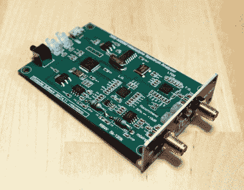
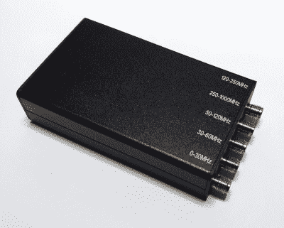

# 也许是时候谈论所有那些赝品和克隆品了

> 原文：<https://hackaday.com/2022/12/05/perhaps-its-time-to-talk-about-all-those-fakes-and-clones/>

前阵子，我通过全球速卖通买了一个便宜的频谱分析仪。在我所处的时代，频谱分析仪是一种内置阴极射线管显示器的极其昂贵的物品，所以花几十美元买一台频谱分析仪仍然有一种小小的兴奋感，即使对所有人来说都很明显，技术的进步已经使以前无法实现的东西变得触手可及。我的全球速卖通频谱分析仪是首次出现在德国业余无线电杂志上的一个设计的克隆，在我当时的评论中，我发现它值这个小钱，但是与它更贵的同类产品相比有点聋和宽。

## 当交易依赖于别人时

My cheap spectrum analyser in all its glory.

作为我调查的一部分，我提出了软件的问题，并发现它所依赖的 NWT4 包是一个人的作品。他在自己的网站上提供免费的啤酒，这在为德国业余无线电爱好者服务时是没问题的，但当他被期望为成千上万来自中国的商业大规模生产的廉价乐器的买家提供免费的个人技术支持时，就成了一个严重的问题。我不能怪他在那种情况下把它拿下来，你也不应该。

这是我最近发现的一种重复模式，当我定期寻找新的廉价产品时，发现了一个 SDR 板。这是一个范围从 0 到 1000 MHz 的 USB 外设，当它到达时，很明显它是一个商业生产的 SDR 的克隆。

## 克隆人战争

SDRplay RSP1 是一种高质量的接收器，其最新修订版的价格约为 100 美元。我买的廉价克隆有廉价的滤波器组件，并有一系列的输入插座，因为它缺乏不同频段的射频输入开关芯片。它没有标记，但进一步的搜索将发现带有 RSP1 标记的例子，这些例子肯定跨越了从“克隆”到“假冒”的界限。

This is not an SDRplay RSP1.

你可能已经猜到了，让我的 SDR 工作的最简单的方法是使用 SDRplay 的软件和 RSP1 的驱动程序。它们很容易获得，因为它们可供 RSP1 所有者使用，但它们显然不是免费的，当然也没有被授权与真正的 SDRplay 板一起使用。

这和[DL4JAL]的频谱分析仪软件是一样的；一个商业化的大规模生产的克隆板依赖于软件支持，而软件支持的发起者可能会有些头疼，并且会失去他们投入所有努力开发的项目的销售。其他的例子，如 Saleae logic analyser 克隆，使其成为一个值得进一步研究的主题，所以我联系了 SDRPlay 和[DL4JAL]了解他们的经验。这两家公司中，SDRplay 做出了回应，我与他们的营销总监乔恩·哈德森(Jon Hudson)进行了交谈。

一方面，SDRplay 不想公开伪造品和克隆品是可以理解的，这显然已经成为他们的一大烦恼。直接的假货明显侵犯了他们的商标，而克隆产品破坏了将正品推向市场的重大研发投资。使用克隆或假冒的软件驱动程序显然违反了许可证。我问他们是否会考虑将驱动程序本身作为一种产品来销售，可以理解的是，他们的回答是，他们不想以这种方式认可关闭和假冒，他们也不希望卷入对不是他们自己制造的劣质硬件的支持。

## 负责任地享受你便宜的东西

The NanoVNA isn’t a clone, it’s based on [an open source project](https://github.com/ttrftech/NanoVNA).

我们都喜欢便宜的仪器，不管它们是逻辑分析仪、SDR、频谱分析仪还是其他什么。有时这些廉价的产品是基于开源项目的，比如我们不久前看到的 [NanoVNA 矢量网络分析仪](https://hackaday.com/2020/04/23/so-you-bought-a-vna-now-what/)，但重要的是要意识到，它们往往是商业产品的克隆，而这些商业产品经过了大量的研究和开发。

可能有一些开源爱好者会回应说，无论如何，所有这些东西都应该是开源硬件，而且这些设备已经被克隆人以某种方式“释放”了。在某种程度上，我们同意 Hackaday 的整个存在依赖于开放的硬件，这将是一个乌托邦式的环境，我们可以在 GitHub 上找到我们选择的任何设备，并以适度的支出开发我们自己的版本。

但是，尽管有许多精彩的开源硬件项目，但有前途的商业项目不被扼杀是非常必要的，因为没有它们，我们就不会有这么多我们依赖的设备。最终，选择取决于设备的生产商，对吗？愤世嫉俗的人可能会问，为什么有人要求小生产商开源他们的设备，而不同时追求更大的生产商。当你站在安捷伦科技公司外面举着标语牌要求他们开源他们的“示波器”时，给我回电话！

既然我们都喜欢看到新产品上市，那么作为消费者，我们就应该质疑廉价新设备的来源，如果它们是克隆品或假货，就考虑购买真品。根据我的克隆 SDR 被虚假峰值困扰的判断，我认为真的会是一个好得多的产品。

(如果你想知道的话，这些克隆软件也可以合法地使用开源软件 LibMiriSDR(T1 ),这是我用来测试的。)

横幅照片:Erik Cleves Kristensen 的“[正品假表](https://commons.wikimedia.org/wiki/File:Genuine_Fake_watches_(13953143821).jpg)”，CC BY 2.0。