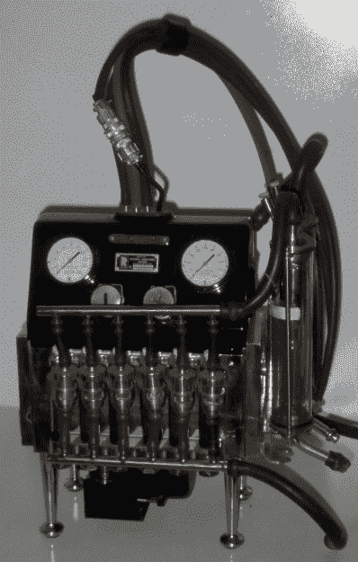
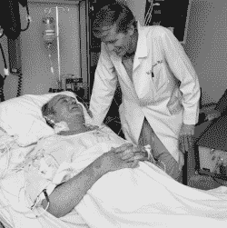
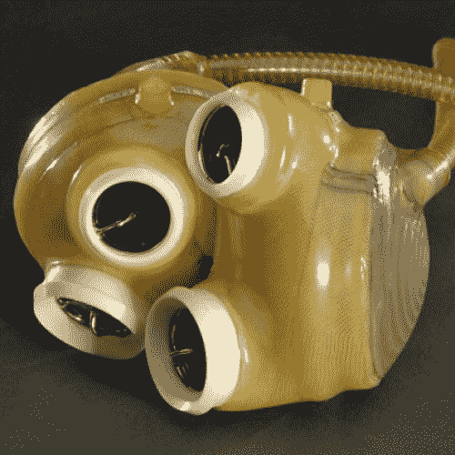

# 永久性人造心脏:寻找已久的替代品可能不远了

> 原文：<https://hackaday.com/2021/08/09/permanent-artificial-hearts-long-sought-replacements-may-not-be-far-away/>

人体可用的人造假体替代部件的数量确实相当可观。从义眼到人造臀部和膝盖，人体的几乎所有部分都可以替换成至少和原来一样好的东西，特别是考虑到 OEM 部分可能在一开始就相当艰难。

但心脏一直是人类的弱点，部分原因是它从未得到休息，部分原因是考虑到所有的事情，我们现代人没有好好照顾它。当心脏衰竭超过药物或手术可以帮助的程度时，我们剩下的选择比膝盖受伤的人要少得多。事实是，我们目前所能希望的最好的是一个机械心脏，让病人活得足够长，以找到一个捐赠的心脏。但即使这样，悲剧必然会发生，年轻健康的人必须死去，这样其他人才能活下来。

长期以来，永久植入式人工心脏一直是医学界的一个目标，如果材料科学和电子工程的最新发展可以说明这一点的话，这种设备可能很快就会成为现实。心脏置换也许有一天会像髋关节置换一样简单，但要做到这一点需要理解机械心脏的历史，以及为什么它不只是像制造一个泵那么简单。

## 美国的心脏

虽然对心脏作为泵的理解可以追溯到公元前 3 世纪，但医学科学花了近 1000 年才取得很大进展；希腊医生盖伦的早期观点是心脏为身体提供热量，血液通过心脏隔膜的小孔从静脉系统流向动脉系统，这一观点是不容置疑的，至少在西方医学传统中是如此。

There’s a reason that the Dodrill-GMR artificial heart looked like a car engine. Source: [National Museum of American History](https://americanhistory.si.edu/collections/search/object/nmah_998420), CC0 1.0

一旦医生可以自由探索人类的心脏，它的结构和功能就变得清晰了。心脏是一个由特殊肌肉组织构成的四腔泵。上面的心室被称为心房，通过单向阀流入下面更大的心室，以防止回流。右心房通过称为腔静脉的大血管接收来自身体的脱氧血液；它移动到右心室，并继续向肺部移动，在那里通过一个复杂的气体交换过程，它失去一氧化碳并获得氧气。氧合血返回心脏的左心房，然后进入强大的左心室，左心室通过主动脉向全身提供氧合血。

从机械学的角度来看心脏，很容易理解为什么制造心脏机械替代品的尝试可以一直追溯到 20 世纪 30 年代。苏联科学家弗拉基米尔·德米霍夫是第一个尝试机械心脏的人，他将自己设计的装置植入一只狗体内。手术后，这只动物活了两个小时。

其他外科医生使用 Demikhov 的狗实验作为人类人工心脏的基础，首先使用体外设备，如 Dodrill-GMR，这是一种由汽车制造商通用汽车研究所制造的设备。1952 年，一名 41 岁的患者在接受二尖瓣修复手术时，使用了 Dodrill-GMR 进行左心室搭桥手术；他在机器上存活了 50 分钟，最后又多活了 30 年。

Dodrill-GMR 和后续心肺机的早期经验为医生提供了宝贵的反馈，告诉他们在泵血时什么有效，什么无效。毕竟血液不是简单的流体；它是一种复杂的液体组织，由血细胞(红细胞和白细胞)以及血浆组成。心脏被优化来泵送这种液体，引入尽可能少的湍流和剪切力来保持细胞完整。心脏的任何机械替代物都不能引入这种破坏性的力，这种力容易导致对患者的伤害。

## 一座太远的桥

Dr. William Devries and Barney Clark, after implantation of the Jarvik-7 heart. Source: [University of Utah](https://healthcare.utah.edu/healthfeed/postings/2012/12/120212ArtificialHeart30YearsLater.php)

机械循环的早期努力集中在完全体外的装置上，承认当时的工程技术还远未准备好提供完全可植入的人工心脏。但是机械替换心脏的梦想继续存在，主要是因为对健康的人类心脏移植的需求继续超过供应。随着几十年来汽车工程的改进，这种情况越来越多；可悲的事实是，车祸提供了最可靠的可行的供体心脏来源，随着汽车变得更加安全，供体库变得越来越小。

第一个引起广泛关注的所谓全人工心脏(TAH)是 Jarvik-7 心脏，它首次在临床上用于患有严重充血性心力衰竭的退休牙医巴内·克拉克。尽管克拉克在手术后的 112 天里不得不被拴在一个大型空气压缩机上，但 Jarvik-7 是第一个泵送机制完全位于胸腔内的人工心脏。即使在今天，它也为完全人工心脏设立了标准——泵送机制是可植入的，但由于工程限制，它们必须从体外获得动力。

A Jarvik-7 artificial heart, similar to the one used in Dr. Barney Clark in 1982\. Note the large pneumatic hoses that power the device. Source: [National Museum of American History](https://invention.si.edu/podcast-robert-jarviks-inventions-keep-pumping).

目前被批准用于患者的两种人工心脏都依赖外部动力。SynCardia TAH 是 Jarvik-7 心脏的直系后代，采用更好、更耐用的材料制成，并配备了不太可能损坏血细胞的瓣膜，仍然由压缩空气提供动力，尽管驱动单元已经足够小型化，病人可以带着它回家。另一种 TAH 由法国 Carmat 公司制造，使用液压驱动的柔性隔膜来泵送血液。液压动力包小到可以随身携带，由锂离子电池供电。

尽管它们的机械结构不同，但这两种装置有一些共同点:它们不打算用作永久性的替换心脏，而是作为一种桥梁，为供体心脏的可用争取一些时间。其主要原因是简单的材料科学:很难找到可以连续多年每分钟连续弯曲 70 至 80 次而不撕裂的材料。Carmat 已经设法做到的最好成绩是大约 1400 天，虽然这比巴内·克拉克的经历好十倍以上，但远远不够。另一个问题是将气动或液压管线引入胸腔在临床上是有问题的，主要是有感染的风险。

## 没有脉搏，没问题

虽然听起来永久的 TAH 还有很长的路要走，但这个领域正在发生的许多事情可能会缩短旅程。一家名为 [BiVACOR](http://bivacor.com/) 的初创公司正在致力于一项与 SynCardia 或 Carmat hearts 截然不同的设计，它包含任何硬件黑客都会非常熟悉的组件。比瓦科 TAH 公司没有依靠隔膜来输送血液，而是使用了离心泵，其叶轮叶片直接与血液接触，提供连续的流动。通常情况下，这将是一个不可接受的剪切力来源，会撕裂血细胞，更不用说需要最终会磨损的轴承。比瓦科 TAH 通过磁悬浮叶轮避免了这些问题，在叶轮和泵壳之间留有很大的间隙。间隙距离受到连续监控和调整，因此没有机械磨损，对血液没有剪切力。双面叶轮是泵中唯一的移动部件，由看起来非常像无刷 DC 电机的定子线圈驱动。

[https://player.vimeo.com/video/526060602](https://player.vimeo.com/video/526060602)

比伐克 TAH 的一大优势是它比现在的 TAHs 要小得多。这一点很重要，因为胸腔中可用的空间非常有限，即使是体型较大的男性患者也是如此。女性患者和儿童的心脏往往较小，通常很难安装 TAH。比伐尔心脏也不太受外界干扰；电缆更容易进入胸腔，并且不太可能成为感染的管道。电池技术的进步也很有可能在不久的将来使植入式电源成为可能；再加上透皮感应充电，比伐尔心脏和类似的心脏可能成为第一个实用的永久性人工心脏。

这里显然还有更多事情要做；一些基本问题，如人体是否有脉搏的生理原因，仍有待回答。幸运的是，BiVACOR 心脏可以被编程为提供脉动流，因此无论答案是什么，它们都处于良好的位置。但是，我们甚至还不知道答案的事实表明，我们还有很长的路要走。幸运的是，工程技术似乎正在赶上永久人造心脏最终成为现实的步伐。