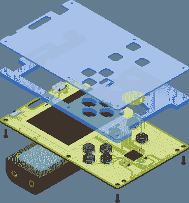

# 皮尤皮尤在你的手掌上

> 原文：<https://hackaday.com/2019/09/19/pew-pew-in-the-palm-of-your-hand/>

人们常说“成功是一半的乐趣”，我们认为在构建硬件时，就像在去参加你最喜欢的黑客大会的旅途中一样，这也是正确的。我们许多人都喜欢规划、设计和构建一个新工具的过程，就像在完成后玩它一样。我们得到的印象是[rado mir dopieraslki]也有同样的感觉，因为他目前正在进行他的 PewPew 项目的另一个迭代[。](https://hackaday.io/project/165032-pewpew-m4)

 对于外行人来说，【Radomir】已经在 PewPew 系列中创造了许多设备，旨在通过使用 CircuitPython 使新手在“裸机”上编程游戏变得更容易、更容易。

最初的版本是阿达果羽毛的盾牌，最终演变成一个独立的设备。最新版本被称为 M4，包括许多细节，如大型 TFT 屏幕和丙烯酸外壳。它还切换到了标志性的 Game Boy 布局，真正实现了经典游戏的感觉。

正如[Radomir]解释的那样，以前版本的 PewPew 被设计得尽可能便宜和易于制造，因为它们是在游戏编程工作室中使用的。但是在那种环境之外，他们留下了一点不尽人意的东西。凭借 M4，他创造了一些更接近传统游戏系统的东西。在这方面，它有点像 Arduboy: [你仍然可以用它来学习游戏开发](https://hackaday.com/2019/07/01/schools-in-session-with-arduboy-curriculum/)，但它也足够吸引人，你可能只是在它上面玩其他人的游戏。

The [HackadayPrize2019](https://prize.supplyframe.com) is Sponsored by:     