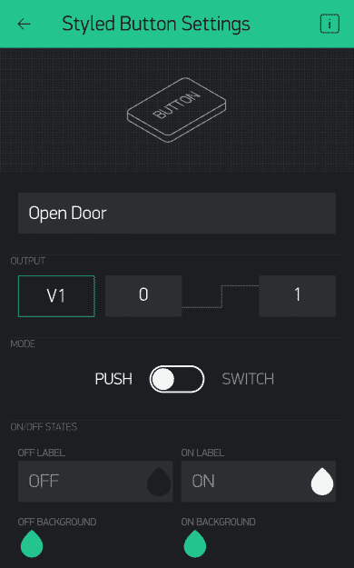

# 光子门锁为 POST 请求交换钥匙

> 原文：<https://hackaday.com/2018/09/07/photon-door-lock-swaps-keys-for-a-post-request/>

在这一点上，我们都很清楚，把“东西”带到互联网上存在一些固有的危险。没有人想回家时看到一堆冒烟的卢布，因为他们的联网烤箱决定卡在“冥府”上。但即使存在风险，我们偶尔也会看到一些项目，证明至少一些无畏的黑客正在设法驾驭物联网来解决现实世界的问题。

 【丹尼尔·安德拉德】来信告诉我们他在新公寓安装的互联网控制进入系统，虽然我们认为它并不适合所有人，但我们不能否认它似乎提高了他的生活质量。他没有给他所有的朋友一把钥匙，而是建立了一个系统，任何有适当链接的人都可以通过大楼现有的对讲系统进入。

由于老式的对讲机设置，这个项目的硬件非常简单。所有[丹尼尔]需要的是一个继电器来关闭门铃上的电路，以及一种启动它的方法。对于他的控制器，他选择了粒子中的光子，这可能有点大材小用，但我们都倾向于使用我们个人感到舒适的东西。

大部分工作都进入了软件，因为[丹尼尔]最终想出了两种不同的方法来通过互联网控制门锁。第一种方法使用 Blynk，它允许您为移动设备创建流畅的可视界面。他的第二个版本是通过对一个特定 URL 的 POST 请求来控制的，他喜欢这样，因为这样他可以更加灵活地与锁进行交互。目前，他有一个简单的网页设置，让朋友和家人只需点击一个按钮就可以打开门。

我们已经看到类似的设置[使用光子打开车库门](https://hackaday.com/2017/09/03/have-alexa-open-your-garage-door/)，许多人[已经开始使用 Blynk](https://hackaday.com/2018/08/17/whats-behind-the-door-an-iot-light-switch/) 来[控制他们的家庭自动化设置](https://hackaday.com/2018/06/07/ambient-lighting-for-baby-with-the-esp8266/)。所有的工具都可供你开发自己的物联网小工具，你只需要弄清楚如何处理这些东西…