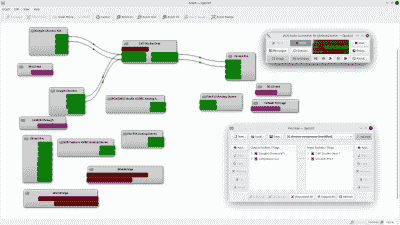
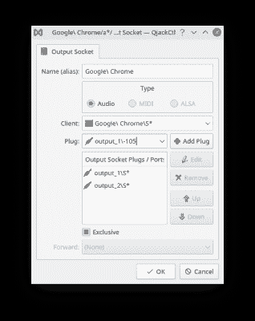

# PipeWire，Linux 上最新的音频小子

> 原文：<https://hackaday.com/2021/06/23/pipewire-the-newest-audio-kid-on-the-linux-block/>

如果你还记得 [PulseAudio](https://en.wikipedia.org/wiki/PulseAudio) 因在 Linux 上为所有人中断音频而出名的时候，请举手。几年来，Linux 上任何音频问题的标准答案都是卸载 PulseAudio，只使用 [ALSA](https://en.wikipedia.org/wiki/Advanced_Linux_Sound_Architecture) 。很可能是这样的，一些发行版在它完全准备好之前就切换到了 Pulse。我的经验是，在修复了几年的错误之后，这种体验变得相当稳定和有用。PulseAudio 为 Linux 带来了一些非常好的功能，比如在设备之间移动声音流，以及根据需要动态地重新采样声音流。

Linux 音频硬币的另一面是 JACK。如果你用过 Ardour，或者对 Firewire 音频接口做过很多工作，你可能对 JACK Audio Connection Kit 很熟悉——递归首字母缩略词很有趣。JACK 让您几乎可以任意地路由音频流，非常适合专业音频观众。

你可能会想，有没有办法把 PulseAudio 和 JACK 一起用。是的，但是让 PulseAudio 插件与 JACK 一起工作有点麻烦。例如，所有的脉冲流混合在一起，在 JACK 图上显示为单个器件，因此您不能将它们路由或单独处理。

这是 Linux 用户多年来面临的难题。PulseAudio 不能用于专业音频，而 JACK 对于其他任何东西来说都太复杂了。我不太愿意建议用另一种音频系统来解决世界上的音频问题，但如果能两全其美就更好了。说实话，PipeWire 就是这种新系统，它有可能成为几乎所有人的解决方案。

## ~~音频~~视频选一个

据说[Wim Taymans]正在考虑将应用程序作为 Flatpaks 分发，并意识到这对视频输入和输出来说是个问题。他一直致力于让 PulseAudio 很好地适应容器化的应用程序，并开始考虑如何解决视频流的问题。在进行最初的协议设计时，很明显，如果音频和视频通过不同的系统传送，AV 同步将是一个非常棘手的问题，因此决定 PipeWire 也包括音频处理。一旦做出这个决定，PipeWire 显然可以完全取代 PulseAudio。为了实现无缝过渡，PipeWire 完全兼容 PulseAudio 服务器。换句话说，任何可以与 PulseAudio 对话的应用程序都自动拥有 PipeWire 支持。

如果 PulseAudio 要从头开始重建，那么它还不如解决专业音频。如果 PipeWire 能够满足专业音频用户的需求，它可以取代 JACK，成为像 [Ardour](https://ardour.org/) 这样的数字音频工作站的音频后端。说服每个项目添加对另一个 Linux 音频服务器的支持将是一场艰苦的战斗，所以他们作弊了。PipeWire 将只实现 JACK API。这听起来可能像是一大堆功能爬行，从一个简单的视频传输系统开始，到重新实现 JACK 和 PulseAudio 结束。

让我们再次强调这一点。PipeWire 是 Pulseaudio 和 JACK 的简易替代品。现在，任何支持 Pulse 的应用程序都支持 PipeWire，同时它可以使用 JACK 可以使用的所有巧妙技巧。到目前为止，我已经找到了 PipeWire 可能实现的两个杀手级黑客技术，我们稍后将会谈到。几乎所有的主流发行版现在都支持将 PipeWire 作为主要的音频服务器，Fedora 34 将它作为默认的解决方案。在使用它的前几周，有一些问题需要解决，但 PipeWire 现在似乎可以很好地使用我扔给它的所有应用程序。

## 延迟问题

JACK 被用于各种各样的 hijinks，它的杀手锏之一是它可以实现低到察觉不到的延迟。播放音频时有明显的延迟可能会严重影响音乐或谈话者。这种效应如此强烈，研究人员已经制造了一种语音干扰器，利用这种原理让远处的说话者闭嘴。这么说吧，你真的不希望你的电话会议出现这种效果。200 毫秒的延迟会关闭语音，但更低的延迟也会分散注意力，尤其是对音乐家而言。

要让 PipeWire 真正取代 JACK，我们需要多低的延迟？热情指南建议用五毫秒时间真正做到不被察觉，但这取决于你到底在做什么。只需做一点工作，在一台现代机器上，我已经通过 USB 音频设备将我的延迟降低到了 18 毫秒以下。换句话说，这大约是你站在离音频源 18 英尺远的地方所得到的延迟。这足以让你的大脑注意到，特别是如果你试图播放音乐，但不是一个交易破坏者。需要降低吗？你可能需要一个实时内核。

要开始调整你的延迟，将`alsa-monitor.conf`和`jack.conf`复制到它们在`/etc/pipewire`中的位置。[这里有一些调整](https://gitlab.freedesktop.org/pipewire/pipewire/-/wikis/Config-ALSA)，但是主要的旋钮是`jack.conf`中的`api.alsa.period-size`和`node.latency`。为了真正获得低延迟，有一系列系统调整可以帮助，本质上与 JACK 上的低延迟所需的调整相同。

## 哦，我们可以拥有的乐趣

现在来看看这些技巧。虽然 JACK 可以处理来自单个声卡的多个流，[但它不容易处理多个外部源或接收器](https://jackaudio.org/faq/multiple_devices.html)。你有一对 USB 麦克风，想把两个都录下来？抱歉，杰克和 ALSA 都不行。换一个更大更贵的音频接口。

PipeWire 没有这个限制。它可以看到你所有的音频设备，甚至可以混合和匹配声道。现在用多个声卡做一个三声道录音已经很琐碎了。

好了，我现在听到你说“我不是音频工程师，我不需要做多声道录音。Pipewire 能为我做什么？”让我们看看其他几个工具，我想你会看到可能性。首先是 [Calf Studio Gear](https://calf-studio-gear.org/) ，一个音频插件集合。插件包括压缩器、参数均衡器和限制器。这三个组成了一个像样的母带制作工具包，这里的“母带制作”指的是一张专辑对声音进行最后润色的最后一步。在我们消费的一些 YouTube 视频中，这一步非常缺乏。不一致的音量是最让我抓狂的。
T3

第二个工具是`qjackctl`，帮助使用 Calf。它不仅允许您查看和操作信号流图，还能够设计简单的规则来自动路由音频。这些规则使用 Perl 正则表达式匹配，很容易设置它们自动将音频流从 Chrome 导入 Calf 压缩器，再从那里导入您的扬声器。将 Calf 和`qjackctl`添加到您桌面的自动运行列表中，您就有了一个针对糟糕的 YouTube 母版制作的自动化解决方案。为什么停在那里？要打变焦电话吗？将话筒穿过 Calf，做一点 EQ 处理，或者添加一个门来减少背景噪音。既然你在做，就把你的录音和电话录音录下来。

## 剩下要做的工作

PipeWire 最初是用来播放视频的。那部分也可以。浏览器已经增加了对视频捕获的 PipeWire 支持，如果你碰巧在运行 Wayland，桌面捕获现在也是 PipeWire 的事情了。OBS 增加了对 PipeWire 视频输入的支持，但是输出到 PipeWire 仍然没有实现。在这个话题上，虽然插孔工具对音频很有用，但视频控制和插件选择明显不足。

有一样东西是 JACK 支持的，PipeWire 目前碰不到的。JACK 支持 FFADO 驱动与 FireWire 音频接口对话，PipeWire 根本不支持。(好吧，是的，ALSA 有一个 FireWire 堆栈，但它不是很好，只支持少数设备。)USB3 无疑已经取代 FireWire 成为新设备的首选连接，但仍有许多高质量的接口仅支持 FireWire。最近，官方列表上出现了一个新的待办事项[:基于 FFADO 的 FireWire 后端或修复 ALSA 驱动程序。](https://gitlab.freedesktop.org/pipewire/pipewire/-/wikis/TODO)

那我们该怎么办？PipeWire 已经改变了我可以用 Linux 音频做的事情。如果视频生态系统发展起来，它有可能让一些新事物成为可能，或者至少变得更容易。Linux 上多媒体的前景是光明的。