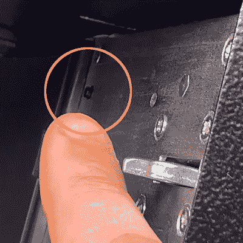

# 手枪保险箱糟糕的设计意味着生物传感器在几秒钟内被绕过

> 原文：<https://hackaday.com/2019/10/03/pistol-safes-poor-design-means-biometric-sensor-bypassed-in-seconds/>

说到保险箱，机械设计和物理布局与电子比特一样重要。如果不小心，一个因素会破坏另一个因素。这似乎是亚马逊基础品牌生物识别手枪保险箱的情况。由于机械设计，指纹传感器可以被一片薄薄的金属覆盖——没有融化的小熊软糖和指纹印。

Small button used to register a new fingerprint. It can be reached by inserting a thin shim in the gap between the door and the frame while the safe is closed and locked.

[LockPickingLawyer]以揭露各种设计糟糕的锁的疯狂行为而闻名，他在这个简短的视频(嵌入在下面)开始时表示，当试图绕过像这样的设备的安全性时，他通常会专注于机械锁。但在这种情况下，简单地颠覆指纹注册要简单得多。

它是这样工作的:面板的背面(在保险箱里面)有一个小按钮。按下此按钮时，设备将被指示注册新的指纹。该系统的安全性依赖于当保险箱关闭时不能接触到该按钮。不幸的是，它的位置很差，只需要一片薄薄的金属从门和保险箱其他部分之间的缝隙中穿过。一次按压，并且(关闭的)保险箱被指示登记和信任新的指纹。之后，保险箱就可以用通常的方式打开了。

保险箱里的手枪可能会妨碍插入金属垫片来按下按钮，但看起来不像。框架中的金属唇，或凹陷的重置按钮可以防止这种攻击。当门关闭时，也可以指示传感器拒绝重新编程。无论如何，这是一个设计元素如何相互影响，并在过程中产生安全影响的很好的演示。

至于在更传统的意义上愚弄传感器，这里有一个提醒，我们已经看到了用于击败指纹传感器的 3D 打印机和指纹照片。

 [https://www.youtube.com/embed/Y-lE4Tz2I_Y?version=3&rel=1&showsearch=0&showinfo=1&iv_load_policy=1&fs=1&hl=en-US&autohide=2&wmode=transparent](https://www.youtube.com/embed/Y-lE4Tz2I_Y?version=3&rel=1&showsearch=0&showinfo=1&iv_load_policy=1&fs=1&hl=en-US&autohide=2&wmode=transparent)

[via[the firamblog](https://www.thefirearmblog.com/blog/2019/10/01/amazon-pistol-safe-defeated-seconds/)