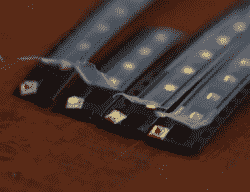

# led 极大地加速了植物的生长

> 原文：<https://hackaday.com/2022/04/30/plant-growth-accelerated-tremendously-with-leds/>

【GreatScott！]看到他的温室在冬天空荡荡的，毫无生气，我很沮丧。于是，他[着手把温室带回家](https://www.youtube.com/watch?v=4FryMPpJG6I)。嗯，至少，一小部分吧。首先，他决定制造人造阳光，建立一个简单的初始实验来玩不同波长的发光二极管。led 对植物生长的影响到底有多大？这是支持他的项目的 Würth Elektronik 最近正在扩展的研究方向。他们一直在研究[广泛的应用笔记](https://bit.ly/Let_it_grow_LP_en)，为我们解释它的生物学方面——这是一个免费的资源宝库，黑客可以也应该从中学习。

最初，【GreatScott！]获得了四种不同颜色的 LEDs 红色、超红色、深蓝色和日光光谱。前三种是有价值的，因为它们的特定波长被植物很好地吸收。然而，日光 led 的使用一直备受争议。然而，他指出，除了光合作用，植物可能需要不同的波长，随着实验的进行，日光 led 确实有助于视觉评估植物。

接下来，【GreatScott！]借用了 Würth 的 LED 驱动器设计，用简单的电位计创建了一个 Arduino PWM 驱动器。他利用这一点开发了自己的 led 主板。

铝制 PCB 增加了散热，延长了 led 的使用寿命。【GreatScott！]用焊膏将 led 回流到上面，却发现“超红”led 在这个过程中熄灭了。值得庆幸的是，当这个问题出现时，他设法获得了官方的园艺开发套件，一个 LED 面板已经准备好了。

【GreatScott！测试对象是芝麻菜植物，你可以在意大利熏火腿披萨上找到它的叶子。他搭建了两套不同的花盆，一套有 LED 装饰，一套没有 LED 装饰，然后把它们都放在窗台上。这些植物同样暴露在阳光下，同样浇水。LED 占空比被设置为大约值。

结果是惊人的，正如你在上面的图片中看到的——除了使用的 led 以外，没有任何变量发生变化。这个实验，甚至包括一个以披萨为测试基质的味觉测试，取得了巨大的成功，而且【GreatScott！]建议我们在开始我们自己的植物生长改善之旅时，到 Würth 获取免费样品。

园艺(又名植物种植)是黑客们可以利用免费知识大踏步前进的领域之一，我们甚至没有谈论我们的评论者肯定会提到的那种植物。植物生长的领域确实硕果累累，已经成熟，可以采摘了。你可以用[意想不到的小努力](https://hackaday.com/2009/02/28/automatic-grow-light/)完成很多改变。窗台上植物的价值不一定是纯粹的装饰，而且[一个小小的桌面装置](https://hackaday.com/2012/12/03/gadgeteer-plant-monitor-wants-it-wet-and-photogenic/)你组装起来，就可以轻松放大！一些黑客明白这一点，在 Raspberry Pi 出现之前，我们就已经开始看到自动种植解决方案。最棒的是，你只需要几个发光二极管就可以启动。

 [https://www.youtube.com/embed/4FryMPpJG6I?version=3&rel=1&showsearch=0&showinfo=1&iv_load_policy=1&fs=1&hl=en-US&autohide=2&wmode=transparent](https://www.youtube.com/embed/4FryMPpJG6I?version=3&rel=1&showsearch=0&showinfo=1&iv_load_policy=1&fs=1&hl=en-US&autohide=2&wmode=transparent)

我们感谢[门德斯尔]与我们分享这些！