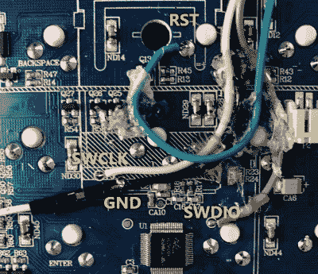

# 将 QMK 移植到廉价的机械键盘上

> 原文：<https://hackaday.com/2020/10/04/porting-qmk-to-a-cheap-mechanical-keyboard/>

在过去的几年里，我们看到了数量惊人的 DIY 键盘制作。一些开关被激光切割成铝，另一些被 3D 打印成塑料。它们可以在定制的 PCB 上焊接在一起，或者小心翼翼地手工布线。但是无论它们是如何构建的，它们几乎都有一个共同点:它们运行一些开源 QMK 键盘固件的变体。

但是如果你只是想在亚马逊上花 50 美元买到的键盘上运行一个开放的固件呢？这正是九个月前[【斯蒂芬·皮里】用这个 DK63 游戏键盘](https://github.com/smp4488/dk63)发现自己的地方。由于许多这种小型 RGB LED 机械键盘与现有的开源设计非常相似，他想知道如何打破原始固件并用 QMK 的构建来替换它。

 虽然[Stephen]还没有 100%地完成所有工作，但他已经接近了他史诗般的逆向工程之旅的终点。第一步是拆开键盘，识别它使用的所有组件，然后从更新程序中取出原始固件。从那里，[在 Ghidra 和串行线调试](https://hackaday.com/2020/02/11/xbox-controller-provides-intro-to-swd-hacking/)之间，他能够找出大多数股票固件在做什么，所以他可以在 QMK 中复制它。

根据他的自述，RGB LEDs 和蓝牙功能目前不工作，但除此之外，QMK 似乎已经启动并运行。如果你同意这些让步，他在页面上有关于用 ST-Link V2 将他的 QMK 构建闪现到股票 DK63 的信息，所以你可以尝试一下。尽管你这样做要自担风险；我们不建议在你唯一的键盘上这样做。

我们已经看到在之前[商业制造的运行 QMK 的键盘，但是它通常涉及](https://hackaday.com/2020/05/05/the-abcs-of-adding-qmk-to-a-wasd-keyboard/)[用新的电子设备](https://hackaday.com/2020/06/19/vintage-keyboard-gets-the-qmk-treatment/)完全替换原来的控制器。(Stephen)在库存硬件上实现了这一切，以便其他所有者可以跟随他的脚步，这确实是一项相当大的成就。

【感谢 Baldpower 的提示。]