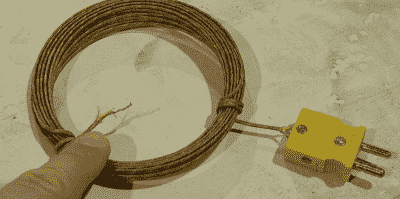
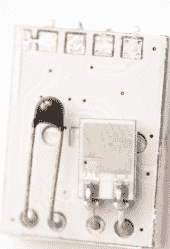

# 实用传感器:我们电子测量热量的多种方式

> 原文：<https://hackaday.com/2021/02/19/practical-sensors-the-many-ways-we-measure-heat-electronically/>

事实证明，测量温度是许多设备的基本功能。你炉的可编程恒温器和数字钟就是明显的例子。如果你只是想知道是否超过了某个温度，你可以使用双金属线圈和微动开关(或者像老式恒温器一样使用水银开关)。但如今，我们需要一系列读数的精度，因此出现了产生小电压的热电偶、电阻随温度变化的 RTD、电阻随温度变化的热敏电阻、红外传感器和振弦式传感器。半导体结的带隙电压随温度变化，这也是可预测和可测量的。可能还有其他方法，其中一些可能很有创意。

 

双金属线圈 by【胡斯韦德】， [CC-BY-SA 3.0](https://creativecommons.org/licenses/by-sa/3.0/deed.en) 。

你可以经常想到创造性的方法来做任何测量。有一个关于物理课上那个聪明的学生的老笑话。问题是你如何用气压计找到建筑物的高度。一个答案是从楼顶扔下气压计，记录它落地的时间。另一个回答——毫无疑问是一个工程系学生——想找到建筑工程师，并提出给他们气压计以换取建筑的高度。出于同样的原因，你可以通过监控一个带摄像头的标准温度计，甚至是一个水平传感器来找到温度，这是另一篇文章的主题。

关键是，有很多方法可以测量任何东西，但在每种情况下，你都是在把你想知道的东西(温度)转换成你知道如何测量的东西，比如电压、电流或物理位置。让我们看看一些最有趣的温度传感器是如何做到这一点的。

## 热电偶

热电偶利用了一种叫做塞贝克效应的东西。当两种不同的金属形成一个结并经历温度梯度时，就形成了电势。关键是这是一个温度梯度，使设备工作。热电偶有一个热接点和一个冷接点。如果你想测量温度，你需要一个参考结。顺便说一句，这种效应的工作原理正好相反——珀耳帖效应——电流通过一对结时，会使一边变热，另一边变冷。

在过去，你会把冷接点放进一桶冰里。如今，您更有可能使用另一种方法来获得冷结的温度，然后进行补偿。当然，有芯片可以做到这一点。

 

热电偶由【阿奇姆·赫林】–[CC-BY-SA-3.0](https://creativecommons.org/licenses/by/3.0/deed.en)。

为什么不直接用其他方法开始呢？热电偶有几个优点。一方面，你可以用它测量高达几千度的温度。因为它们只是两根电线，所以坚固可靠。在炎热或恶劣的环境中，他们很容易管理，通常，在冷端，你有一个稍微好一点的环境。

缺点是温度读数不是线性的。你会看到不同类型的热电偶，每种类型使用两种不同的导线材料。类型会告诉您使用什么样的校准曲线，当然，您也可以为您需要的应用选择金属。例如，J 型使用铁作为两根导线中的一根，T 型使用铜。

另一个重要的考虑因素是如何将电线连接到热电偶。由于该设备在两种不同类型的电线之间的接合点上工作，所以您必须小心如何将其他电线连接到该设备。想了解更多？[【Bil Herd】深入探讨了如何构建热电偶放大器](https://hackaday.com/2015/04/06/how-to-build-a-thermocouple-amplifier/)。

从远处测量红外线的热电偶被称为热电堆。这在非接触式温度计和无源红外(PIR)传感器中很常见。PIR 传感器检测两个传感器之间的温度差，并推断视场中发生了变化。

## 阻力装置

有几种不同类型的材料可以表现出温度随电阻的变化。最大的因素是器件的温度系数是正还是负。换句话说，电阻是随着温度的变化而上升还是下降？

 

热敏电阻(左边)；BY[gratut]， [CC-BY-SA-3.0](http://creativecommons.org/licenses/by/3.0/)

这些器件大部分也是非线性的，但也是便宜易用的。你可以用任何你喜欢的方法来测量电阻。一种常见的技术是将电阻用作分压器或电桥的一部分，并测量输出电压。然而，如果您不想占用模拟输入，可以将电阻连接到电容，测量充电时间。

热敏电阻在结构上与电阻式温度检测器(RTD)略有不同。通常，热敏电阻比金属基(通常是铂)RTD 具有更少的滞后和自热问题。然而，无论哪种情况，你都必须测量电阻，并将其拟合到曲线上，以获得真实的温度。

读取热敏电阻是一种非常常见的操作，多年来人们已经开发出了许多技巧。你也可以花数学处理来得到更好的曲线拟合，或者做简单的数学运算，得到较低的精度。

## 半导体结和意外传感器

半导体材料的带隙电压可预测地随温度变化。如果你曾经深入研究过固态设计，你会看到二极管等式中的 T 项及其所有表现形式。因此，许多 IC 利用这一特性来检测温度也就不足为奇了。

一些芯片被制成温度传感器。例如，常见的 [LM34](https://hackaday.com/2011/09/17/attiny-hacks-simple-usb-temperature-probe/) 和 LM35 芯片利用这一特性，通过一些额外的电路来提供每度 10mV 的良好电压(LM34 测量法亨海特，LM35 测量摄氏温度)。这使得它们非常容易使用。

一些芯片，如你的电脑中的 CPU，使用相同的方法来测量内部温度，用于报告和热量管理。然而，非温度传感器 IC 也有其他方法可以测量温度。

事实证明，几乎所有的电路都以某种方式对温度敏感。根据外部基准测量 CPU 的内部时钟可以显示温度引起的变化。

## 古怪的传感器

还有许多其他测量温度的方法。例如，振弦传感器使用相当于吉他弦的东西。测量包括激发弦和检测振动频率。当支撑结构随着温度变化而收缩和膨胀时，琴弦的音调也随之变化。

你可以通过计算蟋蟀发出的唧唧声的数量来得到一个华氏温度的近似值。在 15 秒内数出鸣叫的次数，然后加上 37。如果有人用某种不知名的乐器做到了这一点，我不会感到惊讶。[凯文]在特雷霍特说，在下面的视频数字是 40，而不是 37，但我想这不是一个精确的科学。

 [https://www.youtube.com/embed/JRHB8714Pj4?version=3&rel=1&showsearch=0&showinfo=1&iv_load_policy=1&fs=1&hl=en-US&autohide=2&wmode=transparent](https://www.youtube.com/embed/JRHB8714Pj4?version=3&rel=1&showsearch=0&showinfo=1&iv_load_policy=1&fs=1&hl=en-US&autohide=2&wmode=transparent)

当然，越来越常见的温度测量方法是使用某种形式的智能传感器。模块或 IC 可以使用我们讨论过的任何方法，将其转换为工程单位，并通过类似 I2C 总线的方式发送数据。这是一个抽象层次，但是您仍然应该理解您想要使用的传感器的潜在优点和局限性。

虽然可能有更多，但没有任何其他测量温度的通用技术。但是在以后的文章中仍然有很多传感器需要讨论。