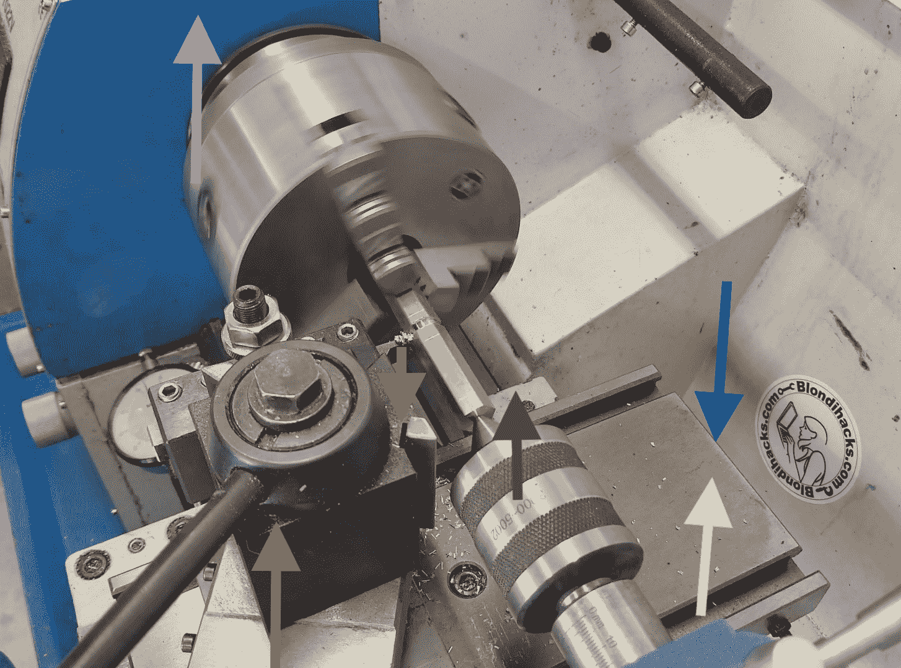

# 机械师的口头禅:精确，你的名字是刚性

> 原文：<https://hackaday.com/2018/10/25/precision-thy-name-is-rigidity/>

“万物皆春”。你可能以前听过这个表达。你认为你对这种特殊表达的欣赏有多深？你知道是谁发自内心地发现了这个吗？机械师。

正如我之前喋喋不休地说的，机床都是关于精度的。说起来容易，但精准真正来自哪里？一句话，刚性。机床做了一件看似神奇的事情。他们用一块稍微坚硬的钢来移除大量的钢(或其他中世纪人类会为之杀戮的材料)。他们设法做到这一点的方法是，在一个非常严格的设置中，将切割工具应用于材料，材料除了屈服别无选择。此外，这种切割动作非常精确，因为这样做时刀具尽可能少地移动。这都归结于刚性。让我们来看一个基本的转弯设置。

## 车床上的弹簧力图解

彩色箭头显示了机械师将会知道和感觉到的一些主要的弹簧力。首先也是最重要的是对刀头的向下压力(红色)。这又试图向上扭转刀架的后部(绿色)。然后，刀架试图将十字滑块的后部向下扭转(蓝色)，整个设置将托架的远端向上扭转(黄色)。同时，工具压力正在推动尾架(棕色)和主轴轴承(紫色)向上。

一切都是弹簧，这些只是你在最简单的机床中能找到的几个。如果这些弹性来源中的任何一个未能支撑住工作的结束，结果将是喋喋不休，不精确的切割，或者机械师从她的前额上挑选分离工具的碎片。这些都不是好结果。

## 机械师的刚性是正常的:质量和完美的配合

在这场对抗僵化的斗争中，我们拥有的武器主要有两种。首当其冲的是铸铁。凭借其巨大的质量，它可以被廉价地制造成刚性的，而且它还擅长吸收谐波振动，这种振动会使任何其他地方的刚性问题变得更糟。第二个武器是精密配件。如果我们能在零件相互连接的地方减少运动，我们就消除了弹簧的来源。当这些部件需要滑动时，这是很困难的，但这就是为什么我们有像燕尾榫和可调钩这样的东西。这些特征允许部件在一个维度上相对于彼此滑动，同时在所有其他维度上尽可能少地移动。这一切都是为了谋杀春天的邪恶恶魔，它威胁着光荣而正义的刚性王国。

所以，下次你听到“一切都是春天”这句话时，为你当地的机械师倒一杯吧。当然，机械工程师会继续谈论它，但是机械师才真正知道。