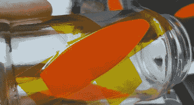

# 印刷螺旋桨叶片修理室内传单

> 原文：<https://hackaday.com/2022/12/09/printed-propeller-blades-repair-indoor-flyer/>

给胃口不好的读者一个合理的警告，下面的视频生动地描述了一架无辜的橡皮筋飞机在半空中被一架自鸣得意的高科技遥控直升机摧毁。这是一场令人震惊的空中阶级斗争，但故事确实有一个美好的结局，因为[混凝土狗]能够用一些非常现代的技术修复他的旧学校传单:[一套 3D 打印的螺旋桨叶片](https://www.youtube.com/watch?v=DmAMwK2zhD8)。

现在，在正常情况下，3D 打印螺旋桨是一个冒险的前景。为了避免被难以置信的旋转力撕裂，它们通常需要增大体积，以至于变得太重，从而影响性能。印刷刀片的阶梯状外表面也没有帮助。

 但是在一架由橡皮筋驱动的轻型飞机上，显然事情要轻松一点。在他的 Prusa Mini 上生产的薄刀片[混凝土狗]看起来只有一两层厚，并且是平放在床上打印的。然后，他用 Kapton 胶带将它们贴在罐子的侧面，并将其放入烤箱中退火约 10 分钟。这不仅加强了印刷刀片，但把一个永久的曲线给他们。

视频最后展示的结果令人印象深刻。[混凝土狗]说，新的叶片实际上优于原来的铝叶片，所以他不得不再次修剪飞机，以增加推力。希望额外的表演能帮助他细长的鸟避免未来的空中冲突。

在电力驱动方面，人们试图 3D 打印飞机和四轴飞行器螺旋桨的时间几乎和桌面 3D 打印机上市的时间一样长。有了现代材料和高分辨率打印机，这个想法比以往任何时候都更实际，尽管[注意到它们不太容易崩溃](https://hackaday.com/2018/01/06/3d-printed-propellers-take-to-the-skies/)。

 [https://www.youtube.com/embed/DmAMwK2zhD8?version=3&rel=1&showsearch=0&showinfo=1&iv_load_policy=1&fs=1&hl=en-US&autohide=2&wmode=transparent](https://www.youtube.com/embed/DmAMwK2zhD8?version=3&rel=1&showsearch=0&showinfo=1&iv_load_policy=1&fs=1&hl=en-US&autohide=2&wmode=transparent)

