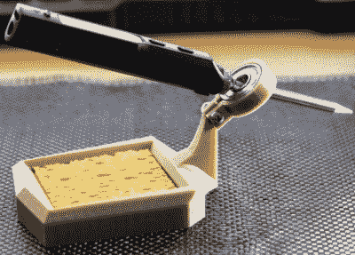

# 印刷 TS100 外壳通过轴承加热

> 原文：<https://hackaday.com/2020/07/12/printed-ts100-case-beats-the-heat-with-a-bearing/>

正如我们过去多次说过的那样，定制外壳和附件的创建是桌面 3D 打印的最佳和最明显的应用之一。当配备入门级打印机时，您的项目将永远不会再遭受被热粘在一个不伦不类的塑料盒中的屈辱。但是如果你用基本的 PLA 打印，你需要小心不要让里面太热。

当[【Oleg Vint】开始为流行的 TS100 烙铁](https://www.thingiverse.com/thing:4438787)制作 3D 打印外壳时，这是一个问题。但由于增加了一个标准的 608 轴承，这种情况下为熨斗提供了一个安全的冷却点，然后再扣上扣子进行存储。当然，你也可以在工作时使用翻转式支架来固定熨斗。

The bearing stand that served as inspiration for the case.

正如[Oleg]在 Thingiverse 页面上解释的那样，他实际上是将一些现有的项目混合在一起，以达到最终的设计。具体来说，使用 608 轴承的想法来自于[一个可打印的 TS100 支架，最初是由【MightyNozzle】](https://www.thingiverse.com/thing:2385609)在 2017 年设计的。在 Creative Commons 的支持下，[Oleg]能够将轴承座与其他几个可打印的 TS100 外壳的元素融合在一起，提出他独特的组合解决方案。

从物理意义上来说，这个项目是桌面 3D 打印使定制创作成为可能的一个很好的例子。但这也证明了围绕这项技术涌现出的令人难以置信的社区。虽然它的物流仍然需要一些工作，但看到[黑客和制造商像这样交换和组合他们的设计](https://hackaday.com/2019/04/24/prusa-launches-their-own-3d-model-repository/)是非常鼓舞人心的。

[感谢 Arturo182]