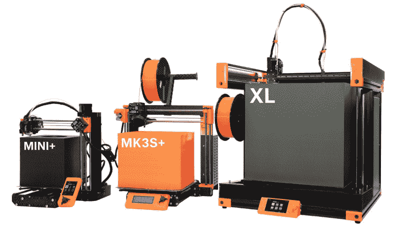
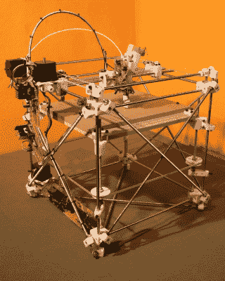
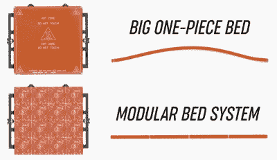
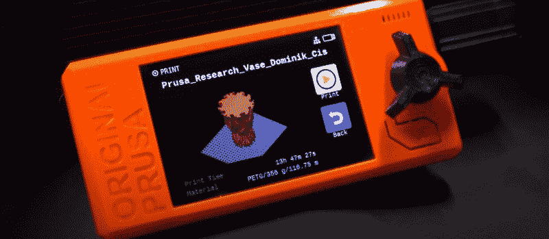
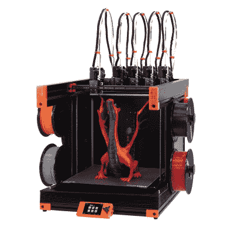

# Prusa XL 变大了，但这只是故事的一半

> 原文：<https://hackaday.com/2021/11/29/prusa-xl-goes-big-but-thats-only-half-the-story/>

几年来，Prusa Research 一直在研发一种更大的打印机，它被命名为 Prusa XL，这已经是一个公开的秘密。这款高端机器定位于与广受欢迎的 Prusa Mini 相反的产品系列，适合需要打印对于旗舰 i3 MK3S+打印机来说太大的单件对象的严肃爱好者或小公司。不幸的是，全球化的新冠肺炎疫情让这家捷克公司很难专注于向市场推出新产品，以至于有些人开始怀疑我们是否会看到这台神秘的机器。

但是现在，等待终于结束了。或者，这才刚刚开始。这是因为虽然 Prusa Research 已经正式宣布了他们的新 XL 型号，并开放了 1999 美元以上打印机的预订，但预计至少要到 2022 年第二季度才能发货。这已经是一个相当长的时间，但鉴于 Prusa 在产品发布方面的记录，如果早期采用者直到明年这个时候才开始看到他们的机器，我们也不会感到惊讶。

那么你的钱能换来什么呢？嗯，肯定不是超大号的 Prusa i3。虽然许多人猜测 XL 只是该公司流行的开源打印机的一个更大版本，并加入了一些现代的细节，如 32 位控制板，但现实完全是另一回事。虽然新机器的高购买价格和笨重的尺寸可能会使它在黑客和制造商社区中很难销售，但毫无疑问，Prusa XL 内置的技术改进和创新提供了对整个桌面 3D 打印机市场未来的一瞥。

## 回到未来

RepRap Mendel, 2009

Prusa i3 MK3S+是最新和最先进的设计版本，可以追溯到 2009 年由 Mendel 开发的 [RepRap。这种开源打印机有许多克隆和变体，但基本上可以描述为使用笛卡尔运动系统，其中高架挤出机沿 X 和 Z 轴移动，而打印表面在 Y 轴上前后移动。今天，绝大多数现代桌面 3D 打印机使用这种设计的一些变体，通常集成了 Prusa Research 多年来所做的改进。](https://reprap.org/wiki/Mendel)

因此，对于不经意的观察者来说，Prusa XL 最大的变化无疑是该机器基于一个完全不同的运动系统，看起来与该公司迄今为止生产的任何东西都不一样。在这种运动方式下，挤出机在 X 和 Y 方向上移动，床垂直移动以构成 Z 轴。这种布局的一个主要优点是对印刷部分施加的压力小得多，尤其是当机器高速运转时。

随着打印机进入下一层，它将缓慢而平稳地下降，而不是快速地来回摇动床，这可能会引入视觉打印伪像。这一点，再加上更立体的框架固有的刚性，使得打印速度比传统的 Mendel/i3 机器更快。对于 Prusa XL 来说，这一点尤为重要，因为该机器将需要尽可能快的速度来处理占据其 36×36×36 厘米(14.17×14.17×14.17 英寸)庞大体积的任何重要部分的打印。

RepRap Darwin, 2007

Prusa XL 使用的皮带和步进电机的具体配置正式名称为 CoreXY，这是一种相对现代的实现方式，专注于速度和简单性。但许多设计元素，如限制高架挤出机的二维运动，以及随着印刷的进行降低床，都让人想起第一台 RepRap 机器达尔文。虽然有商业 3D 打印机采用了达尔文的方法，最著名的是 Makerbot 和 Ultimaker 的 3D 打印机，[它们在业余爱好者群体中没有取得什么进展](https://hackaday.com/2018/12/11/makerbot-moves-away-from-makers-with-new-printer/)。

Prusa 兜了一圈，放弃了他们帮助推广的设计，这将是一个相当大的冲击，但谢天谢地，这不是发生在这里。i3 的设计不能很好地扩展，考虑到 XL 的尺寸，可能无法达到公司的性能目标。所以对于这个特殊的产品，他们决定从头开始。

与此同时，XL 的成本和尺寸显然是针对比 Prusa 传统上追求的更高的市场。因此，虽然这台更大的打印机可能采用了新的设计，但黑客和制造商喜欢的 i3 不会去任何地方。但这并不意味着 XL 的其他功能不会出现在 Prusa 家族的其他产品中。

## 铃铛和哨子比比皆是

Prusa XL 的尺寸显然是该机器脱颖而出的原因，但仔细观察后，会发现许多非常有趣的改进与机器的尺寸无关。换句话说，这些功能是 Prusa(和他们的竞争对手)可能会考虑在其他产品中包含的功能，一旦解决了问题，设计也进行了一些成本优化。

 其中之一就是新型分段床加热器。传统上，3D 打印机使用一个大的加热垫来提高整个床的温度；一种简单但低效的方法。由于它的床非常大，这种低效率太大了，不能忽视，所以 Prusa 使用了一系列较小的加热器。这种方法最明显的优点是，它允许更局部的、有针对性的加热。当你不需要的时候，为什么要浪费能量和时间在每次打印前加热整个床呢？但是即使在较小的床上，加热器阵列也有它的优势。与一个大型加热器相比，以交替模式操作它们会对 PSU 施加较小的应力，并且它们在印刷表面上引起翘曲的趋势较小。

Prusa 还完全重新设计了 XL 的挤出机组件，并取消了用于料层调平的感应传感器。在这个新的“Nextruder”中，一个定制的称重传感器集成到 hotend 的散热器中，允许使用打印机的喷嘴作为物理探针来检测床的位置。这种方法有望比以前的非接触式传感器更精确，并且不依赖于床材料的导电性或磁性。[在](https://hackaday.com/2019/01/27/quartet-of-smd-resistors-used-to-sense-z-axis-height/)之前，我们已经在 DIY 领域看到过这种情况，值得称赞的是，Creality 和 Anycubic 已经[在他们的新型打印机上实现了类似的功能](https://hackaday.com/2021/08/30/3d-printering-is-hassle-free-bed-leveling-finally-here/)。Prusa 似乎已经将这一能力向前推进了一步，因为他们的新闻稿声称 hotend 中的负载传感器也能够检测打印机何时卡住；当确定[用于检测灯丝运动的光学传感器太不稳定](https://hackaday.com/2020/10/08/the-prusa-i3-mk3s-and-a-tale-of-two-sensors/)时，这项功能被悄悄地从 i3 MK3S 中删除了。

最后，Prusa XL 完全采用了他们在 2019 年首次在 Mini 上试验的 32 位控制电子设备。这并不令人惊讶，因为最终，即使是最便宜的桌面 3D 打印机也会抛弃它们的 8 位微控制器。但 Prusa 在这里处于一个特别好的位置，因为他们已经花了几年时间来完善他们的 32 位固件，看起来 XL 将获得他们一直在入门级打印机上测试的功能的增强版本，如网络控制和 3D 打印预览。

## 没 MMU 了？

Prusa 的多材料升级(MMU)令人兴奋不已，当他们从需要一个步进电机来处理每种材料的[初始版本发展到可以](https://hackaday.com/2016/09/28/prusa-releases-4-extruder-upgrade/)[按需切割细丝并将其装入挤出机的更加精细的方法](https://hackaday.com/2018/03/26/cutting-edge-of-3d-printing-revealed-at-last-weekends-mrrf/)时，很明显该公司对这一概念进行了大量思考。但是正如许多 MMU 拥有者可以证明的那样，使用这种设备的现实总是让人有所期待。从字面上和象征意义上来说，有太多的移动部件参与进来，使得一台挤出机的系统变得可靠。

Prusa XL with additional extruders.

这就是为什么在普鲁萨 XL 上，他们甚至没有尝试。XL 不是将不同的细丝送入一台挤出机来实现多色或多种材料的印刷，而是简单地在多达五台已经装载了合适细丝的挤出机之间切换。

自然，这涉及许多额外的工程和硬件，因为打印机需要能够在长时间打印的过程中快速准确地在挤出机之间切换数百次甚至数千次。但是如果处理得当，这肯定是更可靠的方法。它还提供了一些诱人的可能性，因为这项技术并不局限于挤出机。无论是通过官方升级还是 DIY 方式，我们似乎不可避免地会在不久的将来看到 Prusa XL 挥舞着激光。

Prusa XL 实现了完整的工具更换功能，这对于 MMU 来说似乎不是个好兆头。即使经过多年的完善，该公司对这项技术仍没有足够的信心，甚至无法将其作为新的高端机器的一个选项。在这一点上，我们将看到 MMU 进一步发展的机会似乎很小，但可能有一线希望:Prusa 可能正计划在下一代 i3 打印机上实现类似的工具更换功能，如果有点更受限制的话。

## 未来的状况

Prusa XL 拥有许多令人着迷的机载技术，我们在这里刚刚介绍了其中的亮点。虽然其中一些功能无疑更适合大画幅机器，但随着 i3 和 Mini 机型推出下一个进化版本，这些功能中至少有几个会过滤到这些机型上，这是理所当然的。从更远的角度来看，几乎可以肯定的是，其他制造商将尝试实现他们自己版本的这些功能。因此，无论你是否从 Prusa 那里得到它，如果你计划在未来几年内购买一台新的 3D 打印机，那么它似乎是一个安全的赌注，你将受益于至少一些这些进步。

 [https://www.youtube.com/embed/9peACH52KTo?version=3&rel=1&showsearch=0&showinfo=1&iv_load_policy=1&fs=1&hl=en-US&autohide=2&wmode=transparent](https://www.youtube.com/embed/9peACH52KTo?version=3&rel=1&showsearch=0&showinfo=1&iv_load_policy=1&fs=1&hl=en-US&autohide=2&wmode=transparent)

