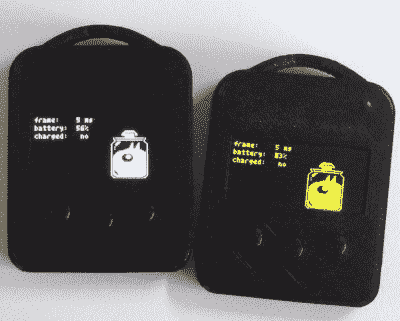

# 把一个开源恶魔放进你的口袋

> 原文：<https://hackaday.com/2020/04/06/put-an-open-source-demon-in-your-pocket/>

早在 1996 年，电子鸡就是硬件小型化的胜利。近 25 年后，我们对商业设计和制造的小工具的期望自然要高得多。但这并不意味着当有人在 DIY 领域取得类似成就时，我们不会被打动。

[dsl]的 Xling 遵循了经典的电子鸡概念。一种小生物，显然是受网飞的《觉醒》中的恶魔的启发，生活在你的口袋里，需要偶尔的关注来保持健康。用户按下几个按钮，与显示器上显示的生物互动，做你对宠物恶魔做的任何事情。喂它灵魂和你拥有的一切。

 但与标志性的 90 年代玩具不同，Xling 的硬件和软件都是开源的。CERN-OHL-W 许可的 PCB 是在 KiCad 中设计的，具有 ATmega1284P 微控制器和 SH1106G 控制器，用于 128 x 64 有机发光二极管显示器。

电源由 AP3401 DC-DC 转换器、MCP73831 充电控制器和 400 mAh 3.7 V 电池提供。所有东西都可以放在 3D 打印的盒子里，看起来就像可以很容易地挂在钥匙圈上。

虽然硬件足够令人钦佩，但软件方面的东西也很有趣。Xling 运行在移植到 ATmega 的 FreeRTOS 内核上，但是 GPLv3 许可的固件仍然需要一些工作。目前只有少数核心功能得以实现，[dsl]希望从社区中获得一些想法和反馈，这样他的完全开源的恶魔电子鸡的梦想才能最终实现。

建立足够多的虚拟宠物，你甚至可以[实现另一个虚拟宠物奇点](https://hackaday.com/2015/11/24/building-the-infinite-matrix-of-tamagotchis/)。但是为了安全起见，也许你不应该。

[https://player.vimeo.com/video/373866887](https://player.vimeo.com/video/373866887)