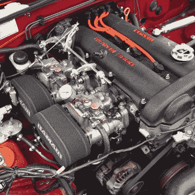
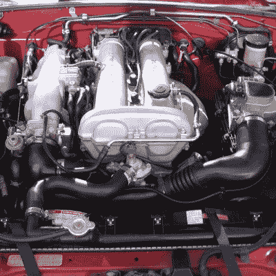
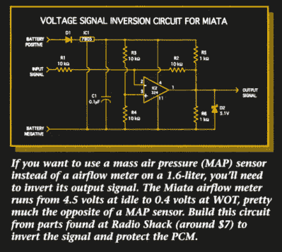
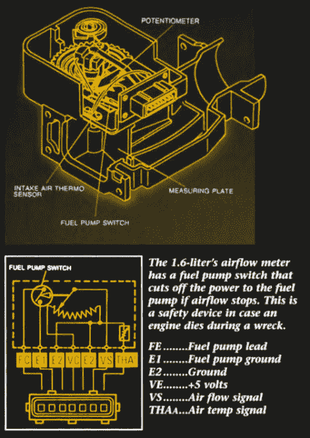

# 把碳水化合物放在 Miata 上，因为太棒了

> 原文：<https://hackaday.com/2019/08/08/putting-carbs-on-a-miata-because-its-awesome/>

化油器与电子燃油喷射(EFI)的对比:超过一定年龄的汽车爱好者将会深谙其中的区别。虽然早期的电喷系统有其缺点，但这项技术带来了可靠性和控制的新标准。到了 20 世纪 90 年代初，绝大多数汽车都销售了电喷系统，化油器成为了历史。

马自达 Miata 也不例外。它于 1989 年上市，不仅具有多端口燃油喷射功能，还配备了无分电器点火系统。该系统由两个废弃火花配置的线圈包组成，由计算机控制计时，在当时是非常先进的，尤其是对于经济型跑车而言。

尽管 Miata 的技术资质，那些在改装车领域的人倾向于走自己的路。一个名叫埃文的人恰好就是这样一个人，他决定这么做——废弃电喷系统，安装一个复古化油器。正是在这一点上，我参与了，机械修补随之而来。

## 但是为什么呢？

这是真的，Miata 的股票电喷系统完全有能力做它的工作，也有能力处理一些温和的发动机修改没有太多的麻烦。那些建设更高的功率水平通常会及时更换电子控制单元，喷油器和燃油泵，但系统的总体架构保持不变。

The engine, with twin Weber carbs fitted. Compare with the stock engine bay, below.

A stock Miata engine bay. Note the space taken up by the original manifold, intake and air flow meter.

但是，这并不是说化油器没有可取之处。由于 Miata 的发动机布局，它可以安装一套双碳水化合物与正确的歧管，并有一个非常短的进气道长度。这有利于减少进气限制，以获得更大的功率，以及大大改善油门响应。鉴于标准进气和空气流量计固有的限制，这里有很大的好处。此外，这样的设置会大大增加进气噪音，这对那些喜欢自然吸气发动机的人来说是一个很大的加分。最后，即使面对昂贵的意大利竞争，拥有独特的构造也是在汽车和咖啡上获得一定关注的好方法，这一点不能打折扣。

或者，就参考这篇文章的标题！

## 但是…这台发动机不是为汽化器设计的

显然，给一辆从未设计过化油器的汽车安装化油器要费一番功夫。由于 Miata 的电脑控制点火系统，它变得更加复杂。这意味着需要对燃油系统和点火系统进行改造，以完成改造。

所需的工作已经被诺曼·加勒特记录在[马自达·米娅塔性能手册](https://books.google.com.au/books?id=wApjC72udH8C&pg=PA71&source=gbs_toc_r&cad=4#v=onepage&q&f=false)中，那是印刷仍然占主导地位的时代(第 79-82 页)。第一步是移除一大堆不再需要的硬件。原有的进气歧管、进气管和空气流量计都已拆下，因为它们与化油器安装不兼容。

完成后，化油器就可以安装到发动机上了。这需要专门为应用设计的特殊歧管。Mazdaspeed 为 1.6 升和 1.8 升 Miata 发动机制造了合适的零件，允许安装双韦伯化油器，这就是我们的项目所使用的。

电喷汽车的燃料系统通常在 30 到 70 磅/平方英寸之间运行，远远高于普通化油器所需的 7 磅/平方英寸。为解决这一问题，必须安装专为化油器设计的燃油压力调节器。这可以安装在发动机舱附近的碳水化合物，因为有足够的空间与原来的进气硬件删除。

A basic op-amp inverter circuit. Note that only one op-amp of the LM324 is used. Credit: Mazda Miata Performance Manual

还有点火的问题。正时提前由计算机控制，基于来自凸轮角度传感器和空气流量计的信号，使电子控制单元能够计算发动机的负荷。随着空气流量计的删除，它不再可能为 ECU 知道多少时间运行。这可以保持原样，但是如果没有合适的定时曲线，引擎就会失去性能。

通常这将由经销商处理。由于设计的马自达 B6 和英国石油公司的引擎，这是不切实际的切换到一个典型的分销商为基础的设置。相反，有两种常见的方法用来欺骗空气流量计信号到电子控制单元，使其能够正确地控制时间。节气门位置传感器可以安装在化油器的节气门连杆上，节气门位置代表气流作为负载信号。

或者，可以安装歧管空气压力传感器，检测进气口的真空。然后可以将该信号反转，类似地模拟足够接近的原始空气流量计，作为发动机负载的良好参考。根据您的喜好，您可能更喜欢节气门位置传感器的机械复杂性，或者进气歧管绝对压力传感器路线的电子复杂性。这位作者倾向于前者，但车主倾向于后者，因此我们开始为汽车建立一个逆变器电路。

像任何主要的引擎修改一样，要让系统正常运行，还有一系列额外的工作要做。在这个版本中，节流阀电缆需要修改，化油器歧管缺乏真空意味着制动助力器不再有效。像任何大型项目一样，要预料到过程中的陷阱。

## 电子陷阱:连接器的错误一侧

The diagram in question, showing the connections to the air flow meter of the car. Reading this backward caused some issues for the author. Credit: Mazda Miata Performance Manual

我主要参与了构建的电子方面，按照诺曼·加勒特的设计，制作了一个运算放大器电路来反转地图传感器信号。根据原理图，这需要一个 LM324 运算放大器来完成。仅使用四个可用运算放大器中的一个，以反相配置设置，增益为 1；即简单的反转，没有放大。该传感器旨在与通用汽车公司的 3-bar map 传感器一起使用，该传感器可随时获得，无论是新的还是旧的，已在全球数百万辆汽车中使用。

在某个性能板上组装好电路后，我们努力让它可靠地运行。在尝试从空气流量计连接器中的 5 伏线路为电路供电后，我们放弃了，并在发动机舱中使用带有 Miata 的 12 伏辅助馈电的 7805 调节器。不幸的是，尽管如此，我们仍然有问题。该电路只是一直输出 0V 或 5V，而不是完全反转 MAP 信号。

由于对根本原因知之甚少，该电路用废弃器件重建，取代了 LF356 运算放大器。这在有限的台架测试中有效，但当连接到汽车上时又开始出现问题。就像这样，几个小时的挫败感接踵而至，直到意识到我们把图表读反了。正如马自达 Miata 性能手册中所描绘的，AFM 连接器是从空气流量计本身的侧面显示的，而不是汽车中的布线机。随着这一疏忽得到纠正，我们能够让电路运行，信号反转得很好。在 Miata ECU 上没有 dyno 或任何高端诊断功能的情况下，很难确定电路的影响有多大，但我们继续将汽车拿出来进行试驾。

## 性能:你的脚让引擎腾飞

简而言之，驾驶 carby Miata 绝对是一种乐趣，超越了普通车型。当然，还有更多的电力可以利用。但最重要的是，油门的咔哒声令人陶醉，只要轻轻一踩油门，引擎就会飞速前进。感应噪音也愉快地存在，结合良好的排气系统，刺耳的树皮是死了。

显然，这种设置也有一些明显的缺点。在重要的司法管辖区，不太可能通过排放规则，在经常出现霜冻和降雪的地区，冷启动性能会降低。在 4000 rpm 左右的 powerband 中还有一个小的平点问题。没有时间进行适当的 A/B 测试，我们无法追踪到一个明确的罪魁祸首。怀疑围绕化油器进气设置牺牲了高端功率的中程扭矩，或运算放大器替代造成的问题，因为 LF356 不是像 LM324 那样的轨到轨部件。

无论如何权衡，最终的产品是一个梦想驾驶，并有引擎盖外观和配乐匹配。对于那些日常驾驶的人来说，这可能不是最好的选择，但对于那些想在当地车展上展示一些老派魅力的周末游客来说，这是一条很好的路。

 [https://www.youtube.com/embed/MPd4dbkrxGE?version=3&rel=1&showsearch=0&showinfo=1&iv_load_policy=1&fs=1&hl=en-US&autohide=2&wmode=transparent](https://www.youtube.com/embed/MPd4dbkrxGE?version=3&rel=1&showsearch=0&showinfo=1&iv_load_policy=1&fs=1&hl=en-US&autohide=2&wmode=transparent)

