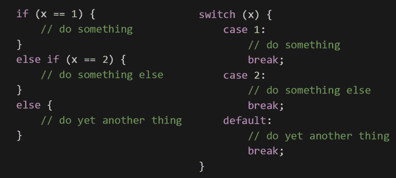
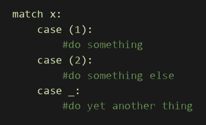
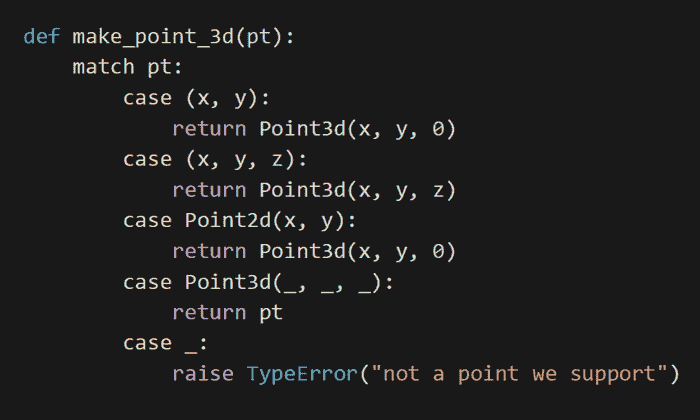
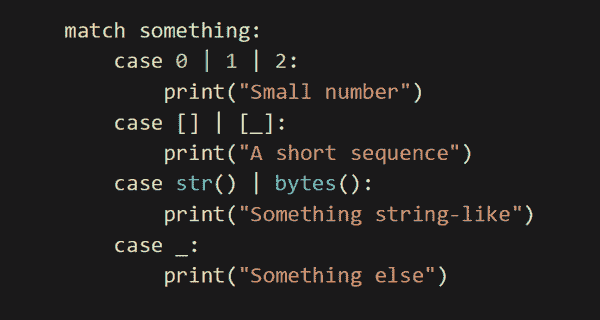
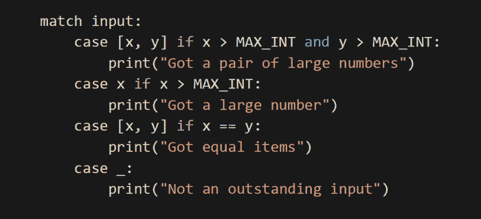

# Python 将很快支持 Switch 语句

> 原文：<https://hackaday.com/2021/04/02/python-will-soon-support-switch-statements/>

欢呼吧！长长的`if` … `else`语句链不见了，因为`switch`语句很快就会出现——算是吧。[Python 大神们其实给我们的是`match`语句。](https://www.python.org/dev/peps/pep-0622/) `match`语句与`switch`语句非常相似，但是有一些非常酷和独特的特性，我将在下面尝试说明。

## 扳动开关

一个`switch`语句经常被用来代替一个`if` … `else`阶梯。下面是 C 语言中相同逻辑的一个简单例子，首先用一条`if`语句执行，然后用一条`switch`语句执行:

从本质上来说，`switch`语句接受一个变量，并针对许多不同的情况测试它是否相等。如果没有匹配的案例，那么调用`default`案例。请注意，在示例中，每个`case`都由一个`break`终止。这可以防止多个案例匹配(或允许级联)，因为案例是按照它们列出的顺序进行检查的。一旦完成一个案例，调用`break`并退出`switch`语句。

## 天作之合

你可以把`match`语句想象成“Switch 2.0”。在我们深入这里的本质之前，如果您想要的只是 Python 中的`switch`,那么您很幸运，因为它们可以以同样的方式使用。这里有一个和我们之前看到的相似的例子，这次在 Python 中使用了`match`。

有一些不同之处需要马上注意。第一，没有`break`语句。开发人员担心，如果在循环中的`match`语句内调用`break`语句，会造成混乱——那么是什么中断了循环还是匹配？这里，执行第一个满足的案例，语句返回。您还会注意到，我们用的是`case _`，而不是`default`，它的行为方式相同。

## 模式匹配的力量

所以，我们有一个语法略有不同的`switch`语句，对吗？不完全是。使用名称`match`是有原因的——这里实际上发生的事情叫做模式匹配。为了说明这是什么，让我们来看一个更令人兴奋的例子，这个例子来自于向 Python 添加相关关键字的特性提案:

哇！我们只是获取一个对象，检查它的类型，检查它的形状，并实例化一个新对象，而没有任何索引，甚至没有一个`len()`调用。它也适用于任何类型，不像经典的`switch`只适用于[整数值](https://www.cs.auckland.ac.nz/references/unix/digital/AQTLTBTE/DOCU_032.HTM)。如果这对你来说还不够酷，模式可以组合。同样，从功能提案来看:

好吧，好吧——再举一个例子。这就是`match`语句真正强大的地方。模式本身可以包括比较，称为守卫。这允许您过滤每个`case`语句中的值:

## 成交！我什么时候可以试试？

我们将接触到 Python 3.10 中这个神奇的新命令，预计将于 2021 年 10 月 4 日全面发布。对于喜欢冒险的人来说，[今天有一个 alpha 版本(Python 3.10.0a6)可供下载](https://www.python.org/downloads/release/python-3100a6/)。花一些时间熟悉模式匹配可能是值得的，比如理解匹配文字值和匹配变量之间的区别[。](https://stackoverflow.com/questions/66159432/match-statement-how-to-use-values-stored-in-variables)

那么为什么不是每种语言都有`match`语句呢？它们显然比`switch`语句更好！至少我是这么说的，我的女朋友 Sara 很快扬起眉毛，解释说这涉及到巨大的性能开销。C 语言中的`switch`语句相对简单。它将整数相互比较，执行`n`常量时间操作。`match`语句带来的所有功能和便利意味着很多事情都在后台进行，这反过来会降低代码执行速度——这是一个难以置信的 Pythonic 式的权衡。

我发现效率是为这种扩展功能付出的小小代价，但作为一名机械工程师，我最喜欢的语言是 Matlab 和 Python，所以你可能应该有所保留地接受我的意见。